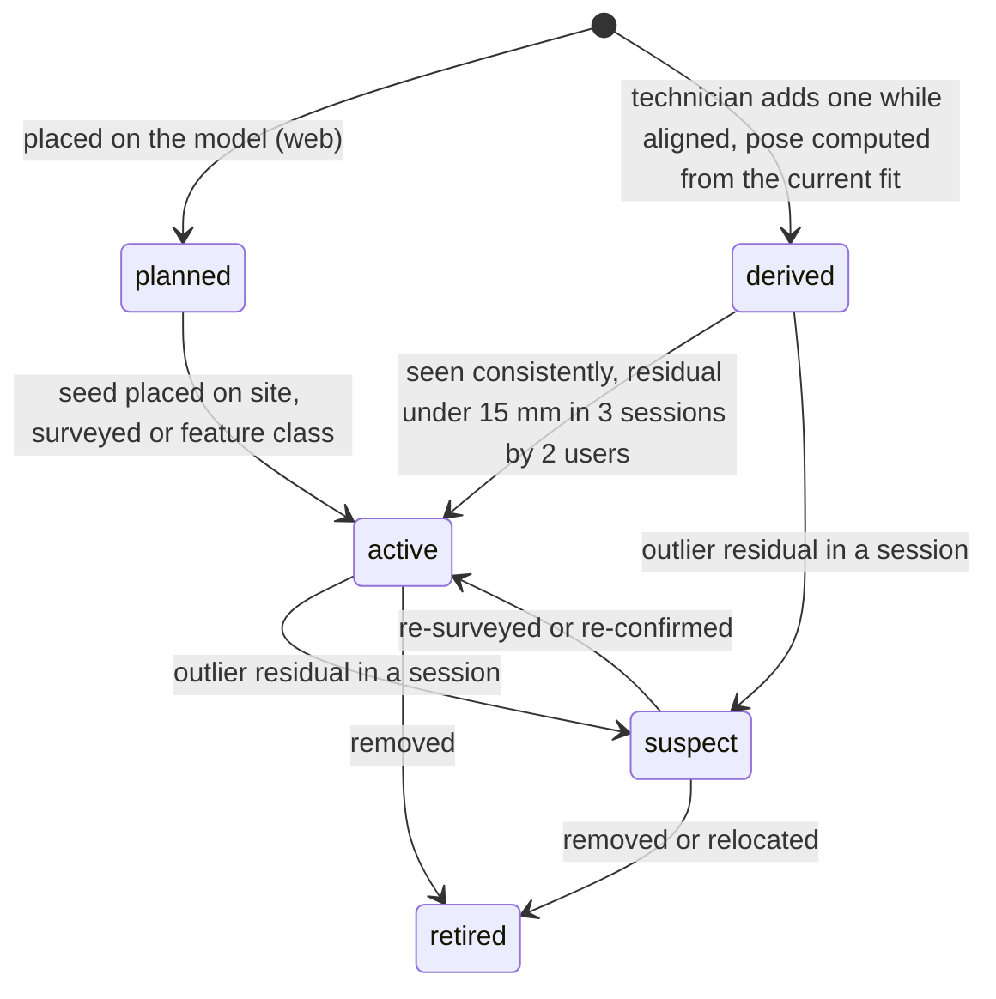
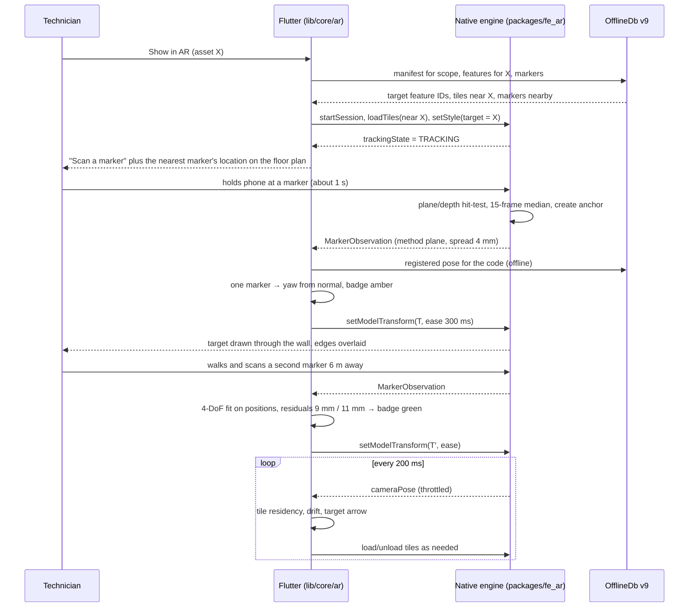
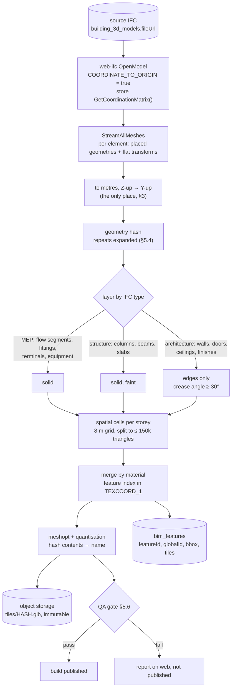
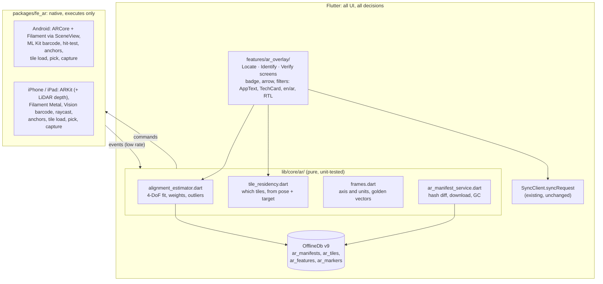
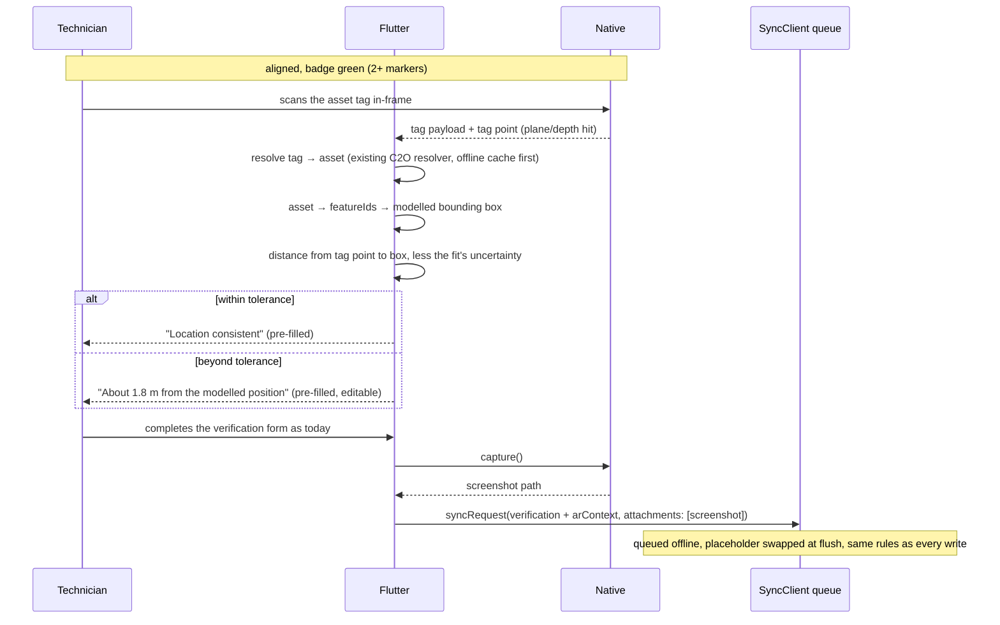
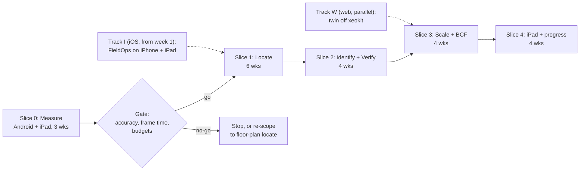

# AR BIM overlay — implementation plan (v3)

A technician in a plant room points the phone at a wall and sees the model drawn over the real world: the valve behind the ceiling tile, the pump the work order is about, the duct that should be there and isn't. Tapping a drawn element opens the same register record a tag scan opens. Anything they raise from that view carries the element's identity and the camera pose that saw it.

It is FieldOps' answer to GAMMA AR and Dalux TwinBIM. It is **not** a copy of them. Those products serve construction QA. FieldOps serves people who maintain and verify assets, so the design is built around what those people do, and it reuses the register, findings, route packs and offline queue the app already has.

**Status:** **v1 built 2026-09-26, never run on a device.** Server (`/api/bim/ar`), web admin and FieldOps (pure logic, floor packs, every screen with a Demo mode, and the native plugin `packages/fe_ar`) are written; FieldOps was statically verified only (type check on an old analyzer, 193 pure-Dart tests), and `fe_ar` has never been built for a device. What exists, how it connects and what is unverified: [ar-implementation.md](ar-implementation.md). The plan below is unchanged. This is **v3 (2026-09-25)**: v2's design plus the platform decision (§2.4), with **Android, iPhone and iPad as first-class targets**. §0 lists what v3 changed, then what v2 changed from v1 (commit `91e81ad`). Every "existing" reference below was read in source. Every "new" item is a development item in §11.

**Update 2026-09-26:** the first alignment is now **markerless**. The user snaps two real corners, which is GAMMA AR's proven method, simplified, and QR boards are what gets left behind for one-scan repeat visits. See [ar-setup-and-gamma-parity.md](ar-setup-and-gamma-parity.md). The 4-DoF estimator below is unchanged; corners are just another kind of observation.

**Prerequisite reading:** [architecture.md](architecture.md) (the offline engine this reuses) and [c2o-field-verification.md](c2o-field-verification.md) (register, route packs, capture form). Marker planning, printing, installing and scan-to-model resolution are specified end to end in [ar-markers-and-qr.md](ar-markers-and-qr.md).

---

## 0. What changed

### v3: the platform decision (2026-09-25)

New requirement: a product on Android **and** iOS/iPadOS, as fast as possible and backed by an active open-source community, with no licences.

| Area | v2 | v3 | Why |
|---|---|---|---|
| **Where AR runs** | Native, Android first, iOS in slice 4 | Native on **Android, iPhone and iPad from slice 1** | The iPad is the better field device (LiDAR, larger screen, more battery), so it can't wait until slice 4 |
| **Web AR (WebXR)** | Considered | **Rejected for on-site AR** (§2.4). The web keeps the desktop twin, marker planning and office review | Safari on iPhone and iPad has no `immersive-ar`, and neither does Android WebView |
| **iOS renderer** | RealityKit | **Filament (Metal)**, the same renderer as Android | RealityKit loads only USDZ, not glTF. Filament loads the same tiles with the same material on both platforms, and Google ships an official ARKit sample for it |
| **Android integration** | SceneView or raw Filament | **SceneView** (ARCore + Filament, Apache-2.0, releasing actively) | Fastest route, with an active community. It's Filament underneath, so tiles and materials are identical to iOS |
| **Feature IDs in tiles** | `_FEATURE_ID_0` (EXT_mesh_features) | A tile-local index in **`TEXCOORD_1`** plus a per-tile table (§5.4) | Filament's glTF loader doesn't support EXT_mesh_features. `TEXCOORD_1` is read by Filament and three.js alike |
| **Instancing** | EXT_mesh_gpu_instancing | **Expanded at export.** Filament's own `InstanceBuffer` only if a budget fails | Filament's glTF loader doesn't support EXT_mesh_gpu_instancing |
| **Hit-test** | Plane → depth → PnP | **LiDAR scene depth first** on iPad Pro and iPhone Pro | LiDAR measures plain painted walls, the top risk in §13 |
| **Team** | 1 mobile + 1 server engineer | **+1 iOS engineer**, and a new Track I that gets FieldOps running on iPhone and iPad | FieldOps doesn't launch on iOS today ([build-release-and-platform.md §6](build-release-and-platform.md#6-ios--not-shippable-yet)) |

### v2: what changed from v1, and why

| Area | v1 | v2 | Why |
|---|---|---|---|
| **Product shape** | A general "overlay the storey" viewer | Three technician jobs, **Locate, Identify and Verify**, scoped to one asset by default (§1) | FieldOps users look for and check assets. They don't review construction progress. Scoping to the job also cuts render load by about 10× |
| **Alignment estimate** | Each new marker replaces the transform. Yaw comes from that one marker's orientation | Every marker seen in a session is **combined** in a 4-DoF weighted least-squares fit on marker *positions*. Each observation is held as a native anchor (§4.3) | Orientation read off a 200 mm target is the noisiest thing we measure. Position spread across several metres is not: two markers 5 m apart cut yaw error from about 1° to about 0.16° |
| **Single-marker measurement** | Planar PnP homography on four corners | Hit-test the marker centre onto the tracked wall plane (or depth). Normal comes from the plane, up from gravity. PnP is only the fallback (§4.2) | This uses the tracking system's metric surface, built from many points over time, instead of four nearly integer corner positions |
| **Quality badge** | Drift *estimated* from distance walked | Drift *measured* from residuals once two or more markers are known | Honest: "last check 12 mm, 4 m ago" |
| **Bad markers** | Not handled | A large residual flags a marker as `suspect` automatically (§4.5) | A marker that was moved or placed wrong otherwise corrupts every session without anyone noticing |
| **Marker network** | Every marker placed from the office | A few surveyed **seed** markers, then technicians **add more** with a "derived" accuracy class (§4.5) | Marker density was v1's biggest open cost question |
| **Geometry unit** | One GLB per storey × discipline, one scene node per element | Spatial **tiles**, merged by material, with **per-vertex feature IDs** (§5) | One node per element means thousands of draw calls. Mobile GPUs manage about 100–200 |
| **Architecture layer** | Drawn solid | **Edges only** | The walls are already there in real life. Their drawn edges also work as a live visual check of the alignment |
| **Repeated parts** | Ignored | Instanced by shared geometry | MEP models are mostly repeated fittings and hangers |
| **Compression** | Draco | **meshopt + quantisation**, then gzip in transport | Draco decoding is CPU-heavy on a phone that is already running SLAM |
| **Model updates** | Re-download the whole pack when its ETag changes | **Tiles named by content hash**. Only changed tiles are rebuilt and downloaded (§5.5) | A model revision usually touches a few percent of tiles |
| **Downloads** | A separate AR pack per storey | The same scopes as route packs (package, building, level, system) under one "download for offline" action (§7.3) | One concept for the technician. System and package scopes download only the tiles near their assets |
| **Asset ↔ element join** | Assumed reliable | Mapping confidence shown on screen, and field visits confirm mappings (§1.2) | An automatic low-confidence match shown as fact sends a technician to the wrong valve |
| **Render host** | Platform view | A headless native AR engine, with **all UI in Flutter**. The host (Texture or AndroidView) is chosen from measured frame times (§6.3) | A native HUD can't follow the repo's i18n, RTL and UI-kit rules |
| **Coordinate frames** | Model re-centring only | Also the **Z-up → Y-up axis swap**, handled once, with golden test vectors shared by server and app (§3) | The axis swap is the classic silent bug, and v1 didn't mention it |
| **Delivery** | Layered phases. First field value around week 12 or later | **Vertical slices**. "Locate" is in the field after slice 1 (§11) | Site feedback before the expensive parts are built |
| **Testing** | Synthetic maths tests only | Plus **recorded site walks replayed** (ARCore Recording & Playback) as golden data (§10) | Alignment regressions get tested against real sites without going to site |
| **Licensing** | Checked the new stack only | Also found **xeokit (AGPL-3.0)** in the existing web twin (§2.3) | The no-licence requirement is already broken elsewhere, and AR must not build on it |

---

## 1. What technicians get

### 1.1 Three jobs

| Job | Entry point | What the screen shows | What gets recorded |
|---|---|---|---|
| **Locate** | Work order, route asset or asset detail → "Show in AR" | The target asset drawn *through* walls and ceilings with a pulsing outline, an edge-of-screen arrow when it is out of view, its system highlighted, everything else as faint edges | Nothing unless they act |
| **Identify** | A tag that is missing, damaged or unreadable, or just "what is this?" | Tap any drawn element → the same asset screen a tag scan opens | A tap-to-identify event, and optionally a mapping confirmation |
| **Verify** | Field verification of an asset | Scanning the tag while aligned compares where the tag *is* with where the model *says* the asset is | `arContext` plus a location result **pre-filled** into the verification form |

AR results pre-fill the form and are never submitted automatically. That is the same rule as nameplate OCR ([nameplate_ocr.dart](../lib/core/ocr/nameplate_ocr.dart)).

Scoping to one asset is the most important performance decision in this document. Locate loads the tiles around the target plus the target's system, not the level.

### 1.2 Mapping confidence is part of the display

The asset → element join already exists on the server: `assets.ifcGlobalId` / `bimModelId` ([asset.ts:105](../../fusion-eco-server/src/model/asset.ts#L105)) and `asset_mappings` with `confidence` and `method: auto | human | imported` ([asset-mapping.ts:10](../../fusion-eco-server/src/model/asset-mapping.ts#L10)). The app has **no** GlobalId anywhere today. Route-pack assets don't carry one ([route_pack.dart:41](../lib/core/c2o/route_pack.dart#L41)).

Rules:
- A confirmed mapping, or an automatic one above the confidence threshold, is drawn as **the target**. Anything weaker gets an "unconfirmed match" badge and a list of candidates.
- Identify or Verify while aligned records a **human confirmation** of the mapping, which goes into the existing proposal flow ([mappingProposalService.ts](../../fusion-eco-server/src/services/bim/mappingProposalService.ts)). Every AR field visit makes the platform's mappings better. This is the part competitors can't copy, because they don't hold the register.

### 1.3 Out of scope

- **Setting-out or QA-grade measurement.** The tool answers "is it there, is it this one, is it where the model says". It doesn't answer "is it within 5 mm".
- **Indoor positioning.** The overlay knows where the phone is relative to markers. GPS check-in stays the source of "which site".
- **Model authoring.** Geometry is read-only. Findings, mapping confirmations and new markers are the only writes.
- **Construction progress review** (built, missing, changed). It is useful, but it serves the contractor more than the technician, so it moves to slice 4.

---

## 2. Licence position

The requirement is **no licence fee, no per-seat runtime cost, no vendor account and no commercial SDK**.

### 2.1 Chosen stack

| Layer | Choice | Licence | Notes |
|---|---|---|---|
| Android tracking | ARCore | Apache-2.0 SDK, free service | On-device tracking needs no key and no billing |
| Android depth, recording | ARCore Depth API; Recording & Playback API | same | Depth: hit-test fallback and occlusion. Recording: test data (§10) |
| Android rendering | Filament through **SceneView** (`arsceneview`) | Apache-2.0 | Released actively (July 2026). Sceneform, its predecessor, was archived in March 2026 |
| iOS / iPadOS tracking | ARKit, with LiDAR scene depth where the device has it | Free with the developer account the app already needs | `ARWorldMap` gives **local** relocalisation (AR-34) |
| iOS / iPadOS rendering | **Filament, Metal backend** | Apache-2.0 | Same engine, tiles and material as Android. Google's official `ios/samples/hello-ar` combines ARKit and Filament |
| In-frame barcode | ML Kit Barcode (bundled model) / Vision | Free, on-device | Payload plus corners |
| Alignment maths | Our own Dart (`lib/core/ar/`) | ours | Closed-form 4-DoF fit, about 300 lines, pure |
| IFC geometry | web-ifc | MPL-2.0 | **Already a server dependency** at the same version the client uses. The geometry streaming API (`StreamAllMeshes`, `GetCoordinationMatrix`, `COORDINATE_TO_ORIGIN`) is in the installed 0.0.77 |
| Tile authoring | gltf-transform, meshoptimizer | MIT | |
| Formats | glTF 2.0 with EXT_meshopt_compression and KHR_mesh_quantization (both in Filament's supported list); feature index in `TEXCOORD_1`; BCF 2.1 | Open specs | Deliberately limited to what Filament's glTF loader supports, so both platforms and the three.js web viewer read the same file |
| Fallback IFC converter | IfcOpenShell | LGPL-3.0 | Only as a separate server-side CLI process for models web-ifc can't handle (§5.7). Never linked into shipped code |

Net new third-party cost: **zero**.

### 2.2 Rejected

| Rejected | Reason |
|---|---|
| Unity + AR Foundation | Licence tiers, splash and seat rules above the free threshold, a history of runtime-fee changes, 50–80 MB more APK, and a second toolchain |
| Vuforia, Wikitude, 8th Wall, MaxST | Commercial per app or per seat |
| Autodesk APS, Trimble Connect SDK | Commercial, and they put the model in someone else's cloud |
| ARCore Cloud Anchors, Geospatial API / VPS | Need a Google Cloud project, an API key and a **network round trip to resolve**. FieldOps exists because plant rooms have no signal |
| ARCore Augmented Images for the marker | QR codes score poorly as image targets, and each marker would need a prebuilt image database, so adding a marker would need an app release |
| `ar_flutter_plugin` and its forks | MIT, but no frame access, no intrinsics, no custom materials, no clipping. It can't be extended from Dart |
| **RealityKit** as the iOS renderer | Free, so not a licence issue. It loads only USDZ, not glTF, so it needs GLTFKit2 conversion or a second export pipeline, plus a second highlight material that would drift from Android's. **Kept as the iOS fallback** (§2.4) |
| **WebXR in the browser** for on-site AR | No `immersive-ar` in Safari on iPhone or iPad, and none in Android WebView (§2.4) |
| **xeokit / XKT** as a geometry source | AGPL-3.0. Being removed from the platform (§2.3) |

### 2.3 The web twin runs on AGPL code, which is being removed

The web digital twin is built on **`@xeokit/xeokit-sdk` 2.6.109 (licence: AGPL-3.0)** and converts IFC with **`@xeokit/xeokit-convert` (AGPL-3.0)**, run by the Next.js route [convert-ifc/route.ts](../../fusion-eco-client/app/api/digital-twin/convert-ifc/route.ts). At least 11 client components import it, including [TwinLiteViewer.tsx](../../fusion-eco-client/components/digital-twin/TwinLiteViewer.tsx). That viewer backs [the technician twin page](../../fusion-eco-client/app/technician/twin/%5BassetId%5D/page.tsx), which **FieldOps opens in a WebView** ([twin_screen.dart:57](../lib/features/twin/twin_screen.dart#L57)).

xeokit is dual-licensed: AGPL, or a commercial licence from its vendor. AGPL §13 extends source-disclosure duties to software used over a network.

**Decision (2026-09-25): remove xeokit. No commercial licence. Open source with permissive licences only (MIT, Apache-2.0, BSD, and MPL-2.0 for web-ifc).** Until Track W ships, the exposure is still live.

Consequences for this plan:
1. The AR pipeline **must not** read XKT or run `convert2xkt`. It builds from source IFC with web-ifc (MPL-2.0).
2. Models that exist only as `.xkt` (the bim-mapping page says demo and twin models often do) **can't be used in AR** until someone uploads the source IFC. The upload flow already exists on that page.
3. **Track W (§11) is committed scope.** The tile pipeline in §5 produces glTF that three.js (MIT, already a client dependency) can render. Moving the web twin onto the same tiles removes the AGPL dependency and leaves **one geometry pipeline for web and mobile**. It also settles v1's open question of whether to keep two 3D stacks.

### 2.4 Platform decision: native on every device, Filament everywhere

The product must run on Android phones, iPhones and iPads, work offline, and be as fast and as well supported as possible, with no licences.

**Web or native.** Chrome on Android has everything this design needs (WebXR hit-test, anchors, depth, DOM overlay, and raw camera access since Chrome 107). But in 2026 Safari on iPhone and iPad still has no `immersive-ar` and no public timeline for it, and Android WebView has none, so a web AR page couldn't run inside FieldOps even on Android. A product that has to run on an iPad can't be built on WebXR. The web keeps what it does well: the desktop twin (Track W), marker planning and office review, all on the same tiles.

**Which native stack:**

| | **Filament on both (chosen)** | SceneView on Android + RealityKit on iOS | Unity + AR Foundation |
|---|---|---|---|
| Licence | Apache-2.0 | Apache-2.0 / free | ❌ commercial above the free tier |
| Loads our glTF tiles | ✅ both platforms, one loader | Android ✅ · iOS ❌ (USDZ only; needs GLTFKit2 or a second export) | ✅ with packages |
| Highlight material | Written **once** (a Filament `.mat`, compiled to Metal and to Vulkan/GLES) | Written twice (Filament, plus a RealityKit `CustomMaterial` in Metal) | Written once |
| Performance | Metal on iOS, Vulkan/GLES on Android; designed for mobile | Best-in-class on each platform | Good, heavier runtime and APK |
| Community | Filament is Google-maintained and underpins SceneView. ARKit and ARCore have very large communities | Largest per platform | Largest overall |
| Main risk | The ARKit ↔ Filament glue is ours (Google's official sample to start from) | Two renderers drift apart visually and collect separate bugs | Excluded by licence |

**Decision:** tracking stays native and platform-specific: ARCore on Android, ARKit on iPhone and iPad. That's where each platform's strengths are (LiDAR, depth, relocalisation) and where the largest communities are. Rendering is **Filament on both**, because the tile format and the highlight material *are* the product and should exist once. Android uses SceneView to get ARCore and Filament running fast. iOS follows Filament's `hello-ar` pattern.

**Fallback:** if Filament + ARKit fails the slice-0 gate on iPad (AR-37), iOS switches to RealityKit, loading tiles through GLTFKit2 (MIT), behind the same channel contract. Dart doesn't change.

---

## 3. Coordinate frames: one conversion, one place

Most "AR is inaccurate" bugs are frame bugs. Each frame is defined once:

| Frame | Up axis | Units | Origin | Where it lives |
|---|---|---|---|---|
| **IFC world** | +Z | model length unit | site / project CRS | the uploaded IFC |
| **Model-local** | +Z | metres | re-centred by web-ifc `COORDINATE_TO_ORIGIN` | geometry build only |
| **Tile (glTF)** | +Y | metres | same origin as model-local | tiles, features, markers, `arContext`, everything served |
| **AR world** | +Y (gravity) | metres | wherever the session started | device only, per session |

Rules:
- **Re-centring.** The geometry build opens the model with `COORDINATE_TO_ORIGIN` and stores `GetCoordinationMatrix()` on the build record. It is the only way back to IFC world, and it is needed only for BCF export and georeferencing.
- **Axis swap.** IFC Z-up → glTF Y-up is `(x, y, z) → (x, z, −y)`, applied **once** at export. Nothing downstream ever sees Z-up.
- **Units.** The build QA checks that storey elevations taken from geometry match `IfcBuildingStorey.Elevation` after scaling (§5.6). A wrong unit fails the build instead of shipping a model at 1/1000 scale.
- **Golden vectors.** One JSON file of known conversions (IFC point → tile point, marker pose → transform) is asserted by **both** the TypeScript and the Dart test suites. The two sides can't drift apart without a test failing.

---

## 4. Alignment

> **Setup order (2026-09-26):** scan a board if one is known → otherwise **snap two corners** → then **leave a board**. Corner detection, matching, drift re-snap and the guided nudge are in [ar-setup-and-gamma-parity.md §2](ar-setup-and-gamma-parity.md). This section's marker maths applies to both.

### 4.1 The marker

- A rigid A4 board, matte: a 115 mm QR inside a 170 mm textured frame (A3 for large halls: 170 mm QR). A 200 mm QR plus a frame does not fit A4. The QR sits in the centre with a **crosshair at the registration point** (the QR centre), and a **high-texture border pattern** around it. The border matters: ARCore finds vertical planes by their visual features, and a plain painted wall has none. The board brings its own.
- Mounted on a wall at about eye height. Walls give a clean normal. A floor marker works too, but its yaw has to come from the QR's corner orientation, which is weaker.
- Payload: the upper-case short URL `HTTPS://<HOST>/M/<code>`. That keeps it in QR alphanumeric mode, version 2, 25 modules, so a 115 mm QR reads from about 2 m ([ar-markers-and-qr.md §2](ar-markers-and-qr.md)). A stranger's phone camera lands on a safe public page. The FieldOps scanner parses the URL **before** the C2O and general schemes ([c2o_scan_payload.dart:52](../lib/core/c2o/c2o_scan_payload.dart#L52)) and opens the right floor and build (§3 of that doc).
- The code carries only an ID. The pose stays on the server, so a correction never means reprinting.

### 4.2 Observation: native measures

The native engine turns a detected marker into **one world-space observation**. It accepts a marker only while tracking is `TRACKING`, the distance is 0.5–2.0 m, the view is within 35° of the wall normal, and the decode has been stable for 10 frames.

Hit-test cascade for the marker centre:

1. **LiDAR scene depth** (iPad Pro, iPhone Pro) → point and normal from a raycast against ARKit's measured depth. It works on plain painted walls. Preferred wherever it exists.
2. **Tracked vertical plane** under the centre → point on the plane, normal from the plane.
3. **Depth API** hit (Android, where supported) → point, normal fitted to depth in a small patch around the centre.
4. **PnP** from the four corners → point and normal. A last resort, flagged `method: pnp` and down-weighted.

Over about one second (15 frames or more), take the per-axis **median** of the centre and the normalised mean of the normals. Reject the observation if the centre spread is over 15 mm and ask the technician to hold still. The result becomes a native **anchor**, so the tracking system keeps correcting the point as its map improves. Dart receives:

```
MarkerObservation { code, anchorId, centre: vec3 (AR world), normal: vec3,
                    method: lidar|plane|depth|pnp, spreadMm, distanceM, viewAngleDeg }
```

### 4.3 Estimation: Dart decides

Both frames are gravity-aligned, so only **yaw about +Y and translation** are unknown: 4 degrees of freedom. Dart keeps every accepted observation from the current tracking session. On each change (a new observation, or an anchor the tracker has updated) it refits.

Let `bᵢ` be marker *i*'s registered centre in the tile frame, `aᵢ` its observed anchor position in AR world, and `wᵢ` its weight. `ā` and `b̄` are the weighted centroids, and `ãᵢ = aᵢ − ā`, `b̃ᵢ = bᵢ − b̄`.

```
θ  = atan2( Σ wᵢ (ãᵢ.x · b̃ᵢ.z − ãᵢ.z · b̃ᵢ.x),
            Σ wᵢ (ãᵢ.x · b̃ᵢ.x + ãᵢ.z · b̃ᵢ.z) )
R  = rotation about +Y by θ
t  = ā − R · b̄
T_ar←tile = [R | t]
```

Closed form, no iteration, stable for any number of markers.

- **One marker**, where the formula above has no information: yaw comes from the observed wall normal against the registered normal. That is the only case that uses a measured orientation.
- **Weights**, `wᵢ = 1 / (σ_class² + σ_driftᵢ²)`. `σ_class` comes from the accuracy class (surveyed 5 mm, feature 20 mm, derived 30 mm; tuned in AR-4). `σ_drift` grows with the distance walked since the observation, and a PnP observation's `σ` is doubled.
- **When to switch.** Yaw from positions takes over from yaw from the normal once the weighted marker spread (RMS distance from the centroid) reaches 1.5 m.
- **Residuals** `rᵢ = |aᵢ − (R·bᵢ + t)|` are **measured quality**. The badge shows the largest residual and the distance since the last observation.
- **Outliers.** When there are three or more markers and `rᵢ > max(3σᵢ, 50 mm)`, drop the marker, refit, and flag it `suspect` (§4.5). With exactly two markers that disagree, you can't tell which one is wrong, so the badge says so and asks for a third.
- **Re-alignment** eases in over about 300 ms and never snaps.

### 4.4 Accuracy

Geometric yaw error from the fit is roughly `σ_yaw ≈ σ_p / (r_rms · √n)`, where `σ_p` is marker position error, `r_rms` the spread and `n` the count. Yaw error swings the model around the markers, so its cost grows with distance:

| Configuration (σ_p = 10 mm) | Yaw | Error at 10 m | Error at 20 m |
|---|---|---|---|
| Single marker, PnP orientation (v1) | 0.5–2° | 90–350 mm | 175–700 mm |
| Single marker, wall-plane normal | to be measured in AR-4; expected 0.3–1° | 50–175 mm | 105–350 mm |
| Two markers 5 m apart | ≈ 0.16° | ≈ 28 mm | ≈ 56 mm |
| Four markers at the corners of an 8 m room | ≈ 0.05° | ≈ 9 mm | ≈ 17 mm |

That is the geometric floor. Tracking drift comes on top and is **measured** by residuals rather than guessed. With feature-placed markers (σ_p ≈ 25 mm), two markers still come to about 0.4°, several times better than any single-marker method.

Product rules that follow:
1. **One marker gets the model on screen; two make it trustworthy.** The badge stays amber until the spread passes 1.5 m.
2. **Mount markers in pairs, on facing or adjacent walls**, not one per room on the same wall.
3. **Never present a measurement.** Locate and Verify report "consistent" or "off by about X" with the current uncertainty, never millimetres.

### 4.5 The marker network



- **Seeds.** Two to four surveyed or feature-placed markers per floor, set from the web model.
- **Densification.** While aligned with the badge green, a technician sticks up a fresh board, scans it and confirms. Its pose is computed from the current fit and it enters as `derived`, with an uncertainty that includes the fit's own. That's how coverage grows without a surveyor per room.
- **Promotion and demotion** use the rules in the diagram. `suspect` markers appear on a web report with their residual history (AR-28). A board that someone knocked sideways shows up within days, not after a month of bad overlays.

### 4.6 Sequence



### 4.7 Fallbacks when no marker is reachable

**Superseded as the main path:** corner snap is now the first-class markerless method, in slice 1 ([ar-setup-and-gamma-parity.md §2](ar-setup-and-gamma-parity.md)). The two below remain last resorts for rooms with no usable corners.

- **Two-point.** Tap a model point, walk to its real twin, confirm, twice. The same 4-DoF fit runs, with each point entered at the tap-precision weight.
- **Floor snap plus nudge.** Snap the storey datum to the detected floor, which removes vertical error, then drag and rotate. Badged `manual`, so it can never be mistaken for a marker fit.

---

## 5. Geometry pipeline (server)

### 5.1 The gap

[bim_elements](../../fusion-eco-server/src/model/bim-element.ts) stores attributes, property sets, containment and classifications. There's **no geometry**: `hadRepresentation` is a boolean. [ifcExtractor.ts](../../fusion-eco-server/src/services/bim/ifcExtractor.ts) opens the model at line 186 with default settings and reads attributes only. The only existing geometry is xeokit XKT, which §2.3 rules out. The build below is new; the identity model it attaches to is not.

### 5.2 Build



It runs as a BullMQ job, one per model version, resumable. Memory stays bounded because `StreamAllMeshes` hands over elements one at a time and cells are flushed as they fill.

### 5.3 Tiling rules

- Cells are per storey, 8 m × 8 m, recursively split until each holds ≤ 150k triangles. Layers go in separate primitives within a tile, so the viewer can toggle them without a reload.
- An element that spans cells has its triangles assigned by centroid. Its feature record lists every tile it appears in.
- Tile bounding boxes are stored so the device can pick tiles by distance without opening files.

### 5.4 Feature IDs and highlighting

- `featureId` is a dense integer per build. Inside a tile, each vertex carries a **tile-local feature index** in `TEXCOORD_1`, stored as an unsigned 16-bit integer through KHR_mesh_quantization (up to 65,535 features per tile). A per-tile table maps each local index to its `featureId`. Leave `TEXCOORD_1` out of gltf-transform's quantize step so the indices stay exact. v2 used `_FEATURE_ID_0` (EXT_mesh_features), but Filament's glTF loader doesn't support that extension. Filament on both platforms and three.js on the web all read `TEXCOORD_1`, so every renderer shares one file.
- **Repeated geometry is expanded at export**, because Filament's glTF loader doesn't support EXT_mesh_gpu_instancing either. meshopt compresses repeats well in transit. If repeats push a tile over its triangle or memory budget, the fix is Filament's own `InstanceBuffer` API fed from a sidecar list of transforms, not a glTF extension.
- Highlighting uses a **feature-state texture**: one texel per feature (colour, visibility, x-ray flag), read by a custom material. Showing, hiding or highlighting any set of elements costs **one texture upload and no geometry change**, and tiles stay at a few draw calls each.
- Picking (§6.4) returns the hit triangle's `featureId`, and `bim_features` maps it to a GlobalId and on to the asset.
- If AR-2 finds the `TEXCOORD_1` material path fails on either platform, the fallback is one primitive per layer per feature *group* (by system). That costs draw calls but keeps picking correct.

### 5.5 Incremental rebuilds

A new model version doesn't mean a new download. [bimVersionDiff.ts](../../fusion-eco-server/src/services/bim/bimVersionDiff.ts) already lists changed elements. Only cells that contain changed elements rebuild. Unchanged cells produce identical bytes, so the same hash, so no upload and no device download. The device compares manifest hashes with the tiles it already has and fetches only what's missing. That makes most of improvements.md **#14** irrelevant for AR by construction.

### 5.6 QA gate before publishing

| Check | Fails when |
|---|---|
| Coverage | Under 97% of elements with `hadRepresentation = true` produced triangles |
| Units | Storey elevation from geometry differs from `IfcBuildingStorey.Elevation` by more than 1% |
| Bounds | Any storey's bounding box is over 1 km, or empty |
| Origin | No coordination matrix stored |
| Budget | Any tile over the §9 hard limit after splitting |

The report sits on the web model page. A failed build is never served to phones.

### 5.7 When web-ifc isn't enough

Some IFC geometry (complex boolean operations, advanced B-reps) converts poorly in web-ifc. The QA coverage figure shows it. The fallback is **IfcOpenShell's `IfcConvert` as a separate CLI process on the server**, for the failing elements only. LGPL-3.0 obligations attach to distributing the library. Running it as an unmodified server-side tool is the usual safe pattern, but confirm that with whoever owns licensing before enabling it. It's off by default.

---

## 6. On-device architecture

### 6.1 Layers



**Native executes, Dart decides.** Native code does what only the platform can: the camera, tracking, detection, hit-tests, drawing and picking. Every decision (which marker to trust, where the model goes, which tiles are loaded, what's highlighted) lives in pure Dart that runs in `flutter test` on a laptop. That's the repo's existing pattern (`lib/core/c2o/`: pure classes behind `abstract interface class` seams), and it's why iOS adds only a native half.

The native side lives in a **local package, `packages/fe_ar`**, not in the app's `android/` folder. It has its own pubspec and version, and it's added to the app as a path dependency.

### 6.2 Why the UI must be Flutter

[CLAUDE.md](../CLAUDE.md) requires every string to go through `'ns.key'.getString(context)` with keys in both `en.json` and `ar.json`, Arabic laid out right to left, and the `AppText`/`TechCard`/`FeColors` kit. A native HUD would need a second i18n system and a second theme. So the native engine is **headless**: it draws the camera and the model, and Flutter draws everything else on top.

### 6.3 Render host: decided by measurement, not taste

| Option | For | Against |
|---|---|---|
| **AndroidView (hybrid composition) hosting SceneView's `ARSceneView`** | Fastest to a working session; SceneView already handles ARCore ↔ Filament | Hybrid composition costs Flutter UI frame time on some devices |
| **`Texture` widget**: Filament renders camera and model into a Flutter-registered `SurfaceTexture` | Best compositing; the same mechanism the app's `camera` plugin preview already uses | We own the ARCore camera texture ↔ Filament glue |
| **iOS: `UiKitView`** hosting Filament's Metal view | Simple; the structure `hello-ar` uses | Platform views add compositing cost when Flutter draws on top |
| **iOS: `Texture`**: Filament renders into a `CVPixelBuffer`-backed swap chain that Flutter displays | Zero-copy on Metal; the same mechanism the `camera` plugin uses on iOS | We own the swap-chain glue; confirm Filament's `CVPixelBuffer` swap-chain support in AR-37 |

Slice 0 measures both hosts on each platform (AR-3 on Android, AR-37 on iPad and iPhone) for p95 frame time and UI jank. Within budget (§9), keep the platform view; otherwise move to `Texture`. The channel contract (§6.4) doesn't change either way, so Dart never knows.

### 6.4 Channel contract, `fusioneco/ar` (frozen in AR-13)

**Commands (Dart → native)**

| Command | Returns | Notes |
|---|---|---|
| `capabilities()` | `{arcore, depth, recording, maxTextureSize, gpuTier}` | Called before offering AR at all |
| `startSession({recordTo?, playbackFrom?})` | — | Record or play back for tests (§10) |
| `loadTiles([{hash, path}])` / `unloadTiles([hash])` | per-tile result | Paths come from the local tile store |
| `setModelTransform(mat4, {easeMs})` | — | Only the fitted transform; native never computes it |
| `setFeatureState(bytes)` | — | The feature-state texture (§5.4) |
| `setLayers({mep, structure, architecture, sectionY?})` | — | |
| `setTarget(featureIds?)` | — | Turns on x-ray drawing for those features and `targetScreen` events |
| `pick(x, y)` | `{featureId, hitPointTile, distanceM}` or null | Ray against resident tiles' triangles; brute force first, a BVH only if AR-21 profiling needs one |
| `capture()` | JPEG file path | Screenshot with overlay, becomes a `QueuedAttachment` |
| `pause()` / `resume()` / `stop()` | — | |

**Events (native → Dart), never per frame**

| Event | Rate |
|---|---|
| `trackingState {state, reason}` | on change |
| `markerObservation` (§4.2) | per accepted observation |
| `anchorUpdated {anchorId, pose}` | when the tracker refines an anchor, at most 2 Hz |
| `cameraPose {pose}` | 5 Hz, only while subscribed |
| `targetScreen {x, y, onScreen}` | 10 Hz, only while a target is set |
| `error {code, detail}` | on error |

### 6.5 Tile residency (Dart)

Resident set = the target's tiles (always) plus tiles on the current storey whose bounding box is within 15 m of the camera, closest first, until the triangle budget (§9) is full. Unloading uses 3 m of hysteresis so tiles don't thrash while the technician walks along a cell boundary. It's pure and tested against a scripted walk.

### 6.6 Drawing per job

| Job | Target | Target's system | Other MEP | Structure | Architecture |
|---|---|---|---|---|---|
| Locate | solid, x-ray outline, pulsing | solid, tinted | edges | faint | edges |
| Identify | — | — | solid, pickable | faint | edges |
| Verify | solid plus an uncertainty halo | tinted | edges | faint | edges |

Drawing architecture as edges keeps transparent fills out of the scene (no depth-sorting artefacts) and turns every wall and door frame into a visual alignment check. If the drawn door frame sits on the real one, the fit is good.

### 6.7 Capability tiers (checked first, not last)

| Tier | Device | Behaviour |
|---|---|---|
| A+ | LiDAR: iPad Pro, iPhone Pro | Everything: LiDAR hit-test on plain walls, occlusion, `ARWorldMap` return visits. The recommended field device |
| A | ARKit without LiDAR; ARCore + Depth API + a capable GPU | Everything except LiDAR. Android gets the depth hit-test and occlusion |
| B | ARCore, no depth | Everything except the depth fallback and occlusion |
| C | No ARCore or ARKit | No AR. "Show in AR" becomes "Show on floor plan" (the [floor plan screen](../lib/features/floor_plan/floor_plan_screen.dart) already pins assets). Never a crash, never a blank view |

### 6.8 Offline storage: schema v9

[offline_db.dart:456](../lib/core/offline/offline_db.dart#L456) is at v8. The repo rules apply: bump `version`, add the DDL to `onCreate`, add an `if (oldVersion < 9)` step, and keep reading old rows.

| Table | Holds |
|---|---|
| `ar_manifests` | scope, id, buildId, manifest ETag, `asOf`, tile hash list |
| `ar_tiles` | hash, file path, bytes, last used. **Files on disk, never base64 in a row** (improvements.md #12) |
| `ar_features` | buildId, featureId, globalId, assetId, bounding box, tile hashes, discipline, system. Indexed on `globalId` and `assetId` |
| `ar_markers` | code, pose, normal, mounting, class, status, uncertainty |

Tiles are **shared across manifests**: two route scopes that overlap store each tile once. Garbage collection deletes tiles no manifest references, least recently used first, when the store goes over its cap.

---

## 7. Server contract

### 7.1 Tables

| Table | Purpose |
|---|---|
| `bim_geometry_builds` | One per model version: status, QA report, coordination matrix, unit scale |
| `bim_tiles` | **Content-addressed** (hash is the key): URL, bytes, triangles, feature count. Shared across builds |
| `bim_build_tiles` | build ↔ tile: storey, cell, layer, bounding box |
| `bim_features` | build, featureId, GlobalId, `bimElementId`, bounding box, tile hashes, discipline, system |
| `bim_ar_markers` | Superseded by the full schema in [ar-markers-and-qr.md §6.1](ar-markers-and-qr.md): pose stored in **project coordinates** (so it survives new builds), FusionEco `floorId`/`spaceId`, host element, label, status incl. spare and needs-review |
| `ar_alignment_events` | per session: markers used, residuals, method, distance walked, outcome |

### 7.2 Endpoints

| Method | Path | Notes |
|---|---|---|
| `GET` | `/api/bim/ar/manifest?scope=&id=` | `scope` uses the route-pack vocabulary (`package`, `building`, `level`, `system`, [route_pack.dart:6](../lib/core/c2o/route_pack.dart#L6)). Returns buildId, tile list (hash, URL, bounding box, layer, bytes), a features URL, markers. `ETag` plus a 304 path |
| `GET` | `/api/bim/ar/tiles/:hash` | `Cache-Control: immutable`. Served through [storageService.ts](../../fusion-eco-server/src/services/storageService.ts) |
| `GET` | `/api/bim/ar/features/:buildId?tiles=` | Compact feature rows for the requested tiles |
| `GET` | `/api/bim/ar/markers?buildingId=&since=` | Delta sync |
| `POST` | `/api/bim/ar/markers` | Densification (a derived marker) |
| `POST` | `/api/bim/ar/markers/:id/confirm` | Seed placement: photo, class |
| `POST` | `/api/bim/ar/alignment-events` | Batched telemetry, queued like any write |
| `POST` | `/api/bim/mappings/field-confirm` | Human confirmation of asset ↔ GlobalId, into the proposal flow |
| — | existing field-verification and finding writes | Take an optional `arContext` block |
| `POST` | `/api/c2o/findings/bcf-export` | BCF 2.1 with AR viewpoints |

### 7.3 One download action

For `package` and `system` scopes the manifest includes only tiles whose bounding box is within 10 m of a scoped asset. For `level` and `building` it includes everything on those storeys. The route list's existing download action gains an **"include AR"** toggle that shows the size estimate first. The technician sees one download, not two systems.

Route-pack assets gain `ifcGlobalId`, `mappingConfidence` and `mappingMethod`. The change is additive and old clients ignore it.

---

## 8. Capture and findings



`arContext`, stored on the server as JSON:

```json
{
  "buildId": "…", "markerCodes": ["L03-C12-A", "L03-C14-B"],
  "fitMethod": "positions", "maxResidualMm": 11, "distanceSinceCheckM": 4.2,
  "cameraTile": [12.41, 1.52, -8.07], "cameraDirTile": [0.71, -0.10, -0.70],
  "featureId": 18234, "globalId": "2O2Fr$t4X7Zf8NOew3FLOH",
  "locationCheck": { "result": "consistent", "offsetM": 0.12, "toleranceM": 0.35 },
  "mappingConfirmed": true
}
```

No new offline machinery. It's an ordinary `syncRequest` with a `QueuedAttachment`, so it follows the ordering, the 428/401 stop-the-run rule and mutation-ID replay in [flush_policy.dart](../lib/core/offline/flush_policy.dart) unchanged.

**BCF export** reuses what's there: [c2o_bcf_issues](../../fusion-eco-server/src/model/c2o-bcf-issue.ts) already models topics, GlobalIds and viewpoints for import. Export turns `cameraTile`/`cameraDirTile` back into IFC world with the build's coordination matrix. An AR viewpoint is literally where a person stood.

---

## 9. Budgets

Measured on the reference devices chosen in AR-1: Android phones, an iPhone, and at least one LiDAR iPad and one non-LiDAR iPad. The hard limits are release blockers.

| Budget | Target | Hard limit |
|---|---|---|
| Resident triangles | 300k (tier B), 600k (tier A), 800k (tier A+ iPad Pro) | 1.5× target |
| Draw calls per frame | ≤ 150 | 250 |
| Frame time, p95, camera and model | ≤ 22 ms | 33 ms |
| Flutter UI jank over the AR view | < 1% janky frames | 3% |
| Tile file | ≤ 2 MB | 8 MB |
| Level download, all layers | ≤ 40 MB | 120 MB |
| Marker in view → first overlay | ≤ 3 s | 6 s |
| Pick latency | ≤ 50 ms | 150 ms |
| App memory in AR | ≤ 350 MB | 500 MB |
| Continuous session before thermal throttling | ≥ 20 min | 10 min |

---

## 10. Testing

The repo tests pure functions behind hand-written fakes, with no mocking library ([CLAUDE.md](../CLAUDE.md)). AR fits that well because the decisions are in Dart.

| Layer | How |
|---|---|
| `frames.dart` | Golden vectors, the same JSON the server's TypeScript tests assert (§3) |
| `alignment_estimator.dart` | Synthetic sets: 1–6 markers, known truth, noise, one planted outlier; checks yaw and translation error bounds and outlier detection |
| `tile_residency.dart` | A scripted walk; checks budget compliance and no thrash at cell boundaries |
| `ar_manifest_service.dart` | Fake fetcher: 304, hash mismatch, partial download resume, GC |
| **Recorded site walks** | ARCore Recording & Playback captures a real walk (camera + IMU). Replaying it through the plugin on any device reproduces the session **without going to site**. The observation stream is also saved as JSON and replayed through the pure estimator in `flutter test`: real-world golden data for alignment regressions. On iOS, Xcode can replay ARKit sessions recorded with Reality Composer; AR-37 confirms that still works |
| Server build | Small IFC fixtures: coverage, units, axis swap, stable hashes, and incremental rebuilds producing only the expected changed hashes |
| Native plugin | A written field checklist per release. A tracking session can't be asserted in CI, and this plan doesn't pretend it can |

Standing constraint: this Mac can't run `flutter analyze` or `flutter test` (Flutter 3.19.3 installed, 3.44 or newer required). Nothing may be reported green until it has run on a correct toolchain.

---

## 11. Delivery plan: vertical slices

> **2026-09-26:** AR-39…AR-53 (corner snap, leave a board, nudge, re-snap, snags and issue pins in AR, progress tracking, system trace) and the slice moves they cause are listed in [ar-setup-and-gamma-parity.md §4](ar-setup-and-gamma-parity.md). The tables below are unchanged except where that list says so.

Each slice ends with something a technician can use on site. Estimates are calendar weeks for **one Flutter/Android engineer, one iOS engineer (Swift, Metal) and one server engineer working in parallel**. With fewer people, each iOS item runs after its Android twin. Item IDs are stable across versions; v3 moved some items between slices and added AR-37, AR-38 and Track I.



Priority follows [improvements.md](improvements.md): **P1** blocks the slice · **P2** needed for real deployment · **P3** polish. Effort: **S** < ½ day · **M** 1–3 days · **L** a week or more.

### Slice 0: Measure on Android and iPad (3 weeks). Nothing gets built on guesses.

| # | Item | P | Effort | Acceptance |
|---|---|---|---|---|
| AR-1 | Choose the reference devices: the two most common Android models in the technician fleet, the weakest one still supported, a LiDAR iPad Pro, a non-LiDAR iPad and an iPhone | P1 | S | Named in this doc; budgets in §9 re-baselined on them |
| AR-2 | Filament capability check **on Android and iOS**: meshopt, quantisation, a custom material reading the `TEXCOORD_1` feature index, line primitives, `InstanceBuffer` | P1 | M | Each one renders, or its documented fallback (§5.4) is chosen |
| AR-3 | Render-host test: AndroidView + `ARSceneView` on the reference devices | P1 | M | p95 frame time and UI jank recorded; host decided (§6.3) |
| AR-37 | iOS spike: Filament `hello-ar` pattern + ARKit on the iPads, loading real tiles with the highlight material; `UiKitView` vs `Texture`; ARKit replay check | P1 | M | p95 frame time on the iPads; host decided; **go/no-go on Filament vs the RealityKit fallback** (§2.4) |
| AR-4 | Alignment test on a real floor with 4 surveyed markers, on an Android phone **and a LiDAR iPad**: LiDAR vs plane vs depth vs PnP for a single marker; 2- and 4-marker fits; walks recorded | P1 | M | Numbers in [LEARNINGS.md](../LEARNINGS.md); `σ_class` values set; §4.4's "to be measured" row filled |
| AR-5 | Hand-built tiles for one level with a throwaway script | P1 | M | Real triangle, draw-call and size numbers against §9 |

**Gate:** two-marker residuals ≤ 50 mm across a 20 m walk, and the frame budget met on the weakest reference device, **on both platforms**. If only iOS fails, take the RealityKit fallback. If accuracy fails, re-scope to floor-plan locate.

### Slice 1: Locate (6 weeks). First field value.

| # | Item | P | Effort | Acceptance |
|---|---|---|---|---|
| AR-6 | Geometry build: web-ifc streaming, coordination matrix, metres, axis swap | P1 | L | A 300 MB IFC builds within the worker memory limit; golden vectors pass |
| AR-7 | Tiling, layers, feature IDs, instancing, meshopt, content hashing | P1 | L | §9 tile budgets met; identical input gives identical hashes |
| AR-8 | Build, tile and feature tables, and the QA gate (§5.6) with its web report | P1 | M | A deliberately wrong-unit IFC fails the gate |
| AR-9 | BullMQ build job: one per version, resumable | P1 | M | A re-run is a no-op; a crashed job resumes |
| AR-10 | Marker registry, printing and installing: **replaced by MK-1…MK-20** in [ar-markers-and-qr.md §8](ar-markers-and-qr.md) (plan → print → install → scan all in slice 1) | P1 | L | See MK items |
| AR-11 | Manifest (scope vocabulary, ETag/304), immutable tiles, feature endpoints | P1 | M | Second request with `If-None-Match` returns 304 |
| AR-12 | Route-pack assets gain `ifcGlobalId`, `mappingConfidence`, `mappingMethod` | P1 | S | Old app builds unaffected |
| AR-13 | `packages/fe_ar` Android: session, tile load/unload, transform, feature-state texture, layers, marker observations (§4.2), events; **contract frozen** | P1 | L | Survives rotation, backgrounding, tracking loss and low memory |
| AR-33 | `packages/fe_ar` iPhone/iPad against the frozen contract: ARKit (LiDAR depth where present), Filament Metal, Vision | P1 | L | **No Dart changes**; the same tests pass; parity checklist against Android. *(Moved from slice 4 in v3.)* |
| AR-14 | `frames.dart` plus the shared golden-vector file | P1 | S | Same vectors pass in TypeScript and Dart |
| AR-15 | `alignment_estimator.dart`: 4-DoF fit, weights, switching rule, residuals, outliers | P1 | M | Synthetic suite plus AR-4 recordings within the bounds in §4.4 |
| AR-16 | `tile_residency.dart` | P1 | M | Scripted walk stays within budget, no thrash |
| AR-17 | OfflineDb **v9**, tile file store, GC | P1 | M | A v8 database upgrades with queue and drafts intact |
| AR-18 | `ar_manifest_service.dart`: hash diff, resumable download, "include AR" on route download | P1 | M | A model revision downloads only the changed tiles |
| AR-19 | Locate UI: x-ray target, off-screen arrow, edges, badge, marker coaching, en/ar strings | P1 | L | A technician finds a ceiling-void valve from a work order with no help |
| AR-20 | Capability tiers and the tier-C floor-plan fallback | P1 | S | An unsupported device never shows a blank or crashing view |

Before slice 1 ships, fix improvements.md **#8** (the scanner freezes on resolver errors, and marker URLs go through that scanner) and **#14** for route packs (AR tiles don't need it, route packs still do).

### Slice 2: Identify + Verify (4 weeks)

| # | Item | P | Effort | Acceptance |
|---|---|---|---|---|
| AR-21 | Native `pick` against resident tiles | P1 | M | ≤ 50 ms at p95 on the reference devices, or a BVH is added |
| AR-22 | Identify: tap → feature → asset → the existing asset screen, with the mapping-confidence badge | P1 | M | Same screen a tag scan opens; unconfirmed matches show candidates |
| AR-23 | Verify: tag point vs modelled box less the uncertainty → pre-filled location result | P1 | M | Never auto-submits; tolerance shown |
| AR-24 | `arContext` on field verification and findings (server and app) | P1 | M | Round-trips through the envelope helpers; queued offline |
| AR-25 | Field mapping confirmation into `mappingProposalService` | P2 | M | A confirmed mapping changes to `method: human` |
| AR-26 | `capture()` → `QueuedAttachment` | P1 | S | A screenshot taken in airplane mode uploads on reconnect |

Before slice 2 ships, fix improvements.md **#1**. An AR verification is the most expensive capture to lose, and today any 401 empties the queue.

### Slice 3: Scale + round-trip (4 weeks)

| # | Item | P | Effort | Acceptance |
|---|---|---|---|---|
| AR-27 | Marker densification and the promotion rules (§4.5) | P2 | M | A derived marker promotes after the configured confirmations |
| AR-28 | Suspect-marker detection and web report | P2 | M | A marker moved 100 mm is flagged within 3 sessions |
| AR-29 | Incremental rebuild driven by `bimVersionDiff` | P2 | M | A 1-element change rebuilds only the cells that contain it |
| AR-30 | BCF 2.1 export with AR viewpoints | P2 | L | Opens in Solibri at the right element and camera |
| AR-31 | Two-point and floor-snap fallbacks | P3 | M | Badged `manual` / `two-point`; can't be mistaken for a marker fit |
| AR-32 | Alignment telemetry, batched and queued | P2 | S | Visible per marker and per building on the web |

### Slice 4: iPad + progress (4 weeks)

| # | Item | P | Effort | Acceptance |
|---|---|---|---|---|
| AR-38 | iPad landscape split view: AR beside the asset or work-order panel | P2 | M | A full Locate → Verify flow without leaving the split view |
| AR-34 | `ARWorldMap` saved locally per storey: return visits relocalise without a marker (iOS only; Android has no offline equivalent) | P3 | M | Reopening on the same storey restores the fit, with residuals checked at the first marker |
| AR-35 | Occlusion: LiDAR on iOS, Depth API on Android tier A | P3 | M | Geometry behind a real wall is hidden, except the x-ray target |
| AR-36 | Version-diff overlay (built / missing / changed) from `bimVersionDiff` | P3 | M | Colours correct against a known delta |

### Track I: FieldOps on iPhone and iPad (iOS engineer, from week 1)

AR can't ship on iOS until the app does. The project already targets iPhone and iPad (`TARGETED_DEVICE_FAMILY = 1,2`, deployment target 15.0), but it can't launch. [build-release-and-platform.md §6](build-release-and-platform.md#6-ios--not-shippable-yet) lists why.

| # | Item | P | Effort | Acceptance |
|---|---|---|---|---|
| I-1 | Decide the bundle ID (still the retired `com.thefusionapps.fusioneco.technician`), register the Firebase iOS app, add `GoogleService-Info.plist` | P1 | S | The app launches on a device |
| I-2 | Signing team, provisioning, TestFlight pipeline | P1 | S | A TestFlight build installs on an iPad |
| I-3 | Push: APNs key in Firebase, the Push capability, the `remote-notification` background mode | P1 | S | A data-only push draws a notification on iOS |
| I-4 | Background sync: BGTaskScheduler identifiers and AppDelegate registration for `workmanager` | P1 | M | The queue drains in the background on iOS |
| I-5 | Release ATS: drop `NSAllowsArbitraryLoads` (improvements.md #30) | P1 | S | The release build uses HTTPS only |
| I-6 | Plugin minimum-version audit (ML Kit, SQLCipher, camera) against the 15.0 target | P1 | S | `flutter build ios` runs clean |
| I-7 | iPad orientations and adaptive layouts for the existing screens (built for phone portrait today) | P2 | L | Core flows work in iPad landscape |

### Track W: web twin off xeokit (web team, parallel, committed 2026-09-25)

| # | Item | P | Effort | Acceptance |
|---|---|---|---|---|
| W-1 | ~~Licensing decision~~ **Decided 2026-09-25: remove, no licence.** Now: list every xeokit import (at least 11 components) and the feature each provides (tours, sectioning, zone colouring, first-person, EquipmentFx, splat layer), with a permissive-licence replacement for each | P1 | M | Every xeokit feature has a named MIT/Apache replacement or an explicit "drop" |
| W-2 | three.js viewer on the §5 tiles for the twin pages (raw three.js; r3f is broken on Next 15 here) | P2 | L | The technician twin page renders with no xeokit import |
| W-3 | Retire `convert2xkt`; source IFC becomes required | P2 | M | No XKT produced; xkt-only models listed for IFC upload |
| W-4 | Remove `@xeokit/xeokit-sdk` and `@xeokit/xeokit-convert` from `package.json` | P1 | S | `npm ls @xeokit/xeokit-sdk` is empty; a licence scan (for example `license-checker --failOn AGPL`) runs in CI |

---

## 12. Dependencies on the existing backlog

| improvements.md | Why AR needs it | Needed by |
|---|---|---|
| **#1** logout wipes the queue | AR verifications are the most expensive captures to lose | slice 2 |
| **#8** scanner freezes on resolver errors | Marker URLs are parsed in that scanner | slice 1 |
| **#12** base64 blobs in SQLite rows | Tiles must be files; screenshots should follow the fix | slice 1 (tiles), slice 2 (screenshots) |
| **#13** WebView token outlives logout | Still true of the xeokit twin until Track W | Track W |
| **#14** `If-None-Match` not wired | AR tiles avoid it by hashing; route packs still need it for the shared download action | slice 1 |

---

## 13. Risks

| Risk | Likelihood | Mitigation |
|---|---|---|
| Plain walls: no plane detected | High (Medium on LiDAR devices) | LiDAR depth on iPad Pro and iPhone Pro; textured marker border; depth fallback; PnP last, down-weighted |
| Filament + ARKit glue is harder than expected | Medium | Start from Google's `hello-ar` sample; measured in AR-37; RealityKit + GLTFKit2 fallback behind the same contract (§2.4) |
| No iOS engineer (Swift, Metal) | Medium | Track I and AR-33 need one from week 1. Without one, iOS lags Android by a slice |
| web-ifc misses some geometry | Medium | The coverage gate shows it; IfcOpenShell CLI fallback (§5.7) |
| A Filament extension isn't supported | Medium | Checked in AR-2 with a fallback per extension; costs size or draw calls, never correctness |
| Hybrid composition too slow | Medium | Measured in AR-3; `Texture` host behind the same contract |
| Markers moved, removed or vandalised | High over months | Automatic suspect detection; densification replaces them cheaply |
| Wrong asset ↔ element mapping | Medium | Confidence shown; candidates listed; field confirmation fixes it at the source |
| Thermal throttling in long sessions | Medium | Scoped rendering, 5 Hz events, a thermal budget in §9, measured |
| xkt-only models can't be used in AR | Certain for some models | Listed on the web with the existing IFC-upload flow |
| AGPL exposure in the web twin | Exists until W-4 | Decided: remove. W-1 to W-4, plus a CI licence scan so it can't come back |

---

## 14. Open decisions

| # | Decision | Why it matters |
|---|---|---|
| 1 | Who places the seed markers: surveyor, commissioning or FM at handover? | Sets the seed accuracy class every fit inherits |
| 2 | Seed density standard, for example 2–4 per floor, in pairs on facing walls | Drives cost and the fit's spread (§4.4) |
| 3 | Can technicians add markers (densification), or only supervisors? | Trade-off between coverage and control; the suspect detection limits the risk |
| 4 | Ship behind a permission flag like `isDigitalTwin`, or to everyone on tier A/B devices? | Decides whether slice 1 needs a new `GET /api/auth/config` flag |
| 5 | ~~xeokit: buy the licence or migrate~~ | **Decided 2026-09-25: remove, open source only.** Track W is committed |
| 6 | Reference devices (AR-1), including **which iPad models the field teams will carry** | Every budget in §9 is set against them |
| 7 | Is the iPad the primary AR field device, with phones secondary? | If yes, layouts and budgets are tuned for iPad first, and a LiDAR iPad Pro becomes the recommended purchase |

---

## 15. Summary

**v3 platform decision:** native AR on Android, iPhone and iPad, with ARCore and ARKit for tracking and **Filament for rendering on both**. The result is one tile format and one highlight material across every device, plus the web twin. WebXR is ruled out by Safari; RealityKit is the iOS fallback. LiDAR iPads get the most accurate hit-tests.

v1 got the stack right and the architecture half right. v2 changed three things that decide whether it works on site:

1. **Accuracy comes from marker positions, not marker orientation.** Combining every marker seen in a session, with residuals, turns a 1° single-marker guess into a measured fit of about 0.1–0.2°, and it catches bad markers by itself.
2. **Performance comes from scope.** Loading an asset's surroundings instead of a whole storey, merging tiles by material with per-vertex identity, drawing architecture as edges and naming tiles by hash cut draw calls, memory and downloads by an order of magnitude.
3. **Value comes from the register.** Locate, Identify and Verify are built on the asset ↔ element mapping that only FusionEco holds, and each field use makes that mapping better.

It also surfaced one thing outside AR that conflicts with the no-licence requirement: the web twin's AGPL dependency (§2.3). The decision is to remove it (Track W).
