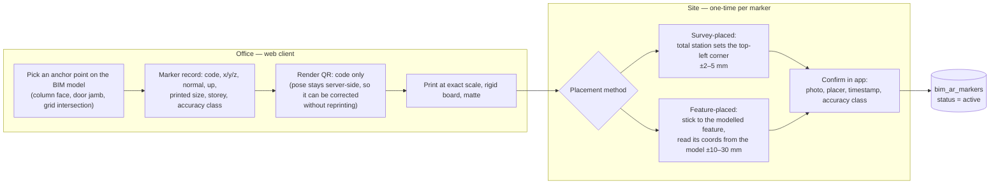
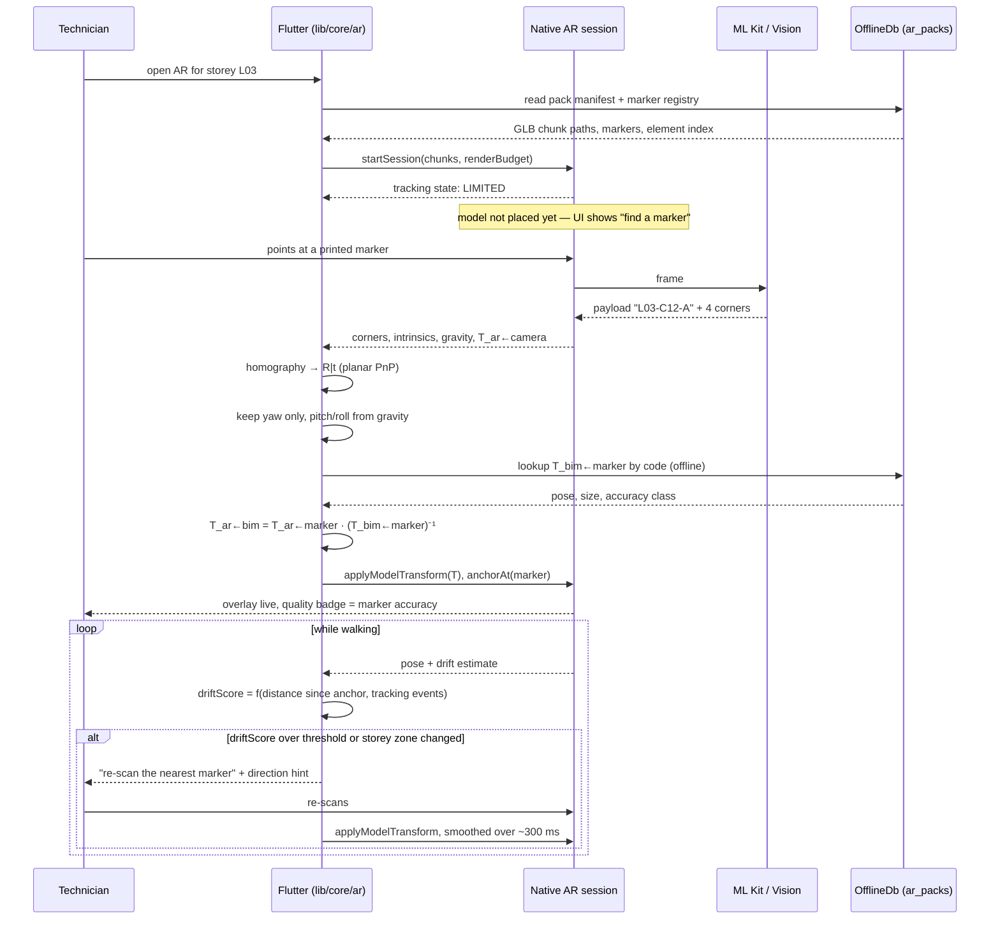
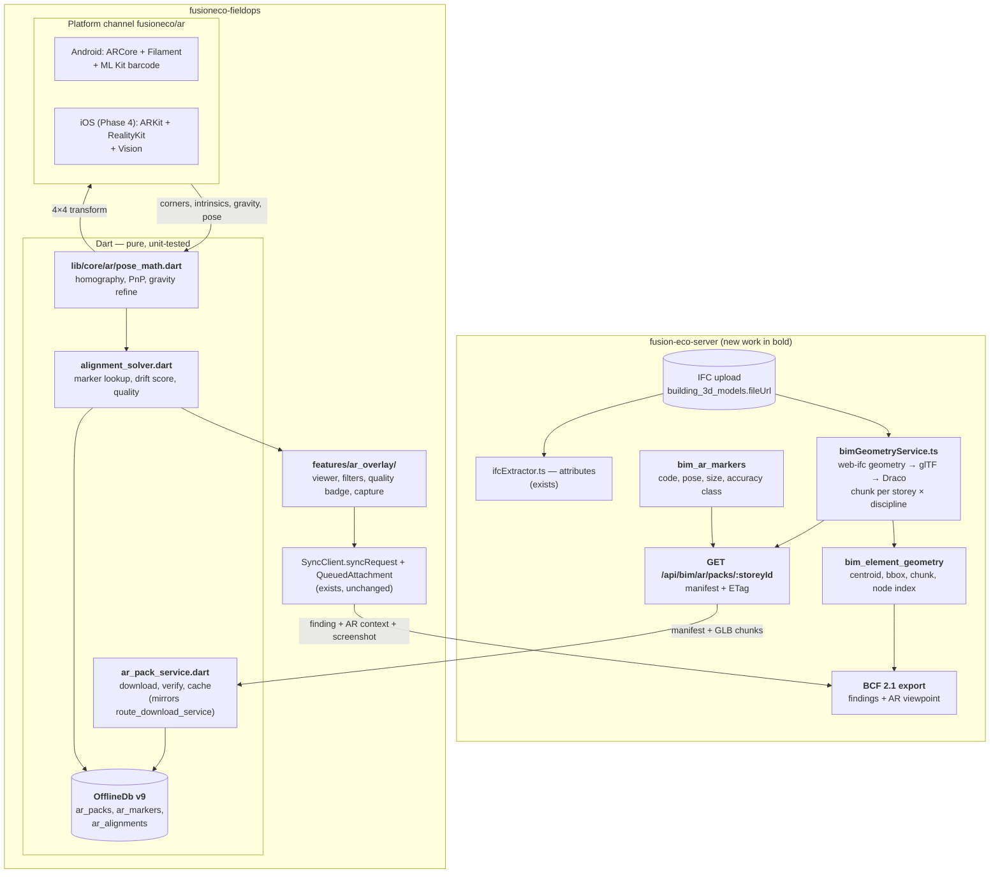

# AR BIM overlay — implementation plan

Standing in a plant room, a technician points the phone at a wall and sees the BIM model drawn over the real world: which pipe should be there, which pump the register says is behind that access panel, which elements of this week's handover are still missing. Tapping a drawn element gives its IFC GlobalId, and a finding raised from that view carries both the element identity and the camera pose that saw it.

This is the FieldOps answer to GAMMA AR, Dalux TwinBIM and Autodesk's AR viewers. It is deliberately **not** a re-implementation of those products: it reuses the C2O register, findings and offline queue that FieldOps already has, and adds only the three things missing — **geometry**, **alignment** and **a renderer**.

**Status:** planned. No code exists yet. Every "existing" reference below was read in source on 2026-09-25; every "new" item is a development item in §10.

**Prerequisite reading:** [architecture.md](architecture.md) for the offline engine this plan reuses wholesale, and [c2o-field-verification.md](c2o-field-verification.md) for the register, route packs and capture form the overlay hangs off.

---

## 1. Scope

### In scope

| | |
|---|---|
| **Overlay** | Storey-scoped BIM geometry drawn in world space over the camera feed, with discipline filters, transparency, and a horizontal section plane |
| **Alignment** | Printed QR markers surveyed or feature-placed on site, detected on-device, solving the BIM→world transform with no network call |
| **Identity** | Tap a drawn element → IFC GlobalId → the C2O register asset, using the same resolve path as a tag scan |
| **Capture** | Raise a C2O finding or field verification from the AR view, with an overlay screenshot and the camera pose, queued offline like every other write |
| **Round trip** | Export those findings as BCF 2.1 so they open in Navisworks, Solibri or Revit at the right element |
| **Offline** | Everything above works with the radio off, after a pack download |

### Not in scope

- **Setting-out or QA-grade measurement.** Visual-inertial tracking drifts 1–3 % of distance walked. This tool answers "is it there, is it right, is it finished"; it does not answer "is it within 5 mm".
- **Indoor positioning.** The overlay knows where the phone is relative to a marker, not relative to the building. Existing GPS check-in ([architecture.md](architecture.md)) stays the source of "which site".
- **Model authoring.** Read-only geometry. Findings are the only thing written back.
- **iOS at first release.** Android ships first, as everywhere else in this repo. The plan keeps the platform seam narrow so iOS is an additive phase (§10, Phase 4).

---

## 2. The licence constraint, and what it rules out

The requirement is a stack with **no licence fee, no per-seat runtime cost, no vendor account, and no commercial SDK**. That single constraint decides most of the architecture, so it is stated first.

### 2.1 Chosen stack

| Layer | Choice | Licence | Notes |
|---|---|---|---|
| Android AR tracking | **ARCore** (Google Play Services for AR) | Apache-2.0 SDK, service free | No key, no quota, no billing account for on-device tracking |
| Android rendering | **Filament** via **SceneView-Android** | Apache-2.0 | Google's own glTF renderer; what ARCore's samples use |
| iOS AR tracking (Phase 4) | **ARKit** | Free with the Apple Developer account already required to ship | |
| iOS rendering (Phase 4) | **RealityKit** / SceneKit | Free, first-party | |
| Barcode detection in-frame | **ML Kit Barcode Scanning** (Android, bundled model) / **Vision `VNDetectBarcodesRequest`** (iOS) | Free, on-device, no network | Both return **corner points**, which is what the pose solve needs |
| Pose solve, alignment math | **our own Dart** (`lib/core/ar/`) | ours | ~400 lines, pure, unit-tested — see §4 |
| Model format | **glTF 2.0 / GLB** | Khronos, royalty-free | |
| Mesh compression | **Draco** and/or **meshoptimizer** | Apache-2.0 / MIT | |
| Server-side glTF authoring | **gltf-transform** | MIT | |
| IFC parsing and tessellation | **web-ifc** | MPL-2.0 | **already a server dependency** — [ifcExtractor.ts:1](../../fusion-eco-server/src/services/bim/ifcExtractor.ts#L1) imports it today for attributes only |
| Issue interchange | **BCF 2.1** | buildingSMART open spec | server already models the import side |

Net new third-party cost: **zero**. Net new vendor account: **none**.

### 2.2 Rejected, and why

| Rejected | Reason |
|---|---|
| **Unity + AR Foundation** | The obvious shortcut and what most construction-AR vendors ship. Rejected: Unity's licence tiers, the splash-screen and seat requirements above the free threshold, and a history of runtime-fee changes. It would also add 50–80 MB to an APK and a second build toolchain for a team that has none. |
| **Vuforia, Wikitude, 8th Wall, MaxST** | All commercial per-app or per-seat. Vuforia's image targets would otherwise be a good fit. |
| **Autodesk APS / Forge Viewer, Trimble Connect SDK** | Commercial, and they would put the model behind someone else's cloud. |
| **ARCore Cloud Anchors** | Free at low volume, but it needs a Google Cloud project, quota and **a network round trip to resolve an anchor**. FieldOps exists because plant rooms have no signal. A hosted anchor service is architecturally wrong here, not just a licence question. Local markers do the same job offline. |
| **ARCore Augmented Images for the QR itself** | Free, but technically wrong: Augmented Images wants feature-rich, non-repeating artwork and scores QR codes poorly. It also needs a pre-built image database per marker, so adding a marker on site would need an app update. §4.2 uses the barcode detector's corner points instead — one code path, any marker, no database. |
| **`ar_flutter_plugin` and its forks** | MIT, so licence-clean, but they expose a fixed node/anchor API with no frame access, no camera intrinsics, no clipping planes and no occlusion control — none of which can be worked around from Dart. Frame access is the whole design (§4.2). Kept as a fallback only if Phase 0 overruns. |

---

## 3. Why marker alignment, and how it is set up

Alignment is the product. Rendering a GLB is a solved problem; putting it in the right place, repeatedly, by a technician in a hurry, is not.

### 3.1 Degrees of freedom

The transform wanted is `T_ar←bim`: BIM project coordinates into the AR session's world frame. Nominally six degrees of freedom. In practice **four**, because both frames are gravity-referenced — ARCore and ARKit build a world frame with Y along gravity, and IFC models are Z-up. The accelerometer gives pitch and roll for free.

Unknowns: **X, Y, Z and heading (yaw)**. That is exactly what one detected marker supplies, which is why a single QR is enough and why a second marker is a refinement rather than a requirement.

### 3.2 Marker lifecycle



Accuracy class travels with the marker and is shown in the app, because a technician must be able to tell a surveyed anchor from one someone taped to a column.

### 3.3 The coordinate-system trap

Real BIM models sit far from the origin — site eastings and northings in the hundreds of thousands. Rendering those directly in float32 destroys precision, so the geometry export **re-centres the model**. If marker coordinates are not shifted by the same offset, the overlay lands hundreds of kilometres away and everyone blames AR.

Rule for this codebase: the export writes its `modelOrigin` offset into `building_3d_models.metadata` ([building-3d-model.ts:10](../../fusion-eco-server/src/model/building-3d-model.ts#L10)), and **every** marker coordinate, element centroid and camera pose is stored and served in that same re-centred frame. `IfcMapConversion` / `IfcSite` georeferencing is resolved once, at export, and never again at runtime. One conversion, one place.

---

## 4. Runtime alignment

### 4.1 The solve

```
T_ar←bim  =  T_ar←marker · (T_bim←marker)⁻¹
```

- `T_ar←marker` — measured on the phone, this frame, from the detected code's four corners.
- `T_bim←marker` — looked up by marker code from the offline registry.

### 4.2 Where each half comes from

The native side owns the camera because ARCore and ARKit must; two camera sessions cannot coexist, which is why [mobile_scanner](../lib/features/scanner/scanner_screen.dart) cannot be reused inside an AR session. But the native side does only what the platform must do:

1. AR session delivers a frame plus the **camera intrinsics** (`ARCore Frame.getCamera().getImageIntrinsics()` / `ARKit ARCamera.intrinsics`) and the device pose in the AR world frame.
2. The frame goes to the platform barcode detector (ML Kit on Android, Vision on iOS). Both return the payload **and four corner points in image space**.
3. Corners, intrinsics, gravity vector and AR camera pose cross the method channel into Dart.

Everything after that is **pure Dart in `lib/core/ar/`**, testable on a laptop with synthetic inputs and no device:

4. Four coplanar correspondences (the marker's known physical corner positions, from its printed size) plus intrinsics → **homography by normalised DLT** → decompose to `R|t`. Standard planar PnP, about 200 lines, no OpenCV and no native dependency.
5. **Gravity refinement.** Marker-derived pitch and roll are the noisy part of a planar solve, especially at oblique viewing angles. Discard them: keep only the yaw, take pitch and roll from the IMU gravity vector, re-orthonormalise. This single step is the difference between an overlay that visibly swims and one that sits still.
6. Compose with the registry pose, hand the resulting 4×4 back over the channel, apply it to the model root, and drop a native anchor at the marker so relocalisation re-pins the model after tracking loss.

This split is the reason the platform seam stays small: **native detects, Dart decides.** iOS in Phase 4 implements steps 1–3 only.

### 4.3 Sequence



Re-alignment is **interpolated, never snapped**. A model that jumps reads as a bug even when the new pose is better.

### 4.4 Fallbacks when no marker is reachable

Both are Phase 3, both reuse the same solver:

- **Two-point alignment.** Tap a point in the model, walk to the physical equivalent, confirm; repeat. Two points plus gravity give the same four degrees of freedom, at whatever accuracy the technician's tapping allows.
- **Floor-plane snap plus manual nudge.** Detect the floor, snap the model's storey datum to it — that removes Z error outright — then drag and rotate for X, Y and heading. Fast, rough, honest: the quality badge says "manual".

---

## 5. Accuracy, and the rule it forces

| Error source | Typical | Driver |
|---|---|---|
| Corner detection → position | ±5–20 mm | marker size, scan distance, focus |
| Corner detection → **yaw** | **±0.5–2°** | viewing obliquity — the dominant term |
| Physical marker placement | ±2–30 mm | survey vs feature-placed |
| VIO drift after alignment | 1–3 % of path walked | lighting, texture, walking speed |
| Print scale error | proportional to depth | wrong printer scaling |

Yaw error pivots the whole model about the marker, so it grows with distance:

```
1° of yaw error  →   17 mm off at  1 m
                 →  175 mm off at 10 m
                 →  350 mm off at 20 m
```

Three consequences, all of which are product rules rather than engineering details:

1. **Scan close and square** — roughly 1 m, face-on. The app coaches this; an oblique detection is rejected rather than used.
2. **Bigger markers win** — 300 mm materially beats 150 mm. Marker size is per-marker data, not a constant.
3. **Many markers beat one perfect marker** — one per room, or every ~10 m of corridor. Re-anchoring resets drift and the yaw lever arm at the same time.

The app must show an honest quality badge (marker accuracy class, time and distance since anchor) and must **refuse to present a measurement**. A finding raised from a drifted view records its drift score, so the office can tell how much to trust it.

---

## 6. Architecture



Layering follows the repo's existing rule ([CLAUDE.md](../CLAUDE.md)): `features/*` → `state/*` → `data/*_repository.dart` → `SyncClient`. The AR additions sit in `core/ar/` as pure classes behind `abstract interface class` seams, next to `core/c2o/` — the same shape, for the same reason: nothing that matters should need a device to test.

---

## 7. Server work

### 7.1 The gap

[bim_elements](../../fusion-eco-server/src/model/bim-element.ts) stores IFC attributes, property sets, containment and classifications. It stores **no geometry and no placement** — `hadRepresentation` is a boolean, not a mesh. `web-ifc` is already a dependency but is used only for attribute extraction. So the geometry pipeline is genuinely new; the identity model it hangs off is not.

### 7.2 New tables

| Table | Purpose | Key columns |
|---|---|---|
| `bim_geometry_chunks` | One GLB per storey × discipline × LOD | `bimModelId`, `storeyGlobalId`, `discipline`, `lod`, `fileUrl`, `contentHash`, `triangleCount`, `byteSize` |
| `bim_element_geometry` | Per-element placement and the node that draws it | `bimElementId`, `globalId`, `centroid`, `bboxMin/Max`, `chunkId`, `nodeIndex` |
| `bim_ar_markers` | The marker registry | `bimModelId`, `buildingId`, `storeyGlobalId`, `code` (unique), `position`, `normal`, `up`, `printedSizeMm`, `accuracyClass`, `status`, `placedByUserId`, `placedAt`, `photoUrl` |
| `ar_alignment_events` | Telemetry: which marker, what residual, what drift | `userId`, `markerId`, `residualMm`, `yawResidualDeg`, `driftScore`, `capturedAt` |

`bim_element_geometry` is worth having even without AR: it answers "where is this asset in the model" for the web twin and for BCF viewpoints.

### 7.3 New endpoints

| Method | Path | Notes |
|---|---|---|
| `GET` | `/api/bim/ar/packs/:storeyGlobalId` | Manifest: chunk URLs + hashes, marker registry, element index, `modelOrigin`. `ETag` from the content hash set. |
| `GET` | `/api/bim/ar/markers?buildingId=` | Registry refresh alone — small, frequent, cheap |
| `POST` | `/api/bim/ar/markers/:id/confirm` | Site placement confirmation: photo, placer, accuracy class |
| `POST` | `/api/bim/ar/alignments` | Telemetry, queued like any other write |
| `POST` | `/api/c2o/findings/:id/bcf-export` | BCFZip with the AR viewpoint |

Chunk URLs are served through the existing [storageService.ts](../../fusion-eco-server/src/services/storageService.ts) and keyed by content hash, so they are immutable and indefinitely cacheable.

### 7.4 BCF

[c2o_bcf_issues](../../fusion-eco-server/src/model/c2o-bcf-issue.ts) already models topics, `globalIds`, `assetIds` and `viewpoints` with camera and component selection — the **import** side of BCF is built. Export is the new half, and an AR capture supplies a better viewpoint than a desktop tool does: the camera position and direction are literally where a person stood.

---

## 8. Offline packs

The AR pack is a route pack with geometry in it, so it copies the existing design rather than inventing one. `RoutePackStore` ([offline_db.dart:432](../lib/core/offline/offline_db.dart#L432)) is the template; `AR pack` gets a sibling `ArPackStore` interface with the same fake-testable shape.

**Schema v9** ([offline_db.dart:456](../lib/core/offline/offline_db.dart#L456) is at v8). Follow the repo rule: bump `version`, add DDL to `onCreate`, add an `if (oldVersion < 9)` step, keep reading old rows.

| Table | Holds |
|---|---|
| `ar_packs` | manifest, `versionTag`, `asOf`, storey, byte size, download state |
| `ar_markers` | the registry rows for cached storeys |
| `ar_alignments` | last good transform per storey, so reopening the view restores the model without a re-scan while the session lives |

GLB chunks are **files on disk** referenced by path, never base64 in a row. The existing base64-in-SQLite habit for photos already costs the Sync Center an O(n²) decode ([improvements.md](improvements.md) #12); it must not be repeated at 40 MB a chunk.

**Budgets**, enforced at export and asserted in the pack verifier:

| Budget | Target | Hard limit |
|---|---|---|
| Pack per storey, all disciplines | ≤ 60 MB | 120 MB |
| Triangles in view after culling | ≤ 400 k | 800 k |
| Chunk file | ≤ 20 MB | 40 MB |
| Cold open to first frame | ≤ 3 s | 6 s |
| Marker registry refresh | ≤ 200 kB | — |

Two dependencies on the existing backlog, both in [improvements.md](improvements.md):

- **#14 (`If-None-Match` is not wired, and a pack download REPLACEs rather than merges).** AR packs are far larger than route packs, so conditional refresh stops being a nicety. Fix it before Phase 2 ships, or every storey re-downloads on every open.
- **#1 (logout wipes the offline queue).** An AR finding is the most expensive kind of capture to lose — the technician has to walk back. Phase 3 should not ship on top of a queue that a 401 empties.

---

## 9. Capture and findings

No new offline machinery. An AR capture is an existing write with more context attached:

- Tap an element → `nodeIndex` → `globalId` → the C2O register, through the same resolve path a tag scan uses ([c2o_asset_resolver.dart](../lib/core/c2o/c2o_asset_resolver.dart)). An element the register does not know is still capturable — it becomes a finding against the model, not the asset.
- Submit through `syncRequest(..., entityType:, entityId:)`, with the overlay screenshot as a `QueuedAttachment`. Placeholder swap at flush time, exactly as photos work today.
- The body carries an `arContext` block: `markerId`, `alignedAt`, `driftScore`, `qualityClass`, camera position and direction in model coordinates, and the element's `globalId`. That block is what becomes a BCF viewpoint on export.

Because it is an ordinary queued write, it inherits the ordering rules, the 428/401 stop-the-run policy and the mutation-id replay protection in [flush_policy.dart](../lib/core/offline/flush_policy.dart) without a line of new sync code.

---

## 10. Development items

Priority follows [improvements.md](improvements.md): **P1** blocks the phase · **P2** needed for a real deployment · **P3** polish.
Effort: **S** < ½ day · **M** 1–3 days · **L** a week or more.

### Phase 0 — Spike: prove the alignment before building anything (target 1–2 weeks)

The go/no-go gate. If the measured accuracy is not good enough for the field, nothing downstream is worth building.

| # | Item | P | Effort | Acceptance |
|---|---|---|---|---|
| AR-1 | One storey of a real IFC hand-converted to GLB with a throwaway script; no pipeline, no tables | P1 | M | A ≤ 60 MB GLB of a real storey opens in a glTF viewer with correct dimensions |
| AR-2 | Bare Android AR activity: ARCore session + Filament, load the GLB, apply a hard-coded transform | P1 | M | Model renders, tracks, survives a backgrounding |
| AR-3 | `lib/core/ar/pose_math.dart` — normalised DLT homography, planar PnP decomposition, gravity refinement, all pure | P1 | M | Unit tests recover a known pose from synthetic corner sets within 0.2° and 3 mm, including at 45° obliquity |
| AR-4 | End-to-end spike: ML Kit corners → channel → Dart solve → transform back → overlay, with a printed 200 mm marker in a real room | P1 | M | **Gate:** walk a 20 m corridor and back; log the drift. Decide go/no-go and record the numbers in [LEARNINGS.md](../LEARNINGS.md) |

### Phase 1 — Server: geometry pipeline and marker registry (target 3–4 weeks)

| # | Item | P | Effort | Acceptance |
|---|---|---|---|---|
| AR-5 | `bimGeometryService.ts`: web-ifc geometry streaming → per-element meshes → merge by storey × discipline | P1 | L | A 300 MB IFC converts without exceeding the worker's memory ceiling |
| AR-6 | glTF authoring with gltf-transform + Draco/meshopt; content-hash file names | P1 | M | Output meets the §8 budgets; identical input produces an identical hash |
| AR-7 | `bim_element_geometry` and `bim_geometry_chunks` migrations, plus the `nodeIndex → globalId` map | P1 | M | Every element with a representation resolves to exactly one node |
| AR-8 | `modelOrigin` written to `building_3d_models.metadata`, applied to every exported coordinate | P1 | S | A round-trip test: element centroid + origin == its IFC world coordinate |
| AR-9 | BullMQ job for conversion, one per model version, resumable | P1 | M | Re-running a completed job is a no-op; a crashed job restarts cleanly |
| AR-10 | `bim_ar_markers` migration, CRUD, QR render, and marker placement in the web client | P1 | L | A marker placed on the web model prints, scans back to the same code, and reads the same pose |
| AR-11 | `GET /api/bim/ar/packs/:storeyGlobalId` with a correct `ETag` and a 304 path | P1 | M | Second request with `If-None-Match` returns 304 with no body |

### Phase 2 — App: AR core (target 4–6 weeks)

| # | Item | P | Effort | Acceptance |
|---|---|---|---|---|
| AR-12 | Platform channel contract `fusioneco/ar` — frozen, documented here, versioned | P1 | S | iOS can be added later without changing the Dart side |
| AR-13 | Android plugin: session lifecycle, chunk loading, transform apply, anchors, screenshot | P1 | L | Survives rotation, backgrounding, tracking loss and low memory |
| AR-14 | `ar_pack_service.dart` + `ArPackStore`, mirroring [route_download_service.dart](../lib/core/c2o/route_download_service.dart) | P1 | M | Download resumes, verifies hashes, and refreshes with `If-None-Match` |
| AR-15 | OfflineDb **schema v9**: `ar_packs`, `ar_markers`, `ar_alignments` + upgrade step | P1 | M | A v8 database upgrades with its queue and drafts intact |
| AR-16 | `alignment_solver.dart`: marker lookup, drift scoring, quality class, re-anchor prompts | P1 | M | Pure tests over a synthetic walk; prompts fire at the configured thresholds |
| AR-17 | `features/ar_overlay/`: viewer, discipline and storey filters, transparency, section plane, quality badge | P1 | L | Filters apply without a reload; the badge never reads better than the data supports |
| AR-18 | Tap-to-identify → `globalId` → register asset, reusing the C2O resolver | P1 | M | A tap on a known asset opens the same detail screen a tag scan does |

### Phase 3 — Field value (target 3–4 weeks)

| # | Item | P | Effort | Acceptance |
|---|---|---|---|---|
| AR-19 | Raise a finding from the AR view: `arContext` + overlay screenshot through `syncRequest` | P1 | M | Raised in airplane mode, it flushes correctly on reconnect |
| AR-20 | Server: accept and store `arContext` on findings and field verifications | P1 | M | Round-trips through the existing envelope helpers |
| AR-21 | BCF 2.1 export with the AR viewpoint | P2 | L | The exported BCFZip opens in Solibri at the right element and camera |
| AR-22 | Version-diff overlay — green built, red missing, amber changed — from [bimVersionDiff.ts](../../fusion-eco-server/src/services/bim/bimVersionDiff.ts) | P2 | M | Two model versions colour correctly against a known delta |
| AR-23 | Two-point alignment fallback | P2 | M | Achieves the same transform within the accuracy the method allows |
| AR-24 | Floor-plane snap plus manual nudge, badged "manual" | P3 | M | Cannot be mistaken for a marker-aligned session |

### Phase 4 — iOS, hardening, scale (target 3–4 weeks)

| # | Item | P | Effort | Acceptance |
|---|---|---|---|---|
| AR-25 | iOS plugin against the frozen channel: ARKit + RealityKit + Vision | P2 | L | Same Dart, same tests, no Dart changes |
| AR-26 | LiDAR occlusion on capable iPhones; Depth API on capable Android | P3 | M | Geometry behind a real wall is hidden |
| AR-27 | Alignment telemetry dashboard — residuals and drift per marker, to find bad markers | P2 | M | A mis-placed marker is visible in the data within a week |
| AR-28 | Device allow-list and graceful degradation on non-ARCore hardware | P2 | S | An unsupported device shows an explanation, never a crash or a blank view |

### 10.1 Test strategy

The repo has no mocking library and tests pure functions behind hand-written fakes ([CLAUDE.md](../CLAUDE.md)). AR fits that better than it looks, because the maths is where the bugs are:

- `pose_math_test.dart` — synthetic corner sets at known poses, including degenerate and oblique cases. No device.
- `alignment_solver_test.dart` — a scripted walk: anchor, drift, re-anchor, storey change. Fake `ArPackStore`.
- `ar_pack_service_test.dart` — fake fetcher, 304 handling, hash mismatch, resume after interruption.
- The native plugins get a manual field checklist, not unit tests. That is honest: a tracking session cannot be asserted in CI.

Note the standing constraint — this Mac cannot run `flutter analyze` or `flutter test` (Flutter 3.19.3 installed, ≥ 3.44 required). Nothing here may be reported as green until it has run on a correct toolchain.

---

## 11. Open decisions

| # | Decision | Why it matters |
|---|---|---|
| 1 | Who places markers — surveyor, commissioning team, or FM on handover? | Sets the accuracy class the whole feature can promise, and who is accountable when an overlay is wrong |
| 2 | Marker density standard: per room, or every N metres of corridor? | Drives print and placement cost, and caps the yaw lever arm (§5) |
| 3 | Does AR ship as a C2O feature flag, like `isDigitalTwin`, or to everyone on supported devices? | Decides whether Phase 2 needs a new `GET /api/auth/config` flag |
| 4 | Storey-scoped packs only, or whole-building for small sites? | Changes the budgets in §8 and the manifest shape |
| 5 | Is the existing web twin ([twin_screen.dart](../lib/features/twin/twin_screen.dart), a WebView) replaced by the native viewer, or kept beside it? | Two 3D stacks is a maintenance cost that should be chosen, not drifted into |

---

## 12. Summary

The expensive half already exists. FusionEco has IFC ingestion, an element identity model, a findings engine, BCF import, route packs and a proven offline queue. What AR adds is geometry export, a marker registry, ~400 lines of pose maths, and a platform view per OS.

The licence constraint costs one thing — Unity's ready-made cross-platform AR — and buys three: no per-seat cost, no vendor lock-in on the model, and no hosted anchor service standing between a technician in a basement and their job.

The risk is not rendering. It is alignment UX and marker discipline on site. Phase 0 exists to measure that before anything else is built.
