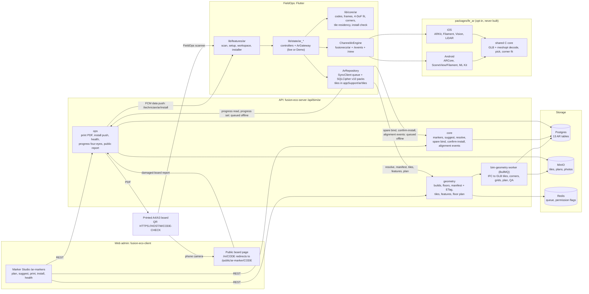

# AR BIM overlay: end-to-end status (2026-09-26)

Where the AR feature stands across all three repos after the multi-agent build and the cross-repo contract check. Read this first. It says what is proven, what is only written, and what a person has to do next, in order.

- **Built (v1, nothing committed):** server (`fusion-eco-server`, `/api/bim/ar`), web admin and public board page (`fusion-eco-client`), FieldOps screens, logic and offline packs (this repo), and the native plugin `packages/fe_ar`.
- **Proven:** the shared maths (codes, frames, fit, coverage) gives identical results in TypeScript on the server and web and in Dart. Real server-made tiles load in the native C core. Every wire shape and channel key was checked across all three repos.
- **Not yet proven:** no Flutter ≥ 3.44 analyze or test run, no device run, no native build, no live API call with a login, no database, no browser.

Per-repo detail: [ar-implementation.md](ar-implementation.md) (FieldOps), [`../../fusion-eco-server/documentation/ar-markers-and-geometry.md`](../../fusion-eco-server/documentation/ar-markers-and-geometry.md) (server), [`../../fusion-eco-client/documentation/ar-markers.md`](../../fusion-eco-client/documentation/ar-markers.md) (web), [`../packages/fe_ar/CHANNEL.md`](../packages/fe_ar/CHANNEL.md) (native wire contract). Specs: [ar-bim-overlay.md](ar-bim-overlay.md), [ar-markers-and-qr.md](ar-markers-and-qr.md), [ar-setup-and-gamma-parity.md](ar-setup-and-gamma-parity.md).

## 1. The whole system



The frames never mix. Marker poses are stored in IFC world. Everything served to a phone or the web is in the **tile frame**: building-local, Y up, one frame per building (contract C2). The phone fits only a yaw and a translation from tile to AR world.

## 2. Cross-repo contract check (this pass)

Every row was checked by reading both sides. Where it says "ran", the check was executed.

| Contract | Server ↔ web | Server ↔ FieldOps | Result |
|---|---|---|---|
| C1 codes | ran: goldens, normalize, format, payload on both TS copies; 2,000 minted codes valid on both | ran: goldens + `fromScan` in real Dart; 4,500 server-printed payloads (upper/lower case, http, trailing slash, query, bare, 500 one-typo rejects) parsed by `MarkerCode.fromScan` | match |
| C2 frames + fit | ran: goldens A and B on both | ran: goldens A and B, and the 30° / (1, 0.2, −3) fit golden in real Dart (θ and t within 1e-5, quality `locked`) | match |
| C2 sigma rule | — | the PnP doubling was lost on the live path (**fixed**, §3) | fixed |
| C3 coverage | ran: 5 goldens + buckets on both | ran: 5 goldens in real Dart | match |
| C6 shapes | read: Marker, floors, plan, manifest, suggest, health, recheck, print headers, public report path and codes | read: Marker, resolve (+ 410 `nearest`, 409/403/404 codes), manifest, tile URL, features, plan, progress, bind, confirm-install `checks`, alignment `observations[].ref` = code, `quality` names | match (notes below) |
| C6 ETag / 304 | — | server quotes the ETag and strips quotes and `W/` on `If-None-Match`; app handles 304 explicitly | match |
| C6 push link | — | `/technician/ar/install?floorId=` and entity `ar_install_request` routed by both app routers | match |
| C7 tile format | — | ran: 195 real tiles from the server pipeline (generated plant room + FEDEMO) parsed by the native C core under ASan/UBSan: layer, buildId, triangle and line counts, featureIds table, bounds all equal; 474 of 474 per-feature rays resolve to a feature | match |
| C8 channel | — | read: 16 C8 methods and 7 event types identical in Dart, `CHANNEL.md`, Kotlin and Swift; every argument and event key matches; extensions are additive | match |

Notes that need no code change:
- **Progress `summary.installed` is cumulative on the server** (installed + verified). FieldOps doesn't read the server's counts: it recounts from the rows and takes only `total`, so its "Installed %" is right. The web doesn't call `/progress`. Any new consumer must know this.
- ~~**Health's "adopt the new position" suggestion needs `posTile` on marker observations.**~~ **Done (2026-09-26, after the workflow):** `ar_session_controller._reportAlignment` sends `posTile = fit.arToTile(aAr)` for every marker observation, `ArObservationSummary` carries it, and the live gateway maps it. Checked on the Dart 3.3.1 mirror (193 tests pass, 0 errors/warnings) and the Flutter 3.19 scratch analysis (0 findings in the three edited files).
- **The live resolve path ignores `retiredAt` and the no-build building name** that the server sends with 410 and 409. The screens fall back to their generic text. It's polish, not a contract break.
- **The QR host fallback is 21 characters** (`eco.thefusionapps.com`), so boards print as QR version 3 until `AR_MARKER_HOST` (19 characters or fewer) is set. Parsers accept any host.

## 3. Fixes made in this pass

- [`lib/state/ar_setup_controller.dart`](../lib/state/ar_setup_controller.dart) `_markerObs`: a board sighted only by PnP now always counts at double sigma (contract C2). Before, the doubling applied only when the manifest had no `sigmaM`, but the server always sends one, so on the live path a PnP sighting weighed as much as a depth-measured one. Checked with the Flutter 3.19 scratch type-check: no new findings.

The per-repo verify passes fixed the rest before this pass: the web `/m` redirect (it would have returned 500 on every scan), board height on the web, per-build feature state on the phone, alignment `posTile` kept on the server, and host-change review wired after a publish.

## 4. What ran, and how

Run in this pass, 2026-09-26, on this Mac:

| Check | Command | Result |
|---|---|---|
| C1–C3 goldens, server + web TS | esbuild bundle of `fusion-eco-server/src/services/ar/{markerCodeService,frames,coverage}.ts` and `fusion-eco-client/{components/ar-markers/lib/markerCode,components/ar-markers/lib/frames,lib/ar/coverage}.ts`, then `node` | 47 checks pass, 2,000 minted codes valid on both |
| C1–C3 goldens + fit, Dart | `dart bin/golden.dart` (Dart 3.3.1) against a scratch copy of `lib/core/ar/*` | 32 checks pass |
| Server QR → app parser | server `markerQrPayload` × 500 codes × 9 variants → `MarkerCode.fromScan` (Dart 3.3.1) | 4,500 of 4,500 |
| C7 tiles, server → native | `buildTilesFromIfc` on the plant-room fixture and `seed-fixtures/fedemo/FEDEMO_TEST_CLEAN.ifc`, then a C driver on `packages/fe_ar/src/fe_ar_core.c` built with `cc -fsanitize=address,undefined` | 195 tiles, 0 failures, 5,688 triangles, 552 line segments, 474/474 rays resolved |
| Server AR unit tests | `npx vitest run src/services/ar src/model/__tests__/syncCoverage.test.ts` | 19 files, 256 tests pass |
| FieldOps pure AR tests | `dart test` (Dart 3.3.1, package:test) over the 13 `test/ar_*_test.dart`, Flutter-binding group stripped | 193 pass |
| FieldOps type-check | Flutter 3.19.3 `flutter analyze` over a scratch copy of `lib/` + AR tests (Dart 3.8 syntax rewritten down) | same 613 messages as the verify pass, all old-toolchain noise; none in the edited file |

Reported by the per-repo verify passes (not re-run here): server `tsc` clean on every AR file and full vitest 1,320 passing (one old failure elsewhere); web scoped `tsc` and `eslint` clean on every AR file, 32,600 fuzz checks against the compiled server maths, the `/m` redirect exercised through Next 15.5's real middleware adapter, i18n key parity; FieldOps i18n (528 `ar.*` keys in both files); the fe_ar C core's own 131 checks plus a 3,000-case corruption fuzz, `FeArRenderer.mm` syntax-checked against Filament 1.72.1 headers, and the Swift files type-checked against stubs.

## 5. Written but not verified

- **FieldOps Dart (about 14k lines of screens and controllers, plus core and data).** It was never analyzed or tested on Flutter ≥ 3.44, never rendered, and never run on a device. It has no widget or controller tests (P-004, P-009).
- **`packages/fe_ar`.** Kotlin, Gradle, CMake, the iOS pod, the ObjC++ renderer and the Filament materials were never built or compiled (`matc` never ran). It is not in the app pubspec. 11 `TODO(slice-0)` markers remain (P-005).
- **Server paths that need a DB, storage or HTTP.** Builds, MinIO, BullMQ, socket emits, transactions and advisory locks were never exercised. No endpoint was called with a login. The three apply scripts never ran (server P-015, P-016).
- **Web.** No page was ever opened in a browser or run against the live API (web P-018).
- **Physical.** No board has been printed and measured, no QR scanned from 2 m, no push delivered to a phone (server P-021, P-022).

## 6. What a person must do next, in order

1. **Review and commit per repo.** Commit the AR files only: all three repos hold other people's uncommitted work. File lists: FieldOps [ar-implementation.md §2](ar-implementation.md#2-file-map), server doc §11 "Where things are", web doc "Where things are". Suggested order: server, then web, then FieldOps.
2. **Create the tables.** On each database, dry-run first, read the output, then apply:
   ```bash
   cd fusion-eco-server
   npx ts-node src/scripts/applyArTables.ts            # dry run, all 13 tables
   npx ts-node src/scripts/applyArGeometryTables.ts    # dry run, the 6 geometry tables
   npx ts-node src/scripts/applyArOpsTables.ts         # dry run, the 4 ops tables
   npx ts-node src/scripts/applyArTables.ts --apply    # after review: creates every missing table
   ```
   The API's boot guard (`DB_AUTO_ENSURE_SCHEMA`, on by default) has **probably already created them on the dev DB**, because a `npm run dev` started after the models were registered. The dry run shows which are `present`.
3. **Pick and set the short marker host.** Set `AR_MARKER_HOST` on the server and `NEXT_PUBLIC_AR_MARKER_HOST` on the web to the **same** host of **19 characters or fewer**, before the first print run. That host must serve the web app, whose middleware sends `/m/<code>` and `/M/<code>` to the public page. Also set `AR_REPORT_SALT`, and declare `AR_MARKER_HOST`, `AR_REPORT_SALT` and `SELF_BASE_URL` in the server's `utils/env.ts` and `.env.example` (server P-020).
4. **Trigger a first geometry build on a real model** (as an office user, after storey-to-floor matching):
   ```bash
   curl -X POST "$API/api/bim/ar/builds" -H "Authorization: Bearer $TOKEN" \
        -H "Content-Type: application/json" -d '{"bimModelId":"<building_3d_models.id>"}'
   curl "$API/api/bim/ar/builds?buildingId=<id>" -H "Authorization: Bearer $TOKEN"          # until published
   curl "$API/api/bim/ar/buildings/<id>/floors" -H "Authorization: Bearer $TOKEN"           # model shows ready
   ```
   Then plan boards in Marker Studio, print one A4 at 100 %, and check the 100 mm line and the 115 mm QR with a ruler.
5. **Install Flutter ≥ 3.44 and run the real checks** in this repo:
   ```bash
   flutter pub get --enforce-lockfile
   flutter analyze
   flutter test
   ```
   Then walk every flow in **Demo mode** (no native AR needed): scan sheet, setup by corners and by board, workspace on a phone and on a tablet, installer run, spare registration, and progress with four-eyes.
6. **Enable `fe_ar` and build slice 0 on devices.** Add the path dependency to the app pubspec as `packages/fe_ar/README.md` describes, compile the materials with `matc`, then build on **an Android phone with ARCore** and **a LiDAR iPad**. Settle the 11 `TODO(slice-0)` markers, and measure QR lock time and spread, corner-snap accuracy and the performance budgets in [ar-bim-overlay.md §9](ar-bim-overlay.md).
7. **Replace the app-link placeholders.** In `fusion-eco-client/public/.well-known/`, put the release keystore's SHA-256 fingerprint in `assetlinks.json` and the Apple Team ID in `apple-app-site-association`. Add a `Content-Type: application/json` header rule for the AASA file in `next.config.mjs`, and wire `/m/<code>` App Links in the app (web P-020, FieldOps P-010).

Decisions and small edits in shared files that the AR agents were not allowed to make:
- **Web Settings toggle for `isArMarkers`** (web P-019). Until it exists, admins can't switch on the AR Markers page in production.
- **Gate the app's AR entry points by `isArView` / `isArInstall`** (FieldOps P-007). On the server, `isArInstall` defaults to off.
- **Location gate** (server P-019). Technician AR writes are not exempt from the 24 h check-in rule. Nothing is lost: a 428 stops the flush and keeps the queue until the next check-in. Exempting the four AR evidence POSTs, as snags are, would avoid the pause.
- **Auto-queue an AR build** after IFC upload and floor matching (server P-018).
- **Two stale sentences** in `fusion-eco-server/documentation/ar-markers-and-geometry.md` (line 16) and the last **State** line of the server's AR LEARNINGS entry still say no table exists. Correct them once step 2 has run.

## 7. Open work by repo

| Repo | Items |
|---|---|
| Server `PENDING.md` | P-015 tables, P-016 live smoke run, P-018 auto-build, P-019 location gate, P-020 env + host, P-021 push, P-022 print acceptance, P-023 GLB in a real renderer, P-024 large IFCs, P-025 Health persistence, P-026 storage GC, P-027 spec items not built, P-028 report rate limit, P-029 CLAUDE.md link |
| Web `PENDING.md` | P-018 browser QA, P-019 Settings toggle, P-020 app links + env, P-021 design gaps (no Plan/3D toggle, poll-based install feed) |
| FieldOps `PENDING.md` | P-004 Flutter ≥ 3.44 + device, P-005 fe_ar slice 0, P-006 Verify/Snag hand-off context, P-007 permission gates, P-008 offline gaps, P-009 tests + one demo dataset, P-010 extras (torch, lasso `pickMany`, lock-ring progress, App Links) |

Not yet in any PENDING file (from this pass): surface `retiredAt` and the building name on the retired and no-build scan sheets. (Sending `posTile` on marker observations was done after the workflow; see above.)
