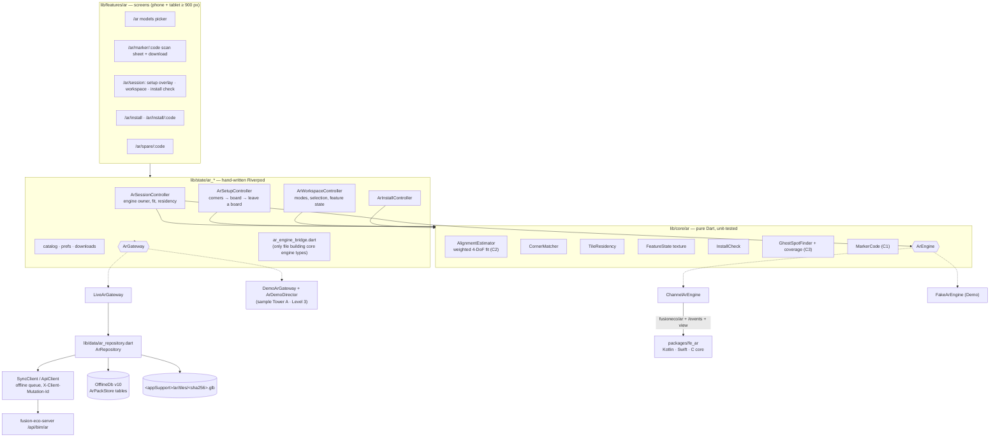
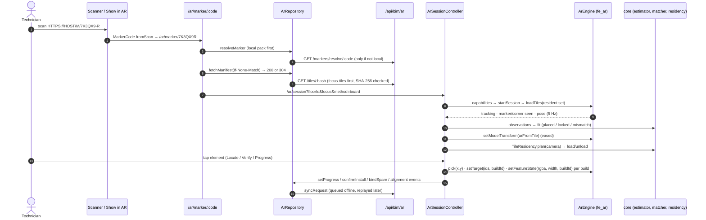

# AR BIM overlay: what is built in FieldOps, and how it fits together

**Status (2026-09-26):** v1 is **written end to end** in this repo: the pure AR logic, the floor-pack storage, every AR screen with a Demo mode, and the native plugin `packages/fe_ar`. It has **not** run on Flutter ≥ 3.44, on a device, or against a live server. §9 lists exactly what was checked and how, and §10 lists what is still owed ([PENDING.md](../PENDING.md) P-004…P-010).

This is the map of the code. The design lives in the three plan docs:
- [ar-bim-overlay.md](ar-bim-overlay.md): architecture, the 4-DoF fit, tiles, the `fe_ar` contract.
- [ar-markers-and-qr.md](ar-markers-and-qr.md): codes, boards, resolve, the install and spare flows.
- [ar-setup-and-gamma-parity.md](ar-setup-and-gamma-parity.md): the setup order (two corners, then leave a board), the workspace and GAMMA parity.

The server side (`/api/bim/ar`) is in `../fusion-eco-server/src/routes/ar*Routes.ts` and `src/services/ar/`. The web admin lives in `../fusion-eco-client`.

---

## 1. The pieces at a glance

**Native executes, Dart decides.** The engine (camera, tracking, detection, drawing, picking) only runs commands. Every decision is made in pure Dart under `lib/core/ar/`: which observation to trust, where the model goes, which tiles are resident and what is highlighted. The screens never touch the engine or the repository directly. They go through two seams, `ArGateway` for data and `ArSessionController` for the engine.

## 2. File map

### 2.1 `lib/core/ar/`: pure logic, no widgets except the view

| File | What it is |
|---|---|
| [marker_code.dart](../lib/core/ar/marker_code.dart) | C1 codes: check character, `normalize`, `display`, `fromScan` (URL or bare code → canonical 7 chars), `qrPayload`, `spareLabel` |
| [vec.dart](../lib/core/ar/vec.dart) | Immutable `Vec2`, `Vec3`, column-major `Mat4` (`fromYawTranslation`, `invertRigid`, …) |
| [frames.dart](../lib/core/ar/frames.dart) | C2 project ↔ tile conversions (building frame, Z-up → Y-up swap) |
| [alignment_estimator.dart](../lib/core/ar/alignment_estimator.dart) | Sealed `ArObservation` (`MarkerObs`, `CornerObs`), the weighted closed-form fit, outlier drop, quality states, `DriftMonitor`, nudge axis |
| [corner_matcher.dart](../lib/core/ar/corner_matcher.dart) | First corner (faces oriented toward the camera to remove the 90° ambiguity), `matchSecond`, `candidatesNear`, `suggestSecond`, `rankForRoom` |
| [tile_residency.dart](../lib/core/ar/tile_residency.dart) | 15 m radius, 3 m hysteresis, triangle budget, target tiles pinned |
| [install_check.dart](../lib/core/ar/install_check.dart) | The installer self-check (right board, print scale, position, tilt), i18n message keys, `toChecksJson` |
| [feature_state.dart](../lib/core/ar/feature_state.dart) | The RGBA feature-state texture: alpha 0 hidden, 85 ghost, 170 normal, 255 highlight |
| [coverage.dart](../lib/core/ar/coverage.dart) | C3 predicted accuracy, the same maths as the server and web heatmap |
| [ghost_spot.dart](../lib/core/ar/ghost_spot.dart) | Where to leave a spare board (coverage gain, clear of doors and equipment), `pairFor` |
| [sha256.dart](../lib/core/ar/sha256.dart) | Tile hash check without a new dependency |
| [ar_engine.dart](../lib/core/ar/ar_engine.dart) | The `ArEngine` interface, value types, and the sealed `ArEvent` family with wire-map parsing |
| [channel_ar_engine.dart](../lib/core/ar/channel_ar_engine.dart) | `ArEngine` over the `fe_ar` plugin. `MissingPluginException` → `supported: false, reason: engine-not-installed` |
| [fake_ar_engine.dart](../lib/core/ar/fake_ar_engine.dart) | `FakeArEngine` with scripted stories plus `ArDemoScenario`, used in tests and for Demo mode tracking |
| [ar_view.dart](../lib/core/ar/ar_view.dart) | `AndroidView`/`UiKitView` (`fusioneco/ar/view`), or a drawn stand-in camera surface |

### 2.2 Data

| File | What it is |
|---|---|
| [domain/ar_models.dart](../lib/domain/ar_models.dart) | Every C6 JSON shape, parsed tolerantly (four envelope shapes, string numbers). `ArApiError` includes the nearest active board for a retired one |
| [data/ar_repository.dart](../lib/data/ar_repository.dart) | `ArRepository`: floors, local-first `resolveMarker`, `fetchManifest` (ETag, **explicit 304**), `downloadTiles` (hash diff, focus first, SHA-256 verified, atomic write, resumable), features, plan, progress. It also holds the queued writes: `bindSpare`, `confirmInstall` (photo as a `QueuedAttachment`), `postAlignmentEvents`, and `setProgress` (local-first with four-eyes pre-check). Seams: `ArTransport`, `ArSync`, `ArTileFiles` |
| [core/offline/offline_db.dart](../lib/core/offline/offline_db.dart) | Schema **v10**: `ar_manifests`, `ar_tiles`, `ar_features`, `ar_markers` (`local_only` survives a refresh), `ar_corners`, `ar_grid_lines`, `ar_progress` (`pending` beats the server copy), `ar_prefs`. Implements `ArPackStore`. `wipe()` clears them; tile **files** stay on disk and are re-adopted after a hash check |

### 2.3 `lib/state/`: controllers and the two seams

| File | What it is |
|---|---|
| [ar_gateway.dart](../lib/state/ar_gateway.dart) | `ArGateway`, everything the screens ask of the outside world |
| [ar_gateway_live.dart](../lib/state/ar_gateway_live.dart) | The only file mapping `domain/ar_models.dart` and `ArRepository` to view models |
| [ar_demo_gateway.dart](../lib/state/ar_demo_gateway.dart), [ar_demo_director.dart](../lib/state/ar_demo_director.dart) | Demo mode's sample floor, and the "physical world" behind a hidden pose (§6) |
| [ar_engine_bridge.dart](../lib/state/ar_engine_bridge.dart) | The only place engine types are constructed (tile refs, layers, pins, the fake, the view) |
| [ar_session_controller.dart](../lib/state/ar_session_controller.dart) | Owns the engine: start/stop, capabilities, download, tile residency, events → observations → fit → `setModelTransform`, drift, target, toasts (engine coaching codes become coaching, not errors) |
| [ar_setup_controller.dart](../lib/state/ar_setup_controller.dart) | The setup ladder (`ArSetupStep`): method → corner A → corner B → locked → leave a board → register; board scan and lock; nudge; mismatch |
| [ar_workspace_controller.dart](../lib/state/ar_workspace_controller.dart) | Modes (Locate, Verify, Progress, Snags, Forms), selection (single, multi, lasso), tools, layers, and the **per-build** feature-state push |
| [ar_install_controller.dart](../lib/state/ar_install_controller.dart) | Install run → find the spot → self-check → confirm through the queue |
| [ar_catalog_controller.dart](../lib/state/ar_catalog_controller.dart), [ar_prefs_controller.dart](../lib/state/ar_prefs_controller.dart), [ar_downloads_controller.dart](../lib/state/ar_downloads_controller.dart) | Entry resolution (asset → floor), the Demo flag and remembered method per floor (`ar_prefs`), background floor-pack downloads |
| [ar_view_models.dart](../lib/state/ar_view_models.dart) | What the screens render, kept apart from the wire models |
| [providers.dart](../lib/state/providers.dart) | `arEngineProvider` (a `ChannelArEngine`), `arRepositoryProvider`, `arPackStoreProvider` (the `OfflineDb`) |

### 2.4 `lib/features/ar/`: screens

| Path | Board(s) |
|---|---|
| [ar_models_screen.dart](../lib/features/ar/ar_models_screen.dart) | TabModels / PhModels: building → floor → tick the models to show together |
| [ar_marker_screen.dart](../lib/features/ar/ar_marker_screen.dart) | M1Scan, M2Ready: every §3.3 resolve error with a next step, then progressive download |
| [ar_session_screen.dart](../lib/features/ar/ar_session_screen.dart) | The one camera screen; hosts setup, the workspace or the install check |
| [setup/](../lib/features/ar/setup/) | TabMethod/PhMethod, S1–S5, TabSnap, M3Lock, M4Aligned, TabRegister/PhRegister |
| [workspace/](../lib/features/ar/workspace/) | TabWork/PhWork, M5Locate, M6Verify, TabMenu/PhMenu + Layers |
| [install/](../lib/features/ar/install/) | I1Run, I2Guide, I3Check |
| [ar_spare_screen.dart](../lib/features/ar/ar_spare_screen.dart) | I4Spare outside a session |
| [widgets/](../lib/features/ar/widgets/) | Glass chrome, the honest badge, the mini plan, the snap pin, the Demo scene, the unsupported fallback, entry buttons |
| [ar_ui.dart](../lib/features/ar/ar_ui.dart) | `arTr`, units, haptics, icons, the 900 px breakpoint |
| [../../theme/fe_ar_colors.dart](../lib/theme/fe_ar_colors.dart) | AR overlay colour tokens |

Hooks added to shared files: [router.dart](../lib/app/router.dart) (`Routes.ar*` and six routes), [scanner_screen.dart](../lib/features/scanner/scanner_screen.dart) (a marker URL is checked **before** C2O; a bare code is tried only after everything else passes on it), "Show in AR" on [asset detail](../lib/features/asset_detail/asset_detail_screen.dart) and [order detail](../lib/features/order_detail/order_detail_screen.dart), `ArDashboardCard` on the [dashboard](../lib/features/dashboard/dashboard_screen.dart), and an install-request fallback in **both** notification routers ([notification_route.dart](../lib/core/utils/notification_route.dart), [push_service.dart](../lib/core/push/push_service.dart)). 528 `ar.*` keys are in both [en.json](../assets/i18n/en.json) and [ar.json](../assets/i18n/ar.json).

### 2.5 `packages/fe_ar/`: the native plugin (opt-in, never built)

A headless Flutter plugin. Android uses Kotlin, SceneView 4.39, ARCore and ML Kit. iOS uses Swift, ARKit, Vision and Filament through Objective-C++. A shared C99 core does GLB and meshopt decoding, picking, corner fitting and the overlay GLB. The wire contract is [CHANNEL.md](../packages/fe_ar/CHANNEL.md); building and enabling are in the [README](../packages/fe_ar/README.md). It is **not** in the app's `pubspec.yaml`.

## 3. A session, end to end

Corner-first setup is the same loop, with `detectCornerAt` polled at the pin every 600 ms instead of a board sighting. Each corner is matched against `manifest.corners`, with the camera position passed so the face pairing can't come out 90° off.

## 4. Routes and entry points (C9)

Only strings cross the router, and every path is built with a `Routes.*` helper. AR routes sit on the root navigator. None is a bottom-nav branch, so `push` is safe.

| Route | Helper | Params | Opened from |
|---|---|---|---|
| `/ar` | `Routes.arModels` | `buildingId`, `floorId`, `assetId`, `workOrderId` | dashboard card, asset "Show in AR", work order "Show in AR" |
| `/ar/marker/:code` | `Routes.arMarker` | the code | scanner (URL form first, bare code last) |
| `/ar/session` | `Routes.arSession` | `floorId`, `method`, `targetGlobalId`, `assetId`, `workOrderId`, `focus`, `models` (comma list), `space`, `install` | models picker, scan sheet, install guide |
| `/ar/install` | `Routes.arInstall` | `floorId` | push `/technician/ar/install?floorId=` (prefix strip), or entity `ar_install_request` |
| `/ar/install/:code` | `Routes.arInstallGuide` | `floorId` | install list |
| `/ar/spare/:code` | `Routes.arSpare` | `floorId` | scan sheet on `SPARE_UNBOUND` |

## 5. Offline behaviour

- **Reads** are pack-first. A board on a downloaded floor resolves with no signal. The manifest is re-validated with its ETag, and Dio treats `< 400` as success, so the repository checks `statusCode == 304` itself before parsing. A retired board keeps resolving locally until the next manifest fetch.
- **Tiles** are content-addressed files, verified against their name, shared across floors, and LRU-tracked in `ar_tiles` (`gcTiles` exists but nothing calls it yet, see P-008).
- **Writes** go through `syncRequest`, so they park in the queue with `X-Client-Mutation-Id`. Progress is written locally first, marked `pending`, and rolled back on an online rejection. A bound spare is kept `local_only` until the server confirms it.
- **Logout** (`OfflineDb.wipe`) clears the AR tables, including `ar_prefs` (the Demo flag and the remembered method per floor), and leaves tile files on disk.

## 6. Demo mode

Demo mode walks every flow with no server, no model and no native AR. It is also what a build without `fe_ar` offers.

- **Switch:** the Demo switch on the unsupported/fallback surface ([ar_unsupported.dart](../lib/features/ar/widgets/ar_unsupported.dart)), a "try Demo" action in the models picker, and "leave Demo" in the session. It is stored as `ar_prefs['demo']`. `ArPrefsController.ready` is awaited before the session picks an engine, so a saved "on" is honoured on the first frame.
- **Engine:** `FakeArEngine(script: FakeArScript.manual)`. It supplies tracking and records commands. It emits no sightings of its own, because its scripted story plays on a different sample floor (`ArDemoScenario`).
- **World:** `DemoArGateway` serves a sample *Tower A · Level 3* (manifest, plan, corners, grid, boards, features, progress). `ArDemoDirector` holds a hidden true pose (yaw 0.41 rad, offset (2.3, 0, −1.7)). Every corner or board "sighting" is a model point pushed through that pose plus a few millimetres of noise. The **real** estimator, corner matcher, install check and badge rules therefore run unchanged and have to rediscover the pose.
- **Screen:** `ArView` draws its stand-in camera surface with `ArDemoScene` (a drawn plant room with tappable elements). A Demo banner stays up the whole time, so nothing is mistaken for a real measurement. Demo writes never reach the server.
- **Entry:** with Demo on, the dashboard card's scan action opens the sample board's scan sheet (`/ar/marker/<DemoArGateway.focusCode>`) as if it had just been read, because there is no real board to point at.

## 7. Enabling `fe_ar` on a device (slice 0)

Full steps are in [packages/fe_ar/README.md](../packages/fe_ar/README.md#enabling-it-in-the-app-slice-0). In short:
1. Add `fe_ar: {path: packages/fe_ar}` to `pubspec.yaml`. Rewrite the lock once with a ≥ 3.44 toolchain, then go back to `--enforce-lockfile`.
2. Android: `minSdk` ≥ 24, `compileSdk` 37 if the AAR check asks for it, and Compose compiler plugin 2.4.0 = the app's Kotlin version. The plugin's manifest keeps ARCore **optional**.
3. iOS: extend `NSCameraUsageDescription`. Filament arrives as a large CocoaPod, so the first `pod install` is slow. Test on devices only.
4. Compile `materials/*.mat` with matc 1.72.1 (`tool/compile_materials.sh`). Until then the fallbacks run: a per-layer tint with no feature state, and on iOS a Core Image camera.
5. Ask for camera permission in the app. Until it is granted, `capabilities()` answers `camera-denied`.
6. Work through the README's slice-0 checklist and the 11 `TODO(slice-0)` markers.

Nothing in the app changes when it is enabled. `arEngineProvider` already builds a `ChannelArEngine`, and `ArView` already hosts `fusioneco/ar/view`.

## 8. Where the code differs from CONTRACT v1

Everything below is additive. Existing C8 call forms still compile.
- `ArEngine.setFeatureState(rgba, width, {buildId})` and `setTarget(ids, {buildId})`. Feature ids are dense **per build**, so an unscoped texture hid or tinted the other build's elements with the same id. The session's target arrow also unioned both builds' bounds. The workspace now sends **one texture per build**, and the Layers panel's MEP SHOW switches (pipes, ducts, trays, equipment) no longer apply to architecture or structure elements. `fe_ar` already accepted `buildId` (CHANNEL.md).
- Extra optional params: `MarkerCode.fromScan(raw, {allowBare})`, `AlignmentEstimator.fit(obs, {manual, nudgeAr})`, `CornerMatcher({floorFinishOffsetM})`. Events take named constructor parameters.
- Route params beyond C9 are listed in §4.
- Engine error events with coaching codes (`corner-no-surface`, `corner-no-walls`, `corner-not-found`, `corner-no-floor`, `corner-not-tracking`, `marker-unstable`) show as coaching toasts. Any other code shows as "AR hiccup (code)".
- The resolve badge from the server is `MODEL_OLDER_THAN_LATEST_UPLOAD`, and the scan sheet reads it. The install-request push entity is `ar_install_request`, and both routers accept it.
- `fe_ar` extensions that Dart doesn't use yet: `projectTile`, `installArCore`, `markerProgress` events (`startSession {progressEvents: true}`), and `recordTo`/`playbackFrom`.

## 9. Verification status (be honest)

**What ran (2026-09-26, this Mac, no Flutter ≥ 3.44):**
- **Type check of all of `lib/` and `test/ar_*`** with the Flutter 3.19.3 analyzer, over a scratch copy. The copy used real `flutter`, `flutter_riverpod` 2.6.1, `go_router` 14.6.2, `dio` 5.9.0 and `uuid`, plus stubs for the other plugins and for `flutter_test`. Dart 3.8 null-aware elements (`?x`) were rewritten for the old parser. Result: no errors or warnings in any AR file or AR hook. The only messages are known old-toolchain noise: `Color.withValues`, `Switch.activeThumbColor`, wildcard `_` parameters, and the rewrite's own `!`.
- **193 pure-Dart AR tests** pass: all 13 `test/ar_*_test.dart` files, run with `package:test` on Dart 3.3.1, with `ar_engine_test`'s `ChannelArEngine` group stripped because it needs a Flutter binding. That covers the C1, C2 and C3 goldens, the estimator, the matcher, residency, the install check, feature state, SHA-256, the ghost spot, the models and the repository.
- **i18n:** a script collects every `ar.*` key used in `lib/`, including the 7 interpolated families expanded to their enum values, and checks both JSON files. Result: 528 used, 528 in each file, none missing, no duplicates, `%a` counts match.
- **Channel contract:** method names, argument keys and event keys were read side by side in `channel_ar_engine.dart`, `ar_engine.dart`, `CHANNEL.md`, `FeArController.kt` / `MarkerDetector.kt` / `CornerDetector.kt` and `FeArController.swift` / `FeArMarkerDetector.swift` / `FeArCornerDetector.swift`. They match.
- **fe_ar C core:** 131 checks under ASan/UBSan. The Swift, ObjC and ObjC++ code was syntax- or type-checked against real headers and stubs (see the fe_ar README).

**Not verified:**
- `flutter analyze` / `flutter test` on Flutter ≥ 3.44 with flutter_lints 6. The `ChannelArEngine` test group needs `TestWidgetsFlutterBinding` and has never run.
- Any widget: layouts at phone and tablet widths, RTL mirroring, the sheet drag, animations, haptics.
- `LiveArGateway` → `ArRepository` → server, end to end: ETag/304, tile bytes, the auth header on the raw Dio client, queued replays.
- The v9 → v10 migration on a populated device DB.
- `fe_ar` on any device. The Kotlin was never compiled, Gradle never ran, the iOS pod was never built, and the materials were never compiled.
- Demo mode was never walked at runtime.

## 10. What is still owed

See [PENDING.md](../PENDING.md): **P-004** (the Flutter ≥ 3.44 run and a device run), **P-005** (`fe_ar` slice 0), **P-006** (the Verify and snag hand-offs don't carry the AR context yet), **P-007** (the `isArView` / `isArInstall` gates), **P-008** (offline gaps: spare codes aren't in the manifest, queued four-eyes rejections, tile GC, building name, ghost-spot clearance), **P-009** (controller, widget and gateway tests; one demo dataset), and **P-010** (extras: torch, batched pick for lasso, the M3 lock-ring progress events, App Links for `/m/<code>`, save and share a view).
