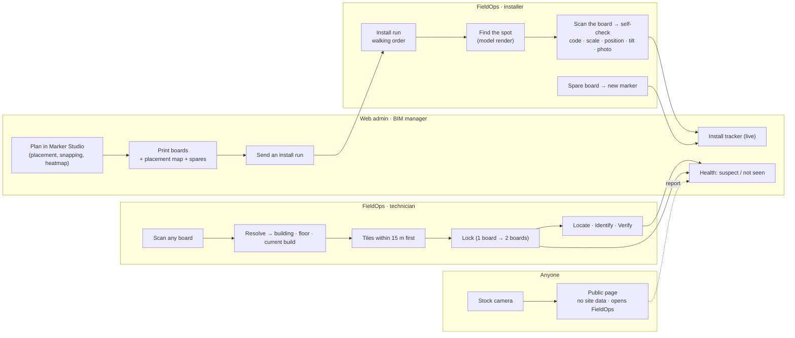
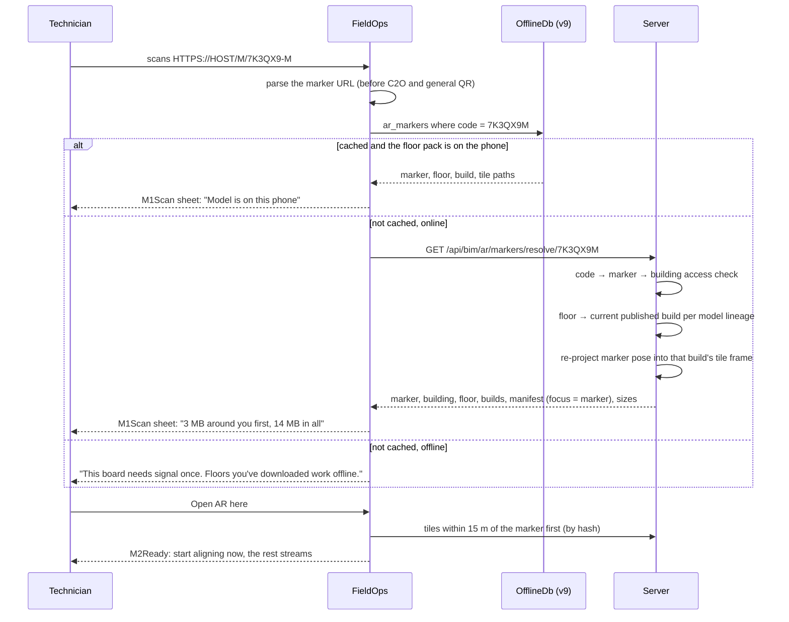
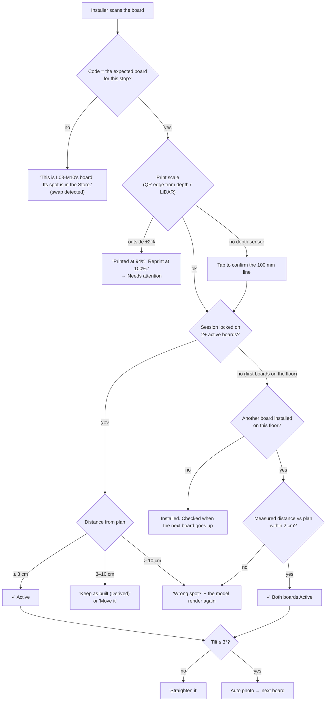

# AR markers and QR codes — end to end

How a marker is **planned** on the model, **printed**, **installed** on a wall, and **scanned**, and how one scan opens the right building, floor and model build. It covers the backend (`fusion-eco-server`), the web admin (`fusion-eco-client`) and FieldOps.

**Status:** **v1 built 2026-09-26, never run on a device.** Codes, resolve, spare binding, confirm-install, alignment events, print sheets, install requests, health and progress exist on the server; Marker Studio, print, install tracker and health on the web; the scan sheet, installer run, self-check and spare flows in FieldOps ([ar-implementation.md](ar-implementation.md)). No board has been printed and scanned on site yet. This doc expands the marker parts of [ar-bim-overlay.md](ar-bim-overlay.md) (§4 alignment, §7 server contract) into full flows. Where the two differ, this doc wins for markers and QR codes.

**Update 2026-09-26:** boards are now **mostly created on site**. After a corner-snap alignment, the app suggests a spot and the user sticks up a spare board ("Leave a board", [ar-setup-and-gamma-parity.md §2.5](ar-setup-and-gamma-parity.md)), just as GAMMA registers its QR codes after aligning. Office planning in Marker Studio (§4.1) and install runs (§4.3, §5.3) become the **optional** surveyed, handover-grade path in slice 2.

**Designs:** every screen below is drawn, and most are clickable, on the design canvas **[AR Markers — E2E UX](https://claude.ai/artifact/GxCE3MSyCQJVBhVodnfzcb)** (private until shared from its Share menu). Board names in this doc (`StudioPlan`, `M1Scan`, …) are the canvas's artboards.

---

## 1. Who does what

| Role | Where | Permission | Does |
|---|---|---|---|
| **BIM manager** | Web admin → **AR Markers** | `isArMarkers` (new; gated like `isBimMapping`, [top-navigation.tsx:372](../../fusion-eco-client/components/top-navigation.tsx#L372)) | Places markers on the model, prints boards, assigns install runs, watches health |
| **Installer** | FieldOps → Install run | `isArInstall` (new flag in `GET /api/auth/config`) | Puts boards up; the app checks each one. Turns spare boards into markers |
| **Technician** | FieldOps → Scan / Show in AR | `isArView` (new flag; defaults on for in-house technicians on supported devices) | Scans any board, locks the overlay, then locates, identifies and verifies |
| **Anyone** | Stock phone camera → public page | none | Sees a safe landing page. Can report a damaged board |



---

## 2. The code and the QR

### 2.1 Two identifiers, on purpose

| | Example | Changes? | Used for |
|---|---|---|---|
| **Code** | `7K3QX9-M` | **Never** | The QR payload and every API. Globally unique, not secret |
| **Label** | `L03-M07` | Only before printing | People: printed large on the board, shown in every UI. Unique within a building |

The code is 6 Crockford base32 characters (about 1.07 billion values; no I, L, O or U to misread) plus a **check character** from the same alphabet: a weighted sum mod 32 with odd weights, which catches any single wrong character. The check stays inside the QR alphanumeric set, which matters for §2.2.

A spare board has a code and a label like `SP-4Q2M`, with `status: spare` and no position yet (§5.4).

### 2.2 The payload: why the QR stays small

The payload is a URL on the web host, written in **upper case**: `HTTPS://<HOST>/M/7K3QX9-M`.

Upper case matters. Upper-case letters, digits and `:/.-` fit QR **alphanumeric mode**. At error-correction level M, a version 2 QR (25 × 25 modules) holds 38 alphanumeric characters, against 26 in byte mode. Scheme and host are case-insensitive, and the server matches `/M/<code>` without regard to case. Fewer modules means bigger modules at the same print size, and that sets how far away the board can be read:

| Board | QR | Modules | Module size | Reads from |
|---|---|---|---|---|
| **A4** (default) | 115 mm | 25 (version 2-M) | 4.6 mm | about 2 m |
| A3 (large halls) | 170 mm | 25 | 6.8 mm | about 3 m |

**Host budget:** 38 − `HTTPS://` (8) − `/M/` (3) − code (8) = **19 characters of host**. With a longer host, the QR goes up to version 3 (29 modules, 4.0 mm on A4) and still works. Choose the short host once, before the first print run, because printed boards live for years.

No site data goes in the QR. Access is checked when the code is **resolved** (§3), not when it's read.

### 2.3 The printed board (`MarkerBoard`)

A4 portrait, drawn at true scale on the canvas:

- The label, large (`L03-M07`); building and floor; space and wall ("Plant Room B · East wall · centre at 1.50 m").
- A **170 mm textured frame** around the 115 mm QR. The frame's high-contrast, non-repeating pattern gives ARCore and ARKit visual features on a plain painted wall. The pattern is **seeded by the code**, so no two boards look alike. That matters for tracking, and it lets a person tell boards apart.
- Registration ticks. The registration point is the **QR centre**.
- Three install steps, a mini placement map, and a **100 mm scale line** ("must measure exactly 100 mm").
- The short URL as text, and "Please don't remove or move this board".

A 200 mm QR plus a frame does **not** fit A4 portrait (210 mm wide). v3 of the overlay plan said "150–200 mm". The real A4 numbers are the ones above.

---

## 3. From one scan to the right model

### 3.1 What the server stores

- **Marker pose in project coordinates**: IFC world, recovered through the build's coordination matrix ([ar-bim-overlay.md §3](ar-bim-overlay.md)). It is **never** stored only in tile coordinates. The tile-frame pose is derived for each build, so a new model version never invalidates a marker.
- **Building and floor use FusionEco's own entities.** IFC storeys and spaces are already matched to `floorId` / `spaceId` in [bim_spaces](../../fusion-eco-server/src/model/bim-space.ts) (lines 30–31). An architectural IFC and an MEP IFC for the same building have different storey GlobalIds but land on the same `floorId`. That is exactly the federation match AR needs, and it already exists.
- **Host element:** the GlobalId of the wall or column the board is on, so a model change under the board can be detected (§3.3).

### 3.2 Resolve



### 3.3 Rules

| Situation | Behaviour |
|---|---|
| Several models on one building (arch, MEP, structure) | The manifest joins the **current published build of each model lineage** (`building_3d_models.isCurrent` plus build QA pass). The geometry build refuses to publish a lineage whose coordinates disagree with its siblings by more than 5 mm or 0.01° (the **federation check**), with a clear message on the web |
| The newest upload failed QA | Serve the previous good build, with the badge "Model is older than the latest upload" |
| The wall or column under a board moved more than 20 mm, or was deleted, in the new build | The marker goes to **`needs-review`**, shown in Health. The board may no longer be on a real wall |
| The user has no access to the building | 403 → "This board belongs to a site you don't have access to." Nothing else is shown |
| The technician is checked in at a different building | A warning, not a block ("You're checked in at Tower B; this board is in Tower A") |
| **Retired** marker | "This board was retired on 3 Sep. The nearest active board is L03-M06, 4 m west." |
| **Spare** board, not yet bound | With `isArInstall`: the spare flow (§5.4). Otherwise: "Blank spare board. Ask your supervisor." |
| No published build for the building, or an xkt-only model | "The model for Tower A isn't ready for AR yet." Web admins see the reason (QA, or source IFC missing) |
| Unknown code | "Not a FusionEco marker we know", with a Report link |

**Offline resolve:** a downloaded floor pack contains every marker on that floor plus every spare code in the building. A scan inside a downloaded floor never needs signal.

---

## 4. Web admin (`fusion-eco-client`)

Routes: `/ar-markers` (buildings) → `/ar-markers/[buildingId]/[floorId]?tab=plan|print|install|health`. There's a new top-navigation item, **AR Markers**, gated by `isArMarkers`. The UI uses the client's own shell: Montserrat, the green brand, and shadcn components.

### 4.1 Plan: Marker Studio (`StudioPlan`)

**Viewer.** The three.js tile viewer from Track W (W-2) loads the **same tiles the phones use**, so what the BIM manager places is exactly what the technician sees. The default view is a **cut plan**: an orthographic top camera with a section plane 1.2 m above the floor datum, generated from the model itself, so no separate floor-plan drawing has to be aligned. There's a 3D toggle.

**Placing.**
- Click a surface → raycast (three-mesh-bvh, MIT) → hit point and face normal.
- Snapping: to wall faces (normal within 10° of horizontal), column faces and grid intersections. Height defaults to **1.50 m to the centre**, with a stepper.
- **Collision check:** the 170 mm frame footprint can't overlap a door swing, an opening or an equipment bounding box. The pin turns red with a reason.
- Auto-labels: the next free `L<floor>-M<nn>`. The location text comes from the containing `IfcSpace` plus the wall's compass orientation ("Plant Room B · east wall"). The host element's GlobalId is stored.
- The inspector (right panel): code, status, the small QR, where, mounting (wall, column or floor), height, accuracy class (Surveyed, Feature, Derived), its **pair** (the facing board that gives the precise lock), and a note for the installer that gets printed on the board.

**Accuracy heatmap.** A predicted overlay accuracy for each 0.5 m cell, using the geometry model in [ar-bim-overlay.md §4.4](ar-bim-overlay.md): the markers visible from the cell (same space, or line of sight through openings), each marker's σ by class, and the lever arm. Legend: ≤ 3 cm / 3–10 cm / > 10 cm. It is computed **in the browser** from a pure TypeScript module shared with the server's suggestion engine, so dragging a pin updates the map live. Coverage = the share of floor cells at ≤ 10 cm.

**Suggest.** The server proposes placements that lift coverage to a target (default 95%). Candidates sit on wall faces every 1 m at 1.5 m height. The score rewards coverage gain and a facing pair 3–10 m away. It penalises spots behind equipment, in risers, or away from circulation routes. Selection is greedy until the target is met. The canvas shows the UX: "3 suggestions raise coverage from 82% to 96%", **Accept all 3** or review one by one.

**Survey import.** Upload a CSV of `x, y, z` (plus optional normal and label) in project coordinates. Each row becomes a **Surveyed** marker, snapped to the nearest wall face. A point more than 50 mm from any modelled face gets a warning, not a silent move.

### 4.2 Print (`PrintSheets`)

- Choose the markers (default: every Planned one on the floor), A4 or A3, a placement map, and N spare boards.
- `POST /api/bim/ar/print-batches` returns a PDF, built on the existing label stack: **pdfkit + bwip-js**, with QR rendering from [codeRenderer.ts](../../fusion-eco-server/src/services/labelPrinting/codeRenderer.ts) (`renderCode('qrcode', …)`). The board is a new template alongside [templates.ts](../../fusion-eco-server/src/services/labelPrinting/templates.ts). Code, label and frame seed come from the marker record.
- The **placement map** page shows the floor's cut plan with numbered stops in walking order: a nearest-neighbour tour from the floor's main entrance.
- A **print-scale warning** is always shown: "Print at 100%. A board printed at 94% gets caught when it's installed."
- **Send to an installer** creates an install run (§4.3) and pushes it to FieldOps. **Mark as printed** moves the markers to `printed`. Every batch is recorded for audit.

### 4.3 Install tracker (`InstallTracker`)

- Floor cards with stacked progress: active, installed, printed.
- Columns: **Printed → Installed · checking → Active**, plus **Needs attention** (for example "printed at 94%, reprint").
- A **live install run** panel: the installer, n of N, a mini plan of the walking route, and a feed ("10:42 L03-M07 installed, 2.90 m from M08, planned 2.91 m. Both boards now active."). Updates arrive over the existing socket.io connection as an `ar_marker_updated` event.
- A board turns **Active** when a second board confirms it (the measured distance to an active neighbour is within 2 cm of plan), or after three sessions agree on it. **The first board on a floor can't be checked** until the second one goes up, and the feed says so.

### 4.4 Health (`MarkerHealth`)

Health reads `ar_alignment_events` (every AR session's per-marker residuals).

| Rule | Status |
|---|---|
| Residual over 50 mm in 2 or more sessions from different devices within 7 days, **while its neighbours agree** (under 20 mm) | **Suspect**. That marker moved; the others didn't |
| No sessions in 30 days on a floor that has sessions | **Not seen**. Check it's still there |
| Host element changed in a new build (§3.3) | **Needs review** |
| Derived marker with 3 confirmed visits | Promoted to **Active** |

The actions on a suspect marker are the creative part:
- **Adopt the new position.** The fit already knows where the board now is: the median position the last N sessions solved for it. If those sessions agree and are stable, one click saves that position as **Derived** and re-checks it on the next 3 visits. No re-survey is needed for a board that's merely been re-stuck.
- **Send a re-check**: a one-board install run.
- **Retire.**

Reports from the public page (§6.3) arrive here too, with the photo.

---

## 5. FieldOps

### 5.1 Getting in

- The **in-app scanner** recognises `…/M/<code>` **before** the C2O and general schemes, following the precedence already in [c2o_scan_payload.dart:52](../lib/core/c2o/c2o_scan_payload.dart#L52). It depends on improvements.md **#8** (scanner freeze), because a stuck scanner blocks markers too.
- **The OS camera**: Android App Links and iOS Universal Links for `/m/*` open FieldOps straight to `/ar/marker/:code`. The web host serves `/.well-known/assetlinks.json` and `/.well-known/apple-app-site-association`. Without the app, the public page opens (§6.3).
- Router: `/ar/marker/:code`, `/ar/session`, `/ar-install/:runId`, `/ar-install/:runId/stop/:markerCode`, `/ar/spare/:code`. Strings only across the router, never `extra`, following [router.dart](../lib/app/router.dart).
- Push: an install run arrives as the usual data-only FCM message `{title, link: '/technician/ar-install/<runId>'}`. The `/technician` prefix strip already maps it, and routing is updated in **both** tap-routing places.

### 5.2 Technician (`M1Scan` → `M6Verify`)

| Screen | What it does | Why it feels easy |
|---|---|---|
| **M1 Scan** | Green corner brackets lock on the board. A bottom sheet shows the label, building, floor, wall, "Your site ✓" and the model state | One button, **Open AR here**. The board has already decided building, floor and model |
| **M2 Ready** | The AR camera is already tracking. A ring shows progress: "Around you, 15 m ✓, Markers ✓, Rest of Level 3 streaming" | **Start aligning** is enabled once the local tiles are in. Nobody waits for the whole floor |
| **M3 Lock** | A ring fills around the board: "Hold still", with chips for 1.1 m ✓, square-on ✓, light OK ✓. There's a haptic tap when it locks | The coaching chips turn green, so people fix distance or angle without reading instructions |
| **M4 Aligned** | Amber badge "Aligned · 1 board · sharp near here". A radar points to the next board: "L03-M06 is 6.7 m behind you" | Honest: it says why a second board helps and where it is. **Carry on** is allowed |
| **M5 Locked** | Green badge "Locked ±2 cm · 2 boards · checked 3 m ago". The target is drawn through the wall with a label; the work order is shown on top | Three big actions: **Identify**, **Verify**, **Layers** |
| **M6 Verify** | Pre-filled: location check (12 cm, tolerance 35 cm), tag matches register, "This is the element in the model" (confirms the BIM link), result, photo with overlay | Nothing to type. It's saved offline with the app's usual queued-write message (`kOfflineQueuedMessage`) |

### 5.3 Installer (`I1Run` → `I3Check`)

- **I1 Install run:** the run arrives like a route: n of N, time left, the floor plan with walking order (done ✓, next pulsing, pending grey), and a big **Next** card with distance.
- **I2 Find the spot:** the board's location **rendered from the model at eye height from the door**, with the ghost board, the 1.50 m dimension and nearby equipment ("just right of the P-02 isolator"), plus three plain steps. Once the session is locked, a live distance chip ("3.4 m") replaces guesswork.
- **I3 Self-check:** scanning the board runs these checks. The installer never measures anything.



The checks live in a pure Dart class, `lib/core/ar/install_check.dart`, tested with fakes like everything in `lib/core/c2o/`.

### 5.4 Spare boards (`I4Spare`)

Printed runs include spare boards with unassigned codes. A technician **locked with a green badge** who scans a spare gets "Make it a marker here?", with the name pre-filled from the space and wall, the measured centre height and facing, and "Saved as Derived, about ±3 cm; it turns Active after three visits confirm it." No printer, no office round trip.

Offline binding is allowed: the pose is computed on the phone and sent through the queue. If the same spare was bound somewhere else first, the server keeps the first binding and the second lands in the conflict log with a clear message.

### 5.5 Offline and storage

OfflineDb **v9** (see [ar-bim-overlay.md §6.8](ar-bim-overlay.md)): `ar_markers` gains `label`, `floorId`, `status`, `hostGlobalId` and `mounting`, plus a `spare` flag for the building's spare codes. Install confirmations, spare bindings and alignment events all go through `syncRequest`, with photos as `QueuedAttachment`s. There's no new offline machinery.

### 5.6 Flags and strings

`isArView` and `isArInstall` come from `GET /api/auth/config`. All strings are `ar.*` keys in both `en.json` and `ar.json` (RTL checked on every screen).

---

## 6. Backend (`fusion-eco-server`)

### 6.1 Tables

| Table | Key columns |
|---|---|
| `bim_ar_markers` | `id`, `code` (unique, 7 chars without the hyphen), `label` (unique per building), `buildingId`, `floorId`, `spaceId`, `hostGlobalId`, `mounting` (`wall`/`column`/`floor`), `posProject` (x,y,z), `normalProject`, `upProject`, `heightAboveFloorM`, `printedQrMm`, `frameSeed`, `accuracyClass` (`surveyed`/`feature`/`derived`), `status` (`spare`/`planned`/`printed`/`installed`/`active`/`suspect`/`needs-review`/`retired`), `pairMarkerId`, `parentMarkerIds`, `installNote`, `installedBy`, `installedAt`, `installPhotoUrl`, `installResidualMm`, `lastResidualMm`, `lastSeenAt`, `createdBy` |
| `bim_ar_marker_events` | `markerId`, `type` (planned, moved, printed, installed, confirmed, flagged, adopted, retired, reported), `actorId`, `payload`, `at`. The full audit trail, which also drives the Install tracker feed |
| `bim_ar_print_batches` | `buildingId`, `floorId`, `markerIds`, `spareCodes`, `format` (A4/A3), `pdfUrl`, `createdBy` |
| `bim_ar_install_runs` | `buildingId`, `floorId`, `assigneeId`, `status`, `startedAt`, `finishedAt` |
| `bim_ar_install_stops` | `runId`, `markerId`, `order`, `status`, `checks` (JSON: code, scale, distance, tilt, photo) |
| `bim_ar_public_reports` | `code`, `note`, `photoUrl`, `ipHash`, `at`. Rate-limited, no auth |
| `ar_alignment_events` | as in [ar-bim-overlay.md §7.1](ar-bim-overlay.md), plus a `perMarker` JSON of residuals |

### 6.2 Endpoints

| Method | Path | Who | Notes |
|---|---|---|---|
| `GET` | `/api/bim/ar/markers?buildingId=&floorId=` | admin | List with status and pair |
| `POST` / `PATCH` / `DELETE` | `/api/bim/ar/markers[/:id]` | admin | Place, move, edit, delete (only before printing) |
| `POST` | `/api/bim/ar/markers/suggest` | admin | `{floorId, targetCoverage}` → candidates with their coverage gain |
| `POST` | `/api/bim/ar/markers/survey-import` | admin | CSV → markers, plus a report of off-face points |
| `POST` | `/api/bim/ar/print-batches` | admin | PDF (A4/A3, map, spares) |
| `POST` | `/api/bim/ar/install-runs` | admin | Assign to an installer and push |
| `GET` | `/api/bim/ar/health?buildingId=` | admin | Statuses, residual series, reports |
| `POST` | `/api/bim/ar/markers/:id/adopt-position` · `/recheck` · `/retire` | admin | Health actions |
| `GET` | `/api/bim/ar/markers/resolve/:code` | technician | §3.2. Access-checked |
| `GET` | `/api/bim/ar/manifest?scope=floor&id=&focus=<code>` | technician | Tiles near `focus` listed first |
| `GET` | `/api/bim/ar/install-runs/:id` | installer | Stops, renders, expected codes |
| `POST` | `/api/bim/ar/install-runs/:id/stops/:markerId/confirm` | installer | Checks JSON + photo. Server re-validates |
| `POST` | `/api/bim/ar/spares/:code/bind` | installer | Pose, name, floor → derived marker. First bind wins |
| `POST` | `/api/bim/ar/alignment-events` | technician | Batched, queued |
| `POST` | `/api/public/ar-markers/:code/report` | public | No auth, rate-limited, photo optional |

Resolve response:

```json
{
  "marker": { "code": "7K3QX9M", "label": "L03-M07", "status": "active", "accuracyClass": "feature",
              "mounting": "wall", "poseTile": { "p": [12.41, 1.50, -8.07], "n": [-1, 0, 0] } },
  "building": { "id": "…", "name": "Tower A" },
  "floor": { "id": "…", "name": "Level 3" },
  "builds": [ { "lineage": "arch", "buildId": "…", "version": 7 }, { "lineage": "mep", "buildId": "…", "version": 7 } ],
  "manifest": { "url": "/api/bim/ar/manifest?scope=floor&id=…&focus=7K3QX9M", "focusBytes": 3100000, "totalBytes": 14000000 },
  "badges": []
}
```

### 6.3 Services

| Service | Job |
|---|---|
| `markerCodeService` | Mint codes (with check character) and spare batches; normalise any casing and hyphens |
| `markerPoseService` | Project ↔ tile conversion for each build; re-project every marker when a build is published; host-element-moved detection → `needs-review` |
| `markerCoverage` (shared TS module) | Predicted accuracy per cell; used by the web heatmap and by suggestions; golden test vectors |
| `markerSuggestionService` | Candidate generation and greedy selection (§4.1) |
| `markerBoardPdfService` | A4/A3 boards, placement map and spares on the label-printing stack |
| `installRunService` | Runs, walking order, push, confirm validation (the server repeats the §5.3 checks it can) |
| `markerHealthService` | The §4.4 rules; runs on every alignment-event batch and nightly |

**The public page** is a web-client route, `/m/[code]` (case-insensitive), next to the existing `/public/c2o-verify` pages. It shows **no building data**. It offers "Open in FieldOps" (the App Link / Universal Link), store buttons, and "Report this marker". See `PublicLanding` on the canvas.

---

## 7. UX rules for every AR screen

1. **The board decides.** A scan never asks for building, floor or model.
2. **One primary action per screen**, in the thumb zone, at least 48 px tall.
3. **Never ask for what the phone can measure**: height, facing, tilt, print scale and distance are measured, not typed.
4. **Never block on a full download.** Start with what's around the user and stream the rest.
5. **Honest status.** Amber means one board; green means measured with two or more. The badge shows what was measured, never an estimate.
6. **Every error has a next step** (§3.3): the nearest active board, who to ask, or a report link.
7. **Close the loop visibly.** The installer sees "L03-M09 is in", and the office sees it seconds later.
8. **Same words offline and online.** Queued writes use the app's single offline message.
9. **Arabic and RTL on every screen**, with en/ar keys added together.

---

## 8. Development items

IDs are `MK-n`. They replace **AR-10** in [ar-bim-overlay.md §11](ar-bim-overlay.md) and slot into its slices.

> **Slice moves (2026-09-26, markerless-first):** MK-24 (spare bind) moves to **slice 1** as AR-43, "Leave a board". MK-8, MK-9, MK-11, MK-12, MK-14 and MK-19 (Marker Studio, install runs, tracker) move to **slice 2** as the surveyed option. MK-7 in slice 1 prints **spare packs** first and planned boards in slice 2. The tables below show the original slices; [ar-setup-and-gamma-parity.md §4](ar-setup-and-gamma-parity.md) is authoritative.

Priority: **P1** blocks the slice · **P2** needed for deployment · **P3** polish. Effort: **S** < ½ day · **M** 1–3 days · **L** a week or more.

### Slice 1: plan → print → install → scan → locate

| # | Item | Repo | P | Effort | Acceptance |
|---|---|---|---|---|---|
| MK-1 | `markerCodeService`: code, check character, case-insensitive parse | server | P1 | S | Every single-character typo is rejected |
| MK-2 | `bim_ar_markers` v2, `bim_ar_marker_events` migrations | server | P1 | M | Status transitions enforced; audit row for each change |
| MK-3 | `markerPoseService` + re-projection on build publish + `needs-review` | server | P1 | M | A new build moves no marker whose host element didn't change |
| MK-4 | Resolve endpoint: access, current build per lineage, fallback build, focus manifest | server | P1 | M | Every row of §3.3 has a test |
| MK-5 | Federation check in the geometry build QA | server | P1 | S | Two lineages 10 mm apart fail to publish, with the message on the web |
| MK-6 | `markerCoverage` shared TS module + golden vectors | server + web | P1 | M | Same numbers in the server and browser tests |
| MK-7 | Board PDF: A4/A3, frame seeded by code, placement map, spares | server | P1 | M | Printed at 100%, the 100 mm line measures 100 mm and the QR is 115 mm; it scans at 2 m |
| MK-8 | Install runs: create, walking order, push, socket updates | server | P1 | M | The run appears on the phone within 10 s |
| MK-9 | Install confirm: server-side checks, state transitions, pair activation | server | P1 | M | The first board stays Installed until the second confirms the pair distance |
| MK-10 | AR Markers nav, `isArMarkers`, building/floor shell with tabs | web | P1 | S | Hidden without the permission |
| MK-11 | Marker Studio: cut plan on the W-2 viewer, raycast placement, snapping, collisions, inspector | web | P1 | L | A marker can't be placed over a door swing; the label auto-increments |
| MK-12 | Heatmap and coverage readout (uses MK-6) | web | P1 | M | Dragging a pin updates the map in under 100 ms |
| MK-13 | Print tab | web | P1 | M | 8 boards + map + 10 spares → a 19-page PDF |
| MK-14 | Install tracker (live) | web | P1 | M | The feed shows the installer's scan within seconds |
| MK-15 | Public page `/m/[code]` + `assetlinks.json` + `apple-app-site-association` | web | P1 | S | A stock camera opens FieldOps when it's installed and the safe page when it isn't |
| MK-16 | Scanner parses marker URLs first; deep-link route `/ar/marker/:code` | FieldOps | P1 | S | Needs improvements.md #8 fixed first |
| MK-17 | Resolve + focus-first download + v9 `ar_markers` columns | FieldOps | P1 | M | Offline scan works inside a downloaded floor |
| MK-18 | Technician screens M1–M5 | FieldOps | P1 | L | Scan to Locked in under 10 s on the reference devices, with the floor already downloaded |
| MK-19 | Installer screens I1–I3 + `install_check.dart` | FieldOps | P1 | L | Every branch of the §5.3 flowchart has a test |
| MK-20 | `isArView` / `isArInstall` flags + `ar.*` strings in en/ar | server + FieldOps | P1 | S | RTL reviewed on every screen |

### Slice 2: verify

| # | Item | Repo | P | Effort | Acceptance |
|---|---|---|---|---|---|
| MK-21 | M6 Verify, pre-filled (with AR-23/24 in the overlay plan) | FieldOps | P1 | M | Nothing to type for a matching asset |
| MK-22 | Survey CSV import | server + web | P2 | S | Off-face points are reported, not moved |

### Slice 3: scale

| # | Item | Repo | P | Effort | Acceptance |
|---|---|---|---|---|---|
| MK-23 | `markerSuggestionService` + Suggest UI | server + web | P2 | L | Level 3 sample: coverage raised to ≥ 95% with no suggestion behind equipment |
| MK-24 | Spare bind (server + I4) | server + FieldOps | P2 | M | Offline bind syncs; a second bind of the same spare lands in the conflict log |
| MK-25 | `markerHealthService` + Health tab + adopt position / re-check / retire | server + web | P2 | L | A board moved 100 mm is flagged within 3 sessions, and adopting fixes it |
| MK-26 | Public reports into Health | server + web | P3 | S | A report with a photo shows on the marker within a minute |

---

## 9. Open decisions

| # | Decision | Why it matters |
|---|---|---|
| 1 | The **short web host** printed on every board | It must be ≤ 19 characters to keep the QR at version 2 (§2.2). Hard to change after boards go up |
| 2 | A4 only, or A3 for halls and plant rooms over 20 m | Reading distance and cost |
| 3 | Can technicians bind spares, or only installers? | Coverage vs control. Health watches derived markers either way |
| 4 | Public reports: straight into Health, or into the existing helpdesk queue? | Who acts on a report of a damaged board |
