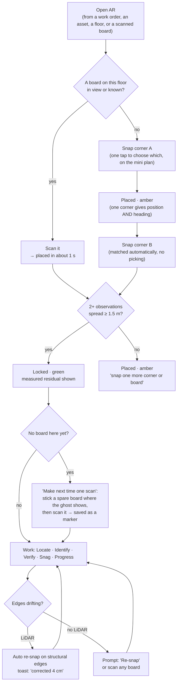

# AR setup: snap two corners, then leave a board. Plus the GAMMA use cases worth taking

**Status:** **v1 built 2026-09-26, never run on a device.** Corner snap (two corners, auto-matched B), board lock, leave a board, register a spare, guided nudge, the method chooser, and the workspace (modes, selection, tools, Menu + Layers, Progress with four-eyes) exist in FieldOps for phone and tablet, with a Demo mode that runs the real estimator ([ar-implementation.md](ar-implementation.md)). Snapping on real depth data is unproven until `fe_ar` slice 0. This doc changes the **order** of the AR plan. The first alignment is now **markerless**: snap two real corners. That is GAMMA AR's proven method, simplified further. QR boards become what you leave behind so the next visit is one scan. Office-planned marker networks ([ar-markers-and-qr.md](ar-markers-and-qr.md)) stay, but as an option for surveyed, handover-grade setups rather than a precondition.

Read with [ar-bim-overlay.md](ar-bim-overlay.md) (§4 alignment maths, the 4-DoF estimator) and [ar-markers-and-qr.md](ar-markers-and-qr.md) (codes, boards, resolve). Designs: row 6 of the canvas **[AR Markers — E2E UX](https://claude.ai/artifact/GxCE3MSyCQJVBhVodnfzcb)**.

---

## 1. What GAMMA AR actually does (research, 2026-09-26)

### 1.1 Getting the model in place

| Method | How it works in GAMMA | Source |
|---|---|---|
| **Corner alignment (primary)** | A pin is lined up with real corners of walls or columns, and "it automatically snaps the real corner". The pin "will be able to identify and auto-align with the edges of the object (walls or columns)". Two reference points anchor the model. Gridlines work too. "Model placement now takes only a few seconds." | GAMMA blog "Faster model placement"; help-centre search results |
| **LiDAR vertical snapping** | On iPad Pro and iPhone Pro, "vertical snapping detects the corner even if it is hidden" | AEC Magazine; GAMMA blog |
| **QR codes: registered after alignment** | "First align the model on site using corners or gridlines, then … register a QR code that you have placed on a flat surface." It's scanned from 1–1.5 m; the bracket turns from white to green; the model loads; you "click on the lock" or wait for automatic confirmation | GAMMA help centre, "Aligning / placing your model using QR codes" |
| **Manual fine-tuning** | "Choose a right corner, stand in the continuation of one of the planes and adjust … only in the perpendicular direction", then the other plane, then shift vertically | Help-centre guidance (search results) |
| **Drift** | Correct it by corner re-alignment, QR re-alignment, "automatic drift correction (LiDAR devices)" or manual adjustment | GAMMA FAQ Q7 |
| **Honesty** | "an indicative tool rather than a surveying device". LiDAR is recommended (iPad Pro 2020+, iPhone 12 Pro+). In low light, reposition often or use QR codes. Positioning takes "a few minutes" | GAMMA FAQ Q6, Q8, Q11, Q18 |

**The lesson:** GAMMA needs **no preparation in the office** to start. A QR code isn't planned on the model; it's a sticker whose position is captured from an alignment already done on site. Our v3 plan made office planning, printing and installing a precondition for the first scan. That's the biggest friction in our design, and GAMMA shows it isn't needed.

### 1.2 The video: "Progress Tracking with GAMMA AR and ACC Build Assets"

I couldn't view the video itself; only its title and channel are readable. GAMMA's and Autodesk's written material on the same workflow describes it:

- A **foreman** overlays the model on a normal site walk and marks components complete.
- A **superintendent** verifies them: "four-eyes principle".
- The system **computes quantities from the BIM objects** (units, lengths, areas, volumes). How precise that is depends on the model: design models support percentage estimates, estimation models support the contract structure, shop models support exact units.
- Status syncs to **Autodesk Build Assets** per asset, or goes out as CSV back into Navisworks or Revit for filtering and quantities.
- Why it matters: when "contract requirements enforce component precision for billing", manual counting is slow. GAMMA claims it is "faster and cheaper".

### 1.3 GAMMA's other use cases

Pre-construction visualisation · installation checks / QA-QC · on-site clash checks · issues tied to components, with assignment · component RFIs · client communication (properties and issues visible "without having to be physically present") · safety (scanned tags that "display additional information … related to safety or hazards") · facility management and handover ("comparison of target and actual values").

---

## 2. Our base setup: snap two corners, then leave a board

### 2.1 The setup ladder

Everything in the ladder feeds **the same 4-DoF estimator** ([ar-bim-overlay.md §4.3](ar-bim-overlay.md)). A corner and a board are just two kinds of observation. Nothing else changes in the alignment maths.

### 2.2 What a corner is, and where candidates come from

A **corner** is a vertical edge where two wall faces meet (inside or outside), or the edge of a column. As an observation it contributes:

- **Position:** where the corner line meets the floor plane.
- **Heading:** the directions of its two faces. This is why **one corner is already a full 4-DoF placement**, unlike one tapped point.
- **Shape:** the angle between the faces, inside or outside, used for matching.

**Candidates are extracted when the geometry is built** (the build in [ar-bim-overlay.md §5](ar-bim-overlay.md)): the vertical edges of walls and columns on each floor, at least 1.2 m tall, with both faces at least 0.4 m wide. Each floor pack carries its candidates, a few hundred small rows, in a new `ar_corners` table. They are ranked by:

| Factor | Why |
|---|---|
| **Structure beats partitions.** `IfcColumn`, and walls with `Pset_WallCommon.LoadBearing` or `IsExternal`, rank highest (the property sets are already in `bim_elements.propertySets`) | Structure is built to tighter tolerance and doesn't move during fit-outs. Drywall does |
| **Distinctive.** No same-shaped corner within 3 m | Avoids ambiguous matches |
| **Visible.** On a circulation space, a room entrance or a plant-room door | People actually stand there |
| **Outside corners of columns** get a bonus | Two faces visible from many angles; easiest to snap |

### 2.3 Snapping: what the phone does

- **The pin:** a crosshair in the middle of the screen. When a corner is detected under it, the pin **snaps** with a haptic tick, and the two detected wall faces draw as thin lines. The user never places a point precisely. They aim roughly and the phone finds the exact edge.
- **With LiDAR** (iPad Pro, iPhone Pro): fit two vertical planes to ARKit's scene depth in a window around the pin and intersect them. The corner line is found even when its base is hidden behind a bin or a pipe, which is GAMMA's "vertical snapping".
- **Without LiDAR** (most Android phones): the tracked vertical planes of both walls, intersected. Plain walls can take a few seconds to detect, so the screen coaches "Sweep slowly across both walls". The fallback is to tap where the corner meets the floor (a floor hit-test), with heading from whichever wall plane was found.
- **Height is never asked for:** it comes from the detected floor plane plus the floor's elevation. A floor whose finish sits above the modelled slab (raised access floor, screed) gets a **floor finish offset** set once per floor in the web admin. That removes GAMMA's third manual step, "shift vertically".

### 2.4 Matching: no hunting through the model

- **Corner A:** context first.
  - From a work order or an asset, the room is known, so the mini plan shows **only that room's corners**, numbered and starred by rank, and the user taps the one they're at.
  - From a floor list, the plan shows the floor's best-ranked corners. **One tap.**
  - The two ways of pairing faces on a 90° corner are 90° apart. **The side the camera is on settles it:** for an inside corner the camera is inside the angle, and for a column the camera sees the two faces pointing at it.
- **Corner B:** **matched automatically.** With corner A placed, the app predicts where every candidate should appear. The corner the user snaps is matched to the nearest candidate of the same shape within 1 m. If two candidates are that close, the app asks with two big buttons. The screen suggests a good B: "Column C-2, 7 m across the room". Corners 3 m or more apart turn the badge green.

**Time budget:** 20–40 seconds from opening to locked, with no preparation.

### 2.5 Leave a board: GAMMA's registered QR, done better

When the badge turns green on a floor area with no board nearby, the app offers **"Make next time one scan"**:

1. A **ghost board** appears in AR where a board would help most: a flat wall area near the room entrance, 1.5 m high, clear of door swings and equipment. It's chosen by the same coverage model the web admin uses ([ar-markers-and-qr.md §4.1](ar-markers-and-qr.md)).
2. The user sticks a **spare board** there (every install pack and every technician's van carries a pack of 20) and scans it.
3. It is saved as a **Derived** marker, with the current fit's uncertainty. The app suggests leaving a second board on the facing wall for a two-board lock.

Compared with GAMMA's generic QR registration, our boards bring a unique textured frame for tracking, codes that are unique and check-summed, a suggested spot, health monitoring that catches a moved board, and promotion to Active after three confirming visits.

**What this does to the marker plan:** boards now appear **organically from use**. Office planning in Marker Studio remains for surveyed, handover-grade networks and for printing spare packs. It is no longer a precondition.

### 2.6 Staying aligned

| Mechanism | Behaviour |
|---|---|
| **Auto re-snap (LiDAR)** | Continuously compares **structural** modelled edges in view with measured depth planes. A consistent offset over 3 cm lasting 2 s, where no board is nearby, applies automatically, with an honest toast: "Corrected 4 cm" |
| **Re-snap prompt (no LiDAR)** | The same test on tracked planes → "Re-snap" button. One corner snap fixes it |
| **Any observation during work** | Every board scanned or corner snapped later just refines the fit |
| **Guided nudge** | GAMMA's help-centre procedure turned into UI. The app **picks the axis from where you stand**: facing along a wall, one slider moves the model only perpendicular to that wall, in 5 mm steps, with the modelled edge highlighted to line up. There's no vertical slider, because the floor sets height. A nudge is logged and suppresses auto-correction nearby for the session |

### 2.7 Badges

| State | Badge | Meaning |
|---|---|---|
| Not placed | — | "Snap a corner or scan a board" |
| Placed | amber · "1 corner" or "1 board" | Sharp near the corner or board |
| Locked | green · "±2 cm · 2 corners" | Measured residual with 2 or more observations at least 1.5 m apart |
| Drifting | amber · "re-snap" | Edge check failing |
| Adjusted by hand | grey · "nudged 1.5 cm" | The user moved it by hand. It is never shown as green |
| Site ≠ model | red · "corners disagree by 9 cm" | Residual over 5 cm. "The site may differ from the model here. Try corners on columns or core walls." |

### 2.8 Expected accuracy (to be measured in slice 0)

| Setup | Expected near the observations | Notes |
|---|---|---|
| 2 structural corners, LiDAR | about 1–3 cm | Our fit, plus construction tolerance |
| 2 corners, no LiDAR | about 3–10 cm | Plane detection quality varies |
| 2 boards | about 1–3 cm | Repeatable for years; best for operations |
| 1 corner or 1 board | good within a few metres | Amber by design |

AR-4 in slice 0 now tests **corner snap against boards** on the same floor, with and without LiDAR, before any of this is built.

### 2.9 Configuration flow v2 and the workspace (from GAMMA's alignment video)

Source: "AUGMENTED REALITY Model Alignment - GAMMA AR" (Pablo_Contech, [YouTube](https://www.youtube.com/watch?v=ffPuqSZjC5w)), from four screenshots the user supplied. Designs: canvas rows 7 (iPad) and 8 (phone).

**What GAMMA shows, and what we do with it:**

| In GAMMA | Our version |
|---|---|
| A **method chooser**: "Align with Corner · Recommended", "Align with QR Code", "GNSS", plus an "Ask every time" checkbox | The chooser **recommends from context**: "Scan a board · Best here" when this room has boards, otherwise corners. Options: Scan a board · Snap to corners · Gridline crossing · **Resume last session** (iPad world map) · GNSS, disabled indoors and needing a paired RTK receiver. "Remember my choice for this floor" replaces "Ask every time" |
| **Gridlines drawn on the slab** (orange dash-dot with a bubble) while aligning | Structural grid lines from `IfcGrid` drawn on the floor as a **guide and a snap target**: grid crossings match column centres. Toggle in the rail and the menu |
| **"Unregistered QR code — Do you want to edit QR codes?"** | Plain language, one decision: **"New board, not saved yet — Save board here / Not now"**, with the name pre-filled, code, measured height and print scale shown. Offered only when locked; if not locked: "Place the model first, then save this board" |
| QR sheet with **four black-and-white corner targets** and a scale label | Our A4 board gains **four corner targets** in the textured frame: sub-pixel corner positions for a better pose, and a print-scale check from their known spacing |
| **Mode rail**: QA/QC · Progress Tracking · Forms | **Locate · Verify · Progress · Snags · Forms**. The mode decides what a tap does |
| **Selection modes**: Single Select, with multi and lasso | **Single · Multi · Lasso** as a visible segmented control, not hidden behind chevrons |
| **Right tool rail**: auto-snap, QR, move, rotate, 3D box, measure, pattern, opacity slider, grid | **Re-snap · Board · Section · Measure · Layers · Grid · Opacity**, each **labelled** on iPad |
| **Flat 13-item menu**: Phases, Show/Hide Floors, Append Models, Floorplan, Save View, Register QR Code, Invite Users, Sync, Flashlight, Form Filters, Settings, Align with Corner, Exit | **Grouped**: *Position* (Re-align, Save a board here, Fine-tune) · *View* (Floor plan, Gridlines, Torch, Save view) · *Project* (Sync, Share view, Change floor or models). A separate **Layers** panel holds models (append), what to show, phase, colour by, opacity and floors |
| **Folder browser** of the CDE (MASTER, Site, per-building folders) | Building → floor → **tick the models to show together** (arch, MEP, structure), with on-device status, update size, and a reason when a model can't be used ("source IFC missing") |
| **Issue pins** (red sphere) and status colours (green) | Snag pins with a label; progress colours with a legend and percentages |

**Responsive rules (one flow, two layouts):**

| | iPad, landscape (primary field device) | Phone, portrait |
|---|---|---|
| Modes | Vertical rail, top-left, text labels | Bottom tab bar with icons and labels |
| Tools | Right rail, **icon + label**, opacity slider built in | 4 icons on the right edge (Re-snap, Layers, Measure, More) |
| Selection and photo | Bottom-left cluster: Single/Multi/Lasso + a 68 pt capture button | Floating row above the sheet: capture + a Single/Multi/Lasso pill |
| Details and actions | Floating card at the bottom: selection summary, 4 status buttons, legend | Bottom sheet (peek, half, full): the same content, buttons in a 2×2 grid |
| Setup guidance | Side card with a mini plan and step dots | Compact top card; mini plan behind a button |
| Menu and layers | Right panel, 760 pt: menu and layers side by side | Full-height sheet with a Menu / Layers switch |
| Status | Lock badge + sync chip, top centre | One combined pill: "Locked ±2 cm · offline" |

Everywhere: touch targets ≥ 44 pt (primary buttons 52–54 pt), labels on every iPad tool, no tool that exists only as an icon on iPad, Arabic RTL mirrors the rails, and nothing important sits under the thumb-dead zone at the top-left of a phone.

**Items added:**

| # | Item | Where | P | Effort | Slice | Acceptance |
|---|---|---|---|---|---|---|
| AR-54 | Method chooser: recommended option from context, remember per floor, disabled options explain why | FieldOps | P1 | S | 1 | The recommended option is correct for a room with boards and for one without |
| AR-55 | Gridlines: extract `IfcGrid` axes in the geometry build, draw them on the floor, snap to grid crossings | server + fe_ar + Dart | P1 | M | 1 | A crossing snap aligns within the corner-snap accuracy |
| AR-56 | "New board, not saved yet" prompt when an unknown board is scanned (merges with AR-43) | FieldOps | P1 | S | 1 | Unlocked: asks to place the model first. Locked: saves in 2 taps |
| AR-57 | Four corner targets on boards: print template + detector refinement + print-scale check | server + fe_ar | P2 | M | 2 | Pose from the targets beats QR corners in AR-4's test |
| AR-58 | Workspace shell: mode rail/tabs, selection modes, tool rail, grouped menu, Layers panel; iPad and phone layouts from one set of widgets | FieldOps | P1 | L | 1–2 | Every action reachable in ≤ 2 taps on both; RTL checked |
| AR-59 | Measure tool, showing uncertainty: real-to-real distances (tracking scale) and real-to-model clearances (current lock uncertainty) | fe_ar + Dart | P2 | M | 2 | "2.41 m ± 1 cm"; a clearance never shows a number finer than the lock |
| AR-60 | Resume last session (iPad world map; AR-34 moved from slice 4) | fe_ar iOS | P2 | M | 2 | Relocalises in the same room and confirms at the first board or corner |
| AR-61 | Phase filter and Save view | FieldOps + server | P3 | S | 3 | A saved view reopens with the same layers, phase and camera |
| AR-62 | GNSS placement with a paired RTK receiver for outdoor sites | fe_ar | P3 | L | later | Only with a receiver. Correction services (NTRIP) can cost money, so check the no-licence rule first |

---

## 3. GAMMA use cases, translated for FusionEco

| Use case | FusionEco version | Builds on | Slice |
|---|---|---|---|
| **Progress tracking with four-eyes** (the video's topic) | **Installation and commissioning status per element**: not started → installed (foreman) → verified (supervisor; second person required, like Snag Assistant) → commissioned. Tap one element or **lasso** many; colour the model by status (cheap through the feature-state texture). Quantities come from geometry (counts, run lengths, areas). Dashboards per floor, trade and system. **Feeds C2O handover readiness.** CSV export for Navisworks or Revit, as GAMMA does | Feature IDs, C2O readiness, Snag second-party rule | 3 |
| **Issues on components** | **Raise a snag from AR**: element, camera pose and a screenshot with the overlay are attached automatically. The Snag Assistant (already built, uncommitted) owns the lifecycle | `lib/features/snags/`, `syncRequest` | 2 |
| **Issue pins in AR** | Open snags, C2O findings and **imported Navisworks or Solibri clashes** (`c2o_bcf_issues`) drawn as pins at their elements | Snags, findings, BCF import | 2 |
| **QA/QC: installed as designed?** | A "Deviation" action on **any** element (moved, missing, different), with the offset measured and its uncertainty shown | Verify flow, the estimator's uncertainty | 2 |
| **Component RFIs** | A question thread on an element | C2O comments | 3 |
| **Client communication** | Share an AR viewpoint as a link that opens the same view in the web twin | Track W three.js viewer | 3 |
| **Safety via tags** | Hazard overlays: isolation points, confined spaces, lock-out points, shown when a board or asset tag is scanned | FM hazard data, asset tags | 4 |
| **FM and handover: target vs actual** | Already our core: Locate, Identify, Verify, plus field mapping confirmation | — | ✅ |
| **Pre-construction visualisation** | Comes free with corner snap: core walls and columns exist early in construction | Corner snap | ✅ |
| **Our own: trace a system** | Tap a pipe → its upstream isolation valve and downstream equipment light up. For leak response | `bim_connections`, `impactTopology.ts` | 3 |

---

## 4. Development items added (IDs continue the overlay plan's series)

| # | Item | Where | P | Effort | Slice | Acceptance |
|---|---|---|---|---|---|---|
| AR-39 | Extract and rank corner candidates at geometry build; `ar_corners` in the floor pack | server | P1 | M | 1 | A real floor yields ranked structural corners, with no duplicates within 3 m |
| AR-40 | Native corner detection: LiDAR depth plane fit, tracked-plane intersection, floor hit-test fallback; pin snap + haptics | fe_ar (both platforms) | P1 | L | 1 | A hidden-base corner found on LiDAR; a plain-wall corner found in under 5 s with coaching |
| AR-41 | Corner observations in the estimator: first-corner 4-DoF, camera-side disambiguation, auto-match for corner B | Dart `lib/core/ar/` | P1 | M | 1 | Synthetic and recorded-walk tests; never mismatches when candidates are ≥ 1 m apart |
| AR-42 | Setup screens S1–S5 (canvas row 6), en/ar | FieldOps | P1 | L | 1 | Open to locked in ≤ 40 s on the reference devices, with no preparation |
| AR-43 | **Leave a board**: suggested ghost spot, spare bind (was MK-24), pair suggestion | FieldOps + server | P1 | M | 1 | The next visit locks with one scan |
| AR-44 | Guided single-axis nudge | FieldOps | P1 | S | 1 | The axis follows where the user stands; the badge goes grey |
| AR-45 | Floor finish offset per floor (web admin) | web + server | P1 | S | 1 | A raised-floor room aligns vertically without a nudge |
| AR-46 | Auto re-snap (LiDAR) and re-snap prompt (no LiDAR) | fe_ar + Dart | P2 | M | 2 | A 5 cm drift is corrected, with a toast |
| AR-47 | Raise a snag from AR + issue pins (snags, findings, BCF clashes) | FieldOps + server | P1 | M | 2 | A pin opens the snag; a new snag carries its element and pose |
| AR-48 | Element properties panel + filters by IFC class, system, property or status | FieldOps | P2 | S | 2 | Filters apply through the feature-state texture with no reload |
| AR-49 | Deviation action on any element | FieldOps + server | P2 | M | 2 | Offset and uncertainty stored; shown as a finding |
| AR-50 | Progress and commissioning status: tap or lasso, four-eyes, quantities, dashboards, CSV, C2O readiness feed | all | P2 | L | 3 | The supervisor's verify is required; floor progress matches element counts |
| AR-51 | System trace (upstream valve, downstream equipment) | FieldOps + server | P2 | M | 3 | Tapping a pipe highlights its isolation valve |
| AR-52 | Share an AR viewpoint to the web twin | web + FieldOps | P3 | S | 3 | The link opens the same camera in the three.js viewer |
| AR-53 | Hazard overlays on scan | all | P3 | M | 4 | Isolation points are shown for a scanned asset |

**Changes to earlier items:**
- **Slice 0, AR-4** now also compares corner snap with boards.
- **MK-24** (spare bind) moves from slice 3 into slice 1 as AR-43.
- **Marker Studio, install runs and the install tracker** (MK-8, MK-9, MK-11, MK-12, MK-14, MK-19) move from slice 1 to **slice 2**, as the surveyed and handover option.
- Slice 1 keeps code minting, resolve, spare-pack printing (MK-7), the public page, scanning and the technician screens.
