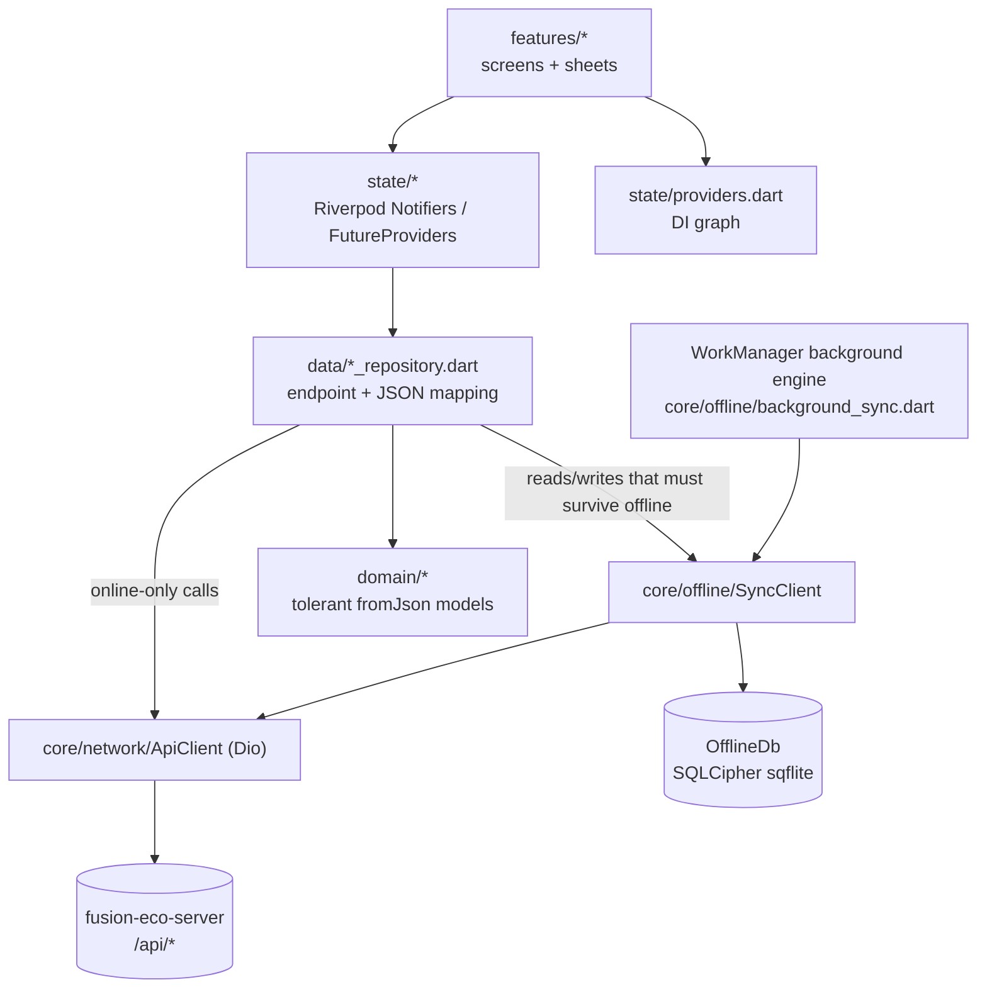
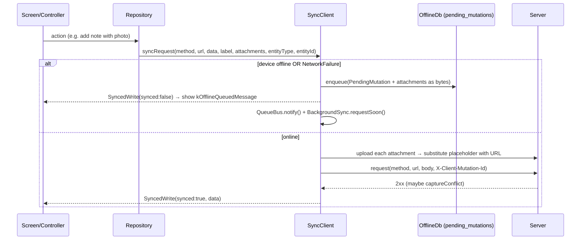

# FieldOps — Core Architecture

How the app is put together below the screens: bootstrap, dependency injection, the network layer, the offline sync engine, session and auth, the location gate, push and realtime, routing, and i18n. Feature-level flows are covered in:

- [c2o-field-verification.md](c2o-field-verification.md): scanning, asset detail, the verification capture form, route packs.
- [maintenance-orders.md](maintenance-orders.md): work orders, PM/RM/AMC, checklists, close, inspections, invites, the AI assistant.
- [build-release-and-platform.md](build-release-and-platform.md): commands, release, Android/iOS config, tests, UI/i18n conventions.

The app is the mobile port of the web technician portal (`fusion-eco-client/app/technician/*`) and talks to the same `fusion-eco-server` API. Many comments say "mirrors the web…" because behaviour is kept deliberately in step with that portal.

## Layers

- **`features/`**: one folder per screen/flow. Large screens hold their own private widgets (`_Foo`).
- **`state/`**: Riverpod 2, hand-written (no codegen): `Notifier`/`NotifierProvider`, `FutureProvider`, `StreamProvider`.
- **`data/`**: repositories. A repository takes either `SyncClient` (offline-aware) or `ApiClient` (online-only). The choice is the offline contract for that endpoint.
- **`core/`**: infrastructure (network, offline, storage, push, realtime, location, capture, OCR, C2O helpers, pure utils).
- **`domain/`**: models parsed with the tolerant helpers in [envelope.dart](../lib/core/network/envelope.dart) (`asDouble`, `asDate`, `firstNonEmpty`…), because Sequelize returns DECIMAL as strings and the API has four envelope shapes.

## Bootstrap and dependency injection

[main.dart:18](../lib/main.dart#L18) does the following in order: lock portrait → restore the saved locale → `Firebase.initializeApp` plus the background FCM handler → `SecureStore` → `SessionStore` (SharedPreferences) → DB passphrase from the keystore → `OfflineDb.open` → `ApiClient` (base URL = saved override ?? `Env.defaultApiBaseUrl`) → `BackgroundSync.init()` → `runApp` inside a `ProviderScope`.

The four stateful singletons are **built in `main()` and injected with `overrideWithValue`**. Their providers in [providers.dart:24](../lib/state/providers.dart#L24) `throw UnimplementedError()` by default. Tests and any second engine (the background sync) must construct their own instances the same way. They must never read these providers without an override.

## Network layer: `core/network/`

[ApiClient](../lib/core/network/api_client.dart#L15) is a thin Dio wrapper:

| Concern | Behaviour |
|---|---|
| Auth | `Authorization: Bearer <token>` from `SecureStore` on every request |
| Idempotency | every non-GET gets `X-Client-Mutation-Id` (UUID v4), unless the caller passed one ([:36](../lib/core/network/api_client.dart#L36)). Queued replays reuse the **original** id, so the server's idempotency guard dedupes them. |
| 401 | emits `onSessionExpired` → `AuthController` logs out (see the risk below) |
| 428 | emits `onLocationRequired` → `CheckInController` raises the blocking check-in gate |
| Timeouts | connect 15s / receive 30s / uploads 120s ([env.dart](../lib/app/env.dart)) |

Every Dio error is mapped by [mapDioException](../lib/core/network/api_exception.dart#L52) into a sealed `ApiFailure`:

- **`NetworkFailure`** means no response object. It is **the only failure that ever gets queued offline.**
- **`HttpFailure(status, message, missing, body)`**: the server answered. `missing` carries the 422 close-gate fields (`["rootCause"]`, `["checklist"]`). `isAlreadyCompleted` treats a duplicate-close 400 as success, because an offline replay is not a failure. HTML bodies from a 502/504 proxy page are never shown as error text.
- **`UnknownFailure`**: anything else.

## Offline sync engine: `core/offline/`

This is the heart of the app. Technicians work in plant rooms and basements with no signal, so every write that matters goes through [SyncClient](../lib/core/offline/sync_client.dart#L73).

### Reads: `syncGet`

Reads are cache-first **only when the device reports offline**. Otherwise they go to the network and write through to `cached_entities` (TTL `Env.cacheTtl` = 24h). A `NetworkFailure` falls back to a non-expired cache entry. The cache key is URL + sorted query ([:141](../lib/core/offline/sync_client.dart#L141)). `SyncedRead.fromCache` lets screens show a "cached" hint.

[prefetchOfflineBundle](../lib/core/offline/prefetch.dart#L26) warms the cache from `GET /api/sync/manifest?technicianId=` (a list of URLs), 4 at a time, throttled to once per 4h. It is kicked from [dashboard_controller.dart:91](../lib/state/dashboard_controller.dart#L91) and forced from Profile.

### Writes: `syncRequest` and the queue

- **Attachments** (photos, voice, face captures) are stored as bytes in the row. The mutation body holds a **placeholder token** that is replaced by the uploaded URL on flush (`_substitute` JSON-encodes the body, then `replaceAll`s). Each attachment's `uploadedUrl` is persisted as soon as it lands (FR-4.7), so a retry never uploads it twice.
- **`entityType`/`entityId`** are stamped by the repository at enqueue time. They are used only to group and label the Sync Center, because URLs aren't reliably reversible. They are never sent.
- `label` is the human line shown in Sync Center and the conflict log.

### Flush: `flushQueue`

[flushQueue](../lib/core/offline/sync_client.dart#L289) replays **oldest-first** and **stops at the first `NetworkFailure`** so ordering holds. On an `HttpFailure`, [classifyFlushFailure](../lib/core/offline/flush_policy.dart#L20) decides:

| Status | Outcome | Why |
|---|---|---|
| 428 (location gate), 401 (session) | `stopRun`: keep everything | every item behind it would fail the same way; dropping would lose a shift's valid evidence |
| other 4xx, or attempts ≥ `Env.maxMutationAttempts` (5) | `drop` → `conflicts` table (capped at 50) | replay cannot succeed |
| 5xx with attempts left | `retryLater` (bump attempts, continue) | transient |

A 2xx whose body carries `captureConflict` (FR-4.8) is recorded as a **non-dropped** conflict ("flagged" in Sync Center). The write succeeded, but the register changed while the device was offline.

**Triggers.** Flushing is cheap to no-op, so it is called from many places:

- [`startAutoFlush`](../lib/core/offline/sync_client.dart#L122): connectivity-change listener, a **20s poll**, and an immediate run. It starts from the shell's first frame ([technician_shell.dart:56](../lib/features/shell/technician_shell.dart#L56)) and after login.
- App resume ([technician_shell.dart:71](../lib/features/shell/technician_shell.dart#L71)), a successful location check-in, the offline banner, and Sync Center "Sync all" / "Sync now" (`stopAfterId`).
- **Background** (Android only): the WorkManager one-off "soon" job queued on every enqueue, plus a 15-minute periodic job ([background_sync.dart](../lib/core/offline/background_sync.dart)).

**Single drainer.** The app and a WorkManager run are separate Flutter engines sharing one DB file. A [SyncLease](../lib/core/offline/flush_policy.dart#L49) in `sync_meta` (3-min TTL, renewed after each item) ensures only one drains at a time. A double replay is safe (server dedupe), but double **uploads** would mint duplicate files.

**UI refresh.** [QueueBus](../lib/core/offline/queue_bus.dart) emits an incrementing tick on every enqueue and after each flushed item. `queueChangedProvider` → `pendingMutationCountProvider`, `pendingMutationsProvider`, `syncProgressProvider` and `syncConflictsProvider` all re-read from it. The tick must change every time: a constant value would collapse into an equal `AsyncValue` and Riverpod would stop notifying.

### Local database

[OfflineDb.open](../lib/core/offline/offline_db.dart#L451) opens `fusion_eco_offline.db` (SQLCipher) at **schema version 8**:

| Table | Holds |
|---|---|
| `pending_mutations` | the write queue (+ `attachments_json`, `entity_type/id`) |
| `cached_entities` | GET cache (url → body, TTL) |
| `sync_meta` | key/value: `lastPrefetchAt`, `flush_lease` |
| `conflicts` | dropped / flagged writes (cap 50) |
| `c2o_assets` | resolved C2O assets for offline scan (by id **or** `asset_reference_id`) |
| `tag_issue_reports` | local-only "tag missing/unreadable" reports (FR-1.7, no server field yet, SR-6) |
| `verification_drafts` | autosaved capture forms (FR-4.2) |
| `route_packs` | downloaded route packs (FR-5.1, SR-2 stamp) |

**Schema change rule:** bump `version`, add the DDL to `onCreate`, **and** add an `if (oldVersion < N)` step to `onUpgrade` (each step is commented with its FR). `PendingMutation.fromRow` still reads the pre-v6 single-attachment columns, so a queue captured on an old build survives the update. Keep that kind of back-compat for queued rows.

The **passphrase** is a random 256-bit value minted once into the platform keystore ([secure_store.dart:47](../lib/core/storage/secure_store.dart#L47)). The background engine uses the read-only `readDbPassphrase()` and **must never mint one**: a second passphrase would make the real DB unreadable. The background run also **never closes the DB**, because sqflite shares one native connection per file across engines.

## Session, auth and permissions

- **Login:** `POST /api/auth/technician-login` (username or email) → `token` into `SecureStore`, `technician` → [Session](../lib/core/storage/session_store.dart#L7) into SharedPreferences. `Session.userId` (UUID) is what every `/technician/:id` call takes. `technicianId` (TECH001) is display only.
- **Partner accounts are refused:** a non-`in-house` `partnerRole` is logged straight back out ([login_screen.dart:46](../lib/features/login/login_screen.dart#L46)). Partners use the web `/partner/*` portal.
- **24h session:** enforced client-side three ways: the saved timestamp, `Session.isExpired`, and an in-app timer ([auth_controller.dart:70](../lib/state/auth_controller.dart#L70)). A server 401 also ends it.
- **Permissions** come from `GET /api/auth/config` (raw, un-enveloped). Only six fields reach the UI. `isAiAgent`/`isCreateAsset`/`isAssetReport` are opt-in (default false). `isDigitalTwin` is **nullable** and opt-out: only an explicit `false` hides "View in 3D".
- **Base URL override:** the login screen can save a custom API host (`apiBaseUrl` pref). Both `main()` and the background engine honour it.

> ⚠️ **Known risk (as of 2026-09-25):** [AuthController.logout](../lib/state/auth_controller.dart#L116) calls `OfflineDb.wipe()`, which deletes `pending_mutations`. `logout()` runs on manual sign-out, on the in-app 24h timer, on the session-expired dialog, and on **any 401 from any request**. Unsynced field work is therefore discarded in those cases. This contradicts `background_sync.dart`'s "the queue is kept; it drains the next time someone signs in" and `flush_policy.dart`'s reason for treating 401 as `stopRun`. By contrast, a session that expires while the app is *closed* keeps its queue, because `readSession()` clears only the prefs. That queue then replays under whoever signs in next. Resolve this before relying on the queue across a session boundary.

## Location check-in gate

The server rejects every **mutating** request from a technician whose last GPS fix is older than 24h with **428 `LOCATION_REQUIRED`** (`fusion-eco-server` `middleware/auth.ts`; GETs pass).

1. The login response's `requestLocation` flag is persisted on `Session`, so a pending prompt survives a restart.
2. [CheckInController](../lib/state/checkin_controller.dart#L41) starts `required` from that flag and flips it back on for any `onLocationRequired` (428).
3. [LocationCheckInGate](../lib/widgets/location_checkin_gate.dart#L21) wraps **every route** (mounted in `MaterialApp.router`'s `builder`). While the gate is `required`, the UI is `AbsorbPointer`'d under a non-dismissible card.
4. `checkIn()` gets a medium-accuracy fix (10s, falls back to the last known position) → `POST /api/fm/technicians/me/location` → clears the flag → **resumes `flushQueue`**, which had stopped on the 428.

## Push and realtime

- **FCM** ([push_service.dart](../lib/core/push/push_service.dart)): server pushes are **data-only**, so the app draws every notification itself ([local_notifications.dart](../lib/core/push/local_notifications.dart), channel `fcm_default_channel`, custom `notification_ting` sound). The background handler is a top-level `@pragma('vm:entry-point')` function that re-inits Firebase. The device token is registered on login and on every cold start with a session (`POST /api/notifications/register-device`). It is **deliberately not unregistered on logout**: phones are personally issued, so an overnight assignment should still ring.
- **Tap routing:** push data and in-app notifications both map `link` (a web `/technician/...` path, minus the prefix) or `entityType` + `entityId` to an app route. There are two copies of these rules, [notification_route.dart](../lib/core/utils/notification_route.dart) and `_routeForPushData`, and they must stay in step.
- **Socket.io** ([socket_service.dart](../lib/core/realtime/socket_service.dart)): one event, `new_notification`, only while the app is running. The URL is the API base with `/api` stripped. The socket is opened and closed by auth state in [socket_controller.dart](../lib/state/socket_controller.dart) and held by the shell, so the bell updates on any screen.

## Routing: `app/router.dart`

- Paths **mirror the web technician routes** without the `/technician` prefix, so server deep links map 1:1.
- Five bottom-nav branches (`dashboard`, `overview`, `orders`, `invites`, `profile`) live in a `StatefulShellRoute.indexedStack`. **Switch to them with `context.go`, never `push`.** Pushing one reserves its branch navigator key twice and crashes with `!keyReservation.contains(key)` ([router.dart:108](../lib/app/router.dart#L108)).
- Every other screen is a root-navigator route (`parentNavigatorKey: _rootKey`).
- **Only serialisable strings cross the router.** Use path and query params built by the `Routes.*` helpers, never `extra`.
- The auth redirect is driven by a `ValueNotifier` bumped only when `isAuthenticated` flips.

## i18n

JSON locales (`assets/i18n/en.json`, `ar.json`) via `flutter_localization`, looked up as `'namespace.key'.getString(context)`. Arabic is RTL, and `Directionality` is pinned explicitly in [app.dart:73](../lib/app/app.dart#L73). **[LocaleController](../lib/state/locale_controller.dart#L39) is the only code allowed to call `FlutterLocalization.translate`**, and widgets must watch it rather than read the package singleton. See the bug history in that file's doc comment: the language used to revert to English after switching tabs. To add a language, see [locale_config.dart](../lib/app/locale_config.dart#L4).

## Configuration

[Env](../lib/app/env.dart) is compile-time (`--dart-define`): `API_BASE_URL`, `WEB_BASE_URL` (the Next.js client, used only to recognise scanned links as ours and to open `/public/*` pages in the in-app browser), and `BRAND_NAME`. It also holds the tuning constants: timeouts, `cacheTtl` 24h, `maxMutationAttempts` 5, `prefetchThrottle` 4h. **The committed defaults point at a LAN dev server (`192.168.0.142`).** Release builds must pass the hosts explicitly. See [build-release-and-platform.md](build-release-and-platform.md).
