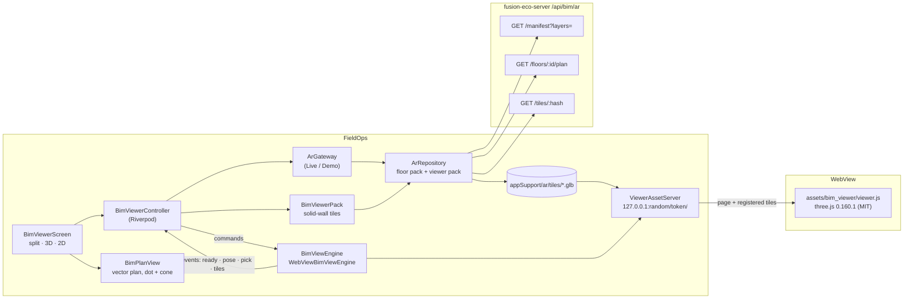
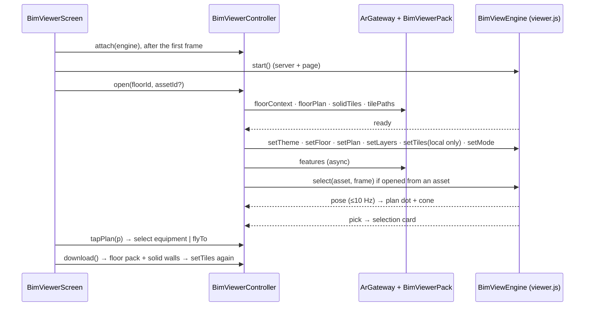

# Model viewer (2D / 3D): Dalux-style split view

Built 2026-09-26 (V1). This is a model viewer inside FieldOps. It shows the floor's BIM model in 3D (orbit or walk) above the floor plan in 2D. A position dot and a view cone on the plan follow the 3D camera, and a tap on the plan moves the camera there. It works offline from the floor pack that AR already downloads.

It was added **alongside** the existing xeokit twin (`TwinScreen`, the web page in a WebView), not instead of it. The user asked for this on 2026-09-26: "don't remove existing like xeokit, add extra". Both buttons sit on the asset screen.

**Status:** the server side, the viewer page and the viewer maths have run. The Dart side has **not** been analyzed or tested; the user said not to test this pass. See §8 and PENDING P-011.

## 1. What a technician gets

| Dalux mobile | FieldOps model viewer |
|---|---|
| Split view: 2D drawing + 3D, green dot and view direction on the drawing | Split view (portrait: 3D over 2D; landscape: side by side), with a blue dot and a view cone that follow the camera at 10 Hz |
| Tap the drawing to jump there in 3D | Tap the plan and the 3D camera flies there (walk keeps its heading, orbit re-targets) |
| Walk through the model | **Walk** mode at eye height (1.6 m): drag to look, joystick to walk |
| Model overview | **Orbit** mode with a **section cut** 2.2 m above the floor ("dollhouse"). Walls and slabs are cut and MEP is not, so ducts above a ceiling stay visible |
| Filters, X-ray | Layers: MEP, Structure, Walls, Outlines, X-ray, Section cut |
| Tap an element for its properties | Tap in 3D or tap equipment on the plan. A card shows the name, IFC type and discipline, and **Open asset** leads to the asset screen. The element is highlighted in both views |
| Offline models | The same floor pack as AR (download once, use in both) plus a small solid-wall pack |

Opened from an asset, the viewer selects the asset, frames it in 3D and highlights its footprint on the plan.

## 2. How it fits together



**Why three.js in a WebView, and not Filament in `packages/fe_ar`.** `fe_ar`'s Android renderer is SceneView's `ARSceneView`, which an ARCore session owns ([FeArPlatformView.kt](../packages/fe_ar/android/src/main/kotlin/com/fusionapps/fe_ar/FeArPlatformView.kt)). The plugin is also not wired into the app yet (P-005). A WebView path runs on every phone today, is licence-free (three.js and meshoptimizer are MIT), and was verified in a real browser against real tiles. It sits behind the Dart [`BimViewEngine`](../lib/core/bim_viewer/bim_view_engine.dart) interface, so a Filament engine can replace it later without touching the screens. The same `viewer.js` can also back the web's Track W viewer.

## 3. Data: the floor pack plus a solid-wall pack

The AR `architecture` layer is **edges only** (lines at creases ≥ 30°): right over a camera image, but it reads as a wireframe in a model viewer. The server now also builds **`architecture_solid`**: the same elements as shaded triangles. It is opt-in on the manifest, so AR packs never change.

| What | Where it comes from | Stored as |
|---|---|---|
| MEP, structure, architecture edges, corners, grid, markers | `GET /manifest?scope=floor&id=` (unchanged) | AR floor pack: `ar_manifests` scope `floor` |
| Solid walls | `GET /manifest?scope=floor&id=&layers=architecture_solid` | Viewer pack: `ar_manifests` scope **`viewer`**, same floor id |
| Plan (rooms, walls, columns, doors, equipment) | `GET /floors/:floorId/plan` (sync cache) | GET cache |
| Features (name, type, asset per feature) | `GET /features/:buildId` | `ar_features` |
| Tile files | `GET /tiles/:hash` | `<appSupport>/ar/tiles/<hash>.glb`, shared by both packs |

Rules this relies on ([ar_repository.dart](../lib/data/ar_repository.dart), [offline_db.dart](../lib/core/offline/offline_db.dart)):
- `saveArManifest` touches corners, grid lines and markers **only for scope `floor`**. The viewer pack shares the floor id and would otherwise wipe them.
- `floorsForBuilding` and the offline floor list read **scope `floor` only**, so a viewer pack is never a second floor.
- Tile GC keeps every tile a stored manifest lists. The viewer pack lists its solid tiles, so they survive GC as long as it exists. `deleteFloorPack` deletes both packs.
- `fetchViewerManifest` follows the same ETag/304/offline rules as `fetchManifest`. A server from before the layer answers **400 `BAD_LAYERS`**, which is treated as "no solid walls", not an error.
- **No solid tiles on the phone** (an older build, a DB without the enum value, Demo): "Walls" draws **plan massing**. Walls are extruded 3 m from the plan's wall polylines and columns, over a floor slab.

## 4. The engine wire

Pure Dart: [bim_view_wire.dart](../lib/core/bim_viewer/bim_view_wire.dart). Dart runs `window.feViewer.run({cmd, args})` with the JSON escaped. Events come back on the `FeViewer` JavaScript channel, one JSON object each. Commands sent before the page reports `ready` are queued in Dart.

| Command | Args | Effect |
|---|---|---|
| `setTheme` | `dark` | Background and wall tones |
| `setFloor` | `datumY, bounds[minX,minZ,maxX,maxZ], eyeHeightM=1.6, cutHeightM=2.2` | Frames the floor, sets eye and cut heights |
| `setTiles` | `base, tiles[{hash, layer, buildId}]` | Replaces the resident set: unloads the rest, loads new tiles (4 in parallel) from `<base><hash>.glb` |
| `setPlan` | `datumY, heightM, walls[{pts, t}], columns, bounds` | Builds plan massing (merged into one mesh) and a floor slab |
| `setLayers` | `mep, structure, architecture, architecture_solid, massing, xray, cut` | Visibility, x-ray opacity, section cut |
| `setMode` | `orbit` or `walk` | Walk stands where orbit looked and shows the joystick |
| `flyTo` | `x, z, headingX?, headingZ?` | 380 ms eased move to a plan point |
| `select` | `featureId, buildId, frame, bboxMin?, bboxMax?` | Highlight overlay (drawn through walls) and optional framing |
| `clearSelection`, `resetView` | none | |

| Event | Fields |
|---|---|
| `ready` | `version, webgl2` (after the WebGL context and the meshopt WASM are up) |
| `tiles` | `loaded, failed, total, resident, triangles, done` |
| `pose` | `pos, dir, mode, fovDeg, target` (orbit). At most 10 Hz, only when moved > 1 cm or ~0.5° |
| `pick` | `featureId, buildId, layer, point, tileHash`, or `{none: true}` |
| `error` | `code`: `NO_WEBGL`, `NO_WASM`, `CONTEXT_LOST`, `SCRIPT`, `COMMAND_FAILED`, `UNKNOWN_COMMAND`; Dart adds `LOAD_FAILED`. The fatal ones switch the screen to plan-only |

**Picking** follows contract C7: the vertex's `TEXCOORD_1.x` is a tile-local index into the tile's scene extras `fe.featureIds`. A raycast ignores clipping, so hits above the section cut are dropped. In x-ray, see-through walls don't swallow a tap meant for what's behind them.

### 4.2 The loopback server

[viewer_asset_server.dart](../lib/core/bim_viewer/viewer_asset_server.dart) serves the page and the floor's tiles to the WebView from `http://127.0.0.1:<random port>/<128-bit token>/`. It uses a server rather than `loadFile` for three reasons:
- Base64 over a channel adds 33 % and a copy per tile on the UI isolate.
- Android blocks `fetch()` of `file://` from a `file://` page.
- ES modules and WASM just work on an `http` origin.

It is locked down:
- It is bound to IPv4 loopback only, and every path starts with the random token.
- It accepts GET only, and the page files are a fixed allow list.
- A tile is served only if its hash was registered, and a hash is never turned into a path.
- It closes with the screen.

Cleartext to 127.0.0.1 is already allowed on both platforms (`usesCleartextTraffic`, `NSAllowsArbitraryLoads`).

## 5. The 2D plan

[bim_plan_view.dart](../lib/features/bim_viewer/bim_plan_view.dart) draws the server's cut plan (section at datum + 1.01 m) as vectors:
- rooms filled, with names once zoomed in;
- equipment footprints, with asset-linked ones darker;
- walls at 0.2 m (minimum 2 px), columns filled, door gaps with a swing arc;
- grid lines dash-dotted, with name bubbles.

It is the model itself, in the tile frame, so a plan tap is a 3D place with no calibration step. That is unlike the raster `FloorPlanScreen` image (FR-2.8), which is a separate system and stays as it is.

Gestures: pan with one finger, pinch with two, double-tap to zoom ×2. A tap selects equipment (smallest containing footprint, else nearest within 22 px) or moves the camera there. The viewport maths are pure ([plan_view_math.dart](../lib/core/bim_viewer/plan_view_math.dart)), so strokes keep a constant pixel width. In walk mode the plan follows the dot when it nears an edge. In split view, an "In <room>" chip names the room the camera is in.

## 6. State flow



Things to watch ([bim_viewer_controller.dart](../lib/state/bim_viewer_controller.dart)):
- **Attach before start, after the first frame.** Riverpod forbids changing provider state while the tree builds. The engine's `ready` would also be lost if it fired before anyone listened.
- The scene is pushed **once per floor per engine**, however many `ready` events arrive. Tile and layer updates after a download are pushed on their own.
- "Walls" means shaded tiles when the phone has them and plan massing when it doesn't (`effectiveLayers`).
- **Datum** (eye height, cut, massing): the corners' height when the floor has corners. Otherwise the lowest wall-tile base, then any tile, then 0, always plus the finish offset (AR-45).

## 7. Files

| Path | Role |
|---|---|
| `assets/bim_viewer/index.html`, `viewer.js`, `viewer_math.js` | The page. `viewer_math.js` is pure and node-tested |
| `assets/bim_viewer/vendor/*` | three.js 0.160.1 `three.module.min.js`, `GLTFLoader`, `OrbitControls`, `BufferGeometryUtils`, `meshopt_decoder` (all MIT, `LICENSE-three.txt`), copied from `../fusion-eco-client/node_modules/three` with imports rewritten to relative paths (no import map, so older WebViews work) |
| `lib/core/bim_viewer/bim_view_wire.dart` | Commands, events, layer state (pure) |
| `lib/core/bim_viewer/bim_view_engine.dart` | Engine seam + `FakeBimViewEngine` |
| `lib/core/bim_viewer/viewer_asset_server.dart` | Loopback server |
| `lib/core/bim_viewer/plan_view_math.dart` | Viewport, hit tests, view cone (pure) |
| `lib/state/bim_viewer_controller.dart`, `bim_viewer_pack.dart` | Controller + solid-wall pack (Live / Demo) |
| `lib/features/bim_viewer/bim_viewer_screen.dart`, `bim_plan_view.dart`, `webview_bim_view_engine.dart` | Screen, plan widget, WebView engine |
| `lib/data/ar_repository.dart` | `fetchViewerManifest`, `localViewerManifest`, the scope fences |
| `lib/app/router.dart` | `/bim-viewer/:floorId?assetId=&name=` (`Routes.bimViewer`) |
| `lib/features/asset_detail/asset_detail_screen.dart` | "Model viewer (3D / 2D)" button (floor required), below the xeokit "View in 3D" |
| `tool/bim_viewer/viewer_math.test.mjs`, `tool/bim_viewer/e2e.mjs` | Node unit tests; browser end-to-end check on real tiles |
| `test/bim_*_test.dart`, `test/viewer_asset_server_test.dart`, `test/bim_viewer_fakes.dart`, `test/ar_repository_test.dart` (viewer group) | Dart tests: **written, not run** |

Server side: `../fusion-eco-server/documentation/ar-markers-and-geometry.md` §"Solid architecture layer".

## 8. Verification (be honest)

| Check | Result |
|---|---|
| Server vitest `src/services/ar` + `src/controllers` | 325/325 pass, including new pipeline tests (solid tiles are TRIANGLES with normals, name exactly the architecture features, never appear in a feature's AR tile list, AR tile hashes are byte-identical with or without them) and `?layers=` parsing |
| Server `tsc` | No errors in any AR file (484 pre-existing errors elsewhere in the repo, untouched) |
| `node --test tool/bim_viewer/viewer_math.test.mjs` | 11/11 |
| `tool/bim_viewer/e2e.mjs` in headless Chromium (SwiftShader) on **real server-built tiles** | 22/22 on the Villa architectural IFC (60 tiles, 20 solid, 127k triangles). On FEDEMO (MEP-heavy) every check passes, except the massing check, which is skipped because its plan has no walls. It checks load, orbit pose, tap-pick → the right feature, highlight, select-and-frame, layer hide, x-ray, walk at eye height, joystick walks forward, flyTo, unload, plan massing (420 walls), the section cut, and no console errors. Screenshots were reviewed |
| `flutter analyze`, `flutter test` (the new Dart tests) | **Not run.** The user said not to test this pass |
| Android / iOS WebView on a device | **Not run** |

Rerun the browser check: build tiles with the server pipeline into a folder (`manifest.json`, `plan.json`, `features.json`, `tiles/`), then:

```
PLAYWRIGHT=../fusion-eco-client/node_modules/playwright TILES_DIR=<dir> node tool/bim_viewer/e2e.mjs
```

## 9. Next

- **V1 leftovers** (P-011): run the Dart tests and analyze on Flutter ≥ 3.44, then a device run (Android WebView WebGL2 and `EagerGestureRecognizer`, iOS WKWebView). Performance on a large floor needs measuring; three.js has no BVH, so a pick is a plain raycast.
- **V2:** PDF drawing register, 2-point calibration snapped to grid crossings, drawings offline, pins on drawings (Dalux mapping item 39).
- **V3:** section box, measure, colour by data (live BMS values on elements), drawings shown in 3D, links between drawings, a whole-building manifest scope.
- **Later:** the same `viewer.js` for the web (Track W), and a Filament `BimViewEngine` once `fe_ar` has a non-AR camera.
