# Build, release & platform guide

For engineers (or Claude Code) building, testing or releasing **FusionEco FieldOps**
(pubspec name `technician_portal`, Android package `com.fusionapps.fieldops`).
Release history and signing notes are in [RELEASE_INFO.md](../RELEASE_INFO.md); the
version-bump rule and the shipped-builds table are in [VERSIONING.md](../VERSIONING.md).
Backend push setup is in [fcm-backend-handoff.md](fcm-backend-handoff.md).

Only **Android** ships today. iOS is scaffolded but cannot launch (see [§6](#6-ios--not-shippable-yet)).
`web/`, `windows/`, `linux/` and `macos/` are untouched `flutter create` output (the macOS
bundle id is still `com.example.flutterApplication1`).

---

## 1. Toolchain

| Requirement | Source |
|---|---|
| Flutter **>= 3.44.0**, Dart **>= 3.13.2** | [pubspec.lock `sdks:`](../pubspec.lock), [pubspec.yaml:7](../pubspec.yaml#L7) |
| AGP 9.1.0, Kotlin plugin 2.4.0, google-services 4.4.4 | [settings.gradle.kts:22-24](../android/settings.gradle.kts#L22) |
| Gradle 9.3.1 | `android/gradle/wrapper/gradle-wrapper.properties` |
| Java 17 source/target | [app/build.gradle.kts:28-29](../android/app/build.gradle.kts#L28) |
| NDK **30.0.16138531**, pinned for the app *and every plugin* | [app/build.gradle.kts:25](../android/app/build.gradle.kts#L25), [build.gradle.kts:18-28](../android/build.gradle.kts#L18) |

- `android/local.properties` (holds `flutter.sdk`) is gitignored and written by the Flutter
  tool on the first `flutter run`/`build`. [settings.gradle.kts:5-7](../android/settings.gradle.kts#L5)
  fails with `flutter.sdk not set` if it is missing.
- `gradlew`, `gradlew.bat` and `gradle-wrapper.jar` are gitignored ([android/.gitignore](../android/.gitignore)).
  The Flutter tool puts them back when it builds.
- The NDK pin for every plugin was added because the Windows build machine only had part of a
  newer NDK download. `android/build.gradle.kts.bak` is the file as it was before that change.
  A machine without NDK 30.0.16138531 has to install it, or the pin has to change.
- [gradle.properties](../android/gradle.properties) asks for an 8 GB heap and sets
  `kotlin.incremental=false`, which works around a Kotlin cache-lock problem on Windows.

> **Verification status (2026-09-25, macOS checkout):** none of the commands below have been
> run here. The newest working SDK on this machine is Flutter 3.19.3 / Dart 3.3.1, and
> `flutter pub get` fails with `technician_portal requires SDK version ^3.13.2`. The
> commands use standard Flutter CLI syntax. Treat analyzer and test results as unknown until
> someone runs them on a Flutter >= 3.44 SDK.

## 2. Commands

```bash
# deps: never let pub rewrite the lockfile
flutter pub get --enforce-lockfile

# static analysis (flutter_lints; platform folders + build/ excluded)
flutter analyze

# all tests
flutter test
# one file
flutter test test/flush_policy_test.dart
# one test, matched as a substring of its full name
flutter test test/flush_policy_test.dart --plain-name "428 (location gate) stops the run and keeps the check"
# regex across every file, matched against "group test" names
flutter test --name "LocationCheckInGate"

# dev run against a LAN backend (server :5002, Next.js client :3000)
# the phone must share the LAN; an Android emulator reaches the host at 10.0.2.2
flutter run \
  --dart-define=API_BASE_URL=http://<lan-ip>:5002 \
  --dart-define=WEB_BASE_URL=http://<lan-ip>:3000

# dev run against the hosted dev stack
flutter run \
  --dart-define=API_BASE_URL=https://dev.api.eco.thefusionapps.com \
  --dart-define=WEB_BASE_URL=https://dev.eco.thefusionapps.com

# Play release bundle. ALWAYS pass both hosts (see §3)
flutter build appbundle --release \
  --dart-define=API_BASE_URL=https://dev.api.eco.thefusionapps.com \
  --dart-define=WEB_BASE_URL=https://dev.eco.thefusionapps.com \
  --dart-define=BRAND_NAME="Fusion Eco"
# -> build/app/outputs/bundle/release/app-release.aab
jarsigner -verify -verbose -certs build/app/outputs/bundle/release/app-release.aab   # must show the release cert, not "Android Debug"

# regenerate launcher icons (config at pubspec.yaml:84-95, source assets/public/app_icon_source.png)
dart run flutter_launcher_icons
```

`API_BASE_URL` is the host root, with no `/api`. Repositories add `/api/...` themselves, and
the socket client removes `/api` again ([socket_service.dart:30](../lib/core/realtime/socket_service.dart#L30)).

## 3. Build-time configuration (`--dart-define`)

| Key | Current default in [env.dart](../lib/app/env.dart) | Used for |
|---|---|---|
| `API_BASE_URL` | `http://192.168.0.142:5002`, a developer's LAN IP ([env.dart:4-7](../lib/app/env.dart#L4)) | Dio base, socket.io, WorkManager isolate |
| `WEB_BASE_URL` | `http://192.168.0.142:3000` ([env.dart:16-19](../lib/app/env.dart#L16)) | twin WebView, `/public/assets/*` links, deciding whether a scanned QR is "ours" |
| `BRAND_NAME` | `Fusion Eco` ([env.dart:25-28](../lib/app/env.dart#L25)) | login / loader / chat copy |

The hosted dev defaults are still in the file as comments ([env.dart:8-11](../lib/app/env.dart#L8), [:20-23](../lib/app/env.dart#L20)).

**LAN-default risk.** Since 2026-09-21 the committed default has been whichever DHCP address the
developer's machine had that day (`.111` → `.125` → `.129` → `.142`, per `git log -L4,7:lib/app/env.dart`).
A release built without `--dart-define` ships pointing at a private IP over cleartext HTTP. Build
1.0.1+2 was built when the default was still `https://dev.api.eco.thefusionapps.com`
([RELEASE_INFO.md](../RELEASE_INFO.md)). That default has since changed.

**Runtime override.** The login screen's settings button ([login_screen.dart:63](../lib/features/login/login_screen.dart#L63))
stores an API base in SharedPreferences key `apiBaseUrl` ([session_store.dart:170](../lib/core/storage/session_store.dart#L170)).
It is only read at startup ([main.dart:35](../lib/main.dart#L35), [background_sync.dart:128](../lib/core/offline/background_sync.dart#L128)),
so the app has to be killed and relaunched before it takes effect. `ApiClient.baseUrl=` is never
called. The override covers the **API only**, not `WEB_BASE_URL`. The button is also visible in
release builds.

## 4. Release checklist (Android → Play Console)

1. **Version.** Bump `version:` in [pubspec.yaml:4](../pubspec.yaml#L4) according to [VERSIONING.md](../VERSIONING.md).
   `BUILD` (the part after `+`) must go up on every upload, forever. Add the new row to the
   VERSIONING.md table in the same change. The table currently stops at build 2, while pubspec is at `1.0.1+3`.
2. **Signing files** (never commit them; both are gitignored by [android/.gitignore](../android/.gitignore) `key.properties` / `**/*.jks`):
   - `android/key.properties`, copied from [key.properties.example](../android/key.properties.example).
     `storeFile` is resolved relative to `android/app/`, so `../fusion-eco-technician.jks` means `android/fusion-eco-technician.jks`.
   - Without `key.properties` the release build **silently signs with the debug key**
     ([app/build.gradle.kts:60-66](../android/app/build.gradle.kts#L60)). The build succeeds, but Play rejects the bundle. Always run the `jarsigner -verify` step.
3. **Hosts.** Pass `API_BASE_URL` and `WEB_BASE_URL` explicitly (see §3). Decide whether this build targets `dev.` or prod.
   RELEASE_INFO.md flags that this was never confirmed.
4. **Firebase.** [android/app/google-services.json](../android/app/google-services.json) (tracked) has clients for
   `com.fusionapps.fieldops` and the retired `com.thefusionapps.fusioneco.technician`, project
   `fusion-eco-technician`. RELEASE_INFO.md contradicts itself on whether the release-key
   SHA-1/SHA-256 fingerprints are registered on the new app entry. Check in the Firebase console.
5. **Shrinking** is off on purpose ([app/build.gradle.kts:67-72](../android/app/build.gradle.kts#L67)).
   If R8 or resource shrinking is ever turned on, keep `res/raw/notification_ting`. Dart refers
   to it only by name, so the shrinker would strip it.
6. After the upload, update RELEASE_INFO.md (the AAB path, the hosts used). Do not add passwords or keystore contents to it.

## 5. Android platform config

[AndroidManifest.xml](../android/app/src/main/AndroidManifest.xml):

| Item | Why |
|---|---|
| `INTERNET`, `ACCESS_NETWORK_STATE` | API, connectivity_plus |
| `CAMERA`, `RECORD_AUDIO` | checklist/verification photos, voice notes, QR + nameplate OCR |
| `ACCESS_FINE_LOCATION`, `ACCESS_COARSE_LOCATION` | task GPS stamps + location check-in (foreground only, no `ACCESS_BACKGROUND_LOCATION`) |
| `VIBRATE` | QR scan buzz |
| `POST_NOTIFICATIONS` | Android 13+ push display |
| `android:usesCleartextTraffic="true"` ([:22](../android/app/src/main/AndroidManifest.xml#L22)) | the LAN `http://` default. Applies to the whole app, with no `network_security_config` |
| portrait-only activity ([:27](../android/app/src/main/AndroidManifest.xml#L27)) | matches `SystemChrome.setPreferredOrientations` in [main.dart:20](../lib/main.dart#L20) |
| `<queries>` VIEW http/https ([:66-75](../android/app/src/main/AndroidManifest.xml#L66)) | `url_launcher` can't see browsers on Android 11+ without it |

- The manifest declares no services or receivers. FCM (`firebase_messaging`) and WorkManager
  (`workmanager`, [background_sync.dart:47](../lib/core/offline/background_sync.dart#L47), Android-only)
  bring theirs in through manifest merge. There is no `default_notification_channel_id` meta-data.
  It isn't needed, because every push is data-only and drawn by `LocalNotifications`.
- `res/raw/notification_ting.wav` is the push sound for channel `fcm_default_channel`
  ([local_notifications.dart:14-20](../lib/core/push/local_notifications.dart#L14)). Android fixes a
  channel's sound when the channel is created. To change the sound, ship a **new channel id**;
  editing the existing one has no effect on devices that already have it.
- Core library desugaring is on for `flutter_local_notifications` ([app/build.gradle.kts:31](../android/app/build.gradle.kts#L31), [:88](../android/app/build.gradle.kts#L88)).
  `minSdk`/`targetSdk`/`compileSdk` come from the Flutter plugin defaults. There are no product flavors.
- `android/build/reports/problems/problems-report.html` is tracked in git by accident: the root `/build/` ignore rule doesn't cover `android/build/`.

## 6. iOS — not shippable yet

What exists: [Info.plist](../ios/Runner/Info.plist) usage strings for camera, microphone,
location-when-in-use and photo library ([:7-14](../ios/Runner/Info.plist#L7)); display name
"FusionEco FieldOps"; iPhone portrait-only; `NSAllowsArbitraryLoads = true` ([:75-79](../ios/Runner/Info.plist#L75));
deployment target 15.0; Swift Package Manager plugin integration (`FlutterGeneratedPluginSwiftPackage`,
so there's no Podfile yet); template `AppDelegate`/`SceneDelegate`.

Needed before iOS can ship:

- [ ] `ios/Runner/GoogleService-Info.plist`. Without it, `Firebase.initializeApp()` ([main.dart:26](../lib/main.dart#L26)) has no options and the app fails at startup.
- [ ] Bundle id. `PRODUCT_BUNDLE_IDENTIFIER` is still the retired `com.thefusionapps.fusioneco.technician` (`ios/Runner.xcodeproj/project.pbxproj`). Decide on the id and register a matching Firebase iOS app.
- [ ] Signing: `DEVELOPMENT_TEAM` is not set.
- [ ] Push: the Push Notifications capability (entitlements file), `UIBackgroundModes` → `remote-notification`, and an APNs key uploaded to Firebase ([fcm-backend-handoff.md §5](fcm-backend-handoff.md)).
- [ ] `LocalNotifications.init` passes Android settings only ([local_notifications.dart:32-39](../lib/core/push/local_notifications.dart#L32)). Add `DarwinInitializationSettings` plus Darwin details in `show()`.
- [ ] Background sync: `workmanager` on iOS needs BGTaskScheduler identifiers in Info.plist and AppDelegate registration. Until then the queue drains only while the app is open.
- [ ] Some plugins (for example ML Kit text recognition) may still need CocoaPods; `flutter build ios` will generate a Podfile. Check each plugin's minimum iOS version against the 15.0 target.

## 7. Push & location check-in flow

```mermaid
flowchart TD
  subgraph PUSH["FCM push (data-only)"]
    S1["server notificationService.createNotification"] --> S2["sendEachForMulticast<br/>data: title, link, entityId, entityType"]
    S2 --> Q{"app state?"}
    Q -->|foreground| F1["FirebaseMessaging.onMessage<br/>push_service.dart:51"]
    Q -->|background / killed| B1["firebaseMessagingBackgroundHandler<br/>separate isolate, re-inits Firebase<br/>push_service.dart:20"]
    F1 --> LN["LocalNotifications.show<br/>channel fcm_default_channel, notification_ting"]
    B1 --> LN
    F1 --> BADGE["invalidate unseenNotificationCountProvider"]
    LN --> TAP{"tap"}
    TAP -->|app alive| R1["onDidReceiveNotificationResponse"]
    TAP -->|cold start| R2["PushService.init → launchPayload()<br/>push_service.dart:57"]
    R1 --> RT["_routeForPushData<br/>link '/technician/..' or entityType → route"]
    R2 --> RT
    RT --> GO["routerProvider.go(route)"]
    T0["login / app resume → PushService.init"] --> T1["getToken → POST /api/notifications/register-device"]
  end

  subgraph LOC["Location check-in gate"]
    L1["POST /api/auth/technician-login"] --> L2["body.requestLocation → Session.requestLocation<br/>auth_repository.dart:41"]
    M1["any mutating request"] --> M2{"HTTP 428<br/>LOCATION_REQUIRED?"}
    M2 -->|yes| M3["ApiClient interceptor → onLocationRequired<br/>api_client.dart:46"]
    M2 -->|"yes, during queue flush"| M4["classifyFlushFailure → stopRun<br/>queue kept, flush_policy.dart:30"]
    L2 --> C1["CheckInController.required = true"]
    M3 --> C1
    C1 --> G1["LocationCheckInGate (MaterialApp builder)<br/>AbsorbPointer + blocking card"]
    G1 -->|Share Location| C2["currentCheckInPosition<br/>geolocator, 10 s, last-known fallback"]
    C2 --> C3["POST /api/fm/technicians/me/location {lat,lng}<br/>exempt from the gate"]
    C3 --> C4["clearRequestLocation; required = false"]
    C4 --> C5["unawaited(syncClient.flushQueue())<br/>resume the stopped queue"]
    M4 -.->|resumed by| C5
  end
```



Contract sources: server `fusion-eco-server/documentation/fcm-push-notifications.md` and
`technician-location-capture.md`. Client files: [push_service.dart](../lib/core/push/push_service.dart),
[local_notifications.dart](../lib/core/push/local_notifications.dart),
[checkin_controller.dart](../lib/state/checkin_controller.dart),
[location_checkin_gate.dart](../lib/widgets/location_checkin_gate.dart) (mounted at [app.dart:73-76](../lib/app/app.dart#L73)),
[technician_location_repository.dart](../lib/data/technician_location_repository.dart).

Known gaps:
- **No `location_request` push handling.** Nothing in `lib/` reads `message.data['type']`. The
  server's 05:00 silent `data: {type: "location_request"}` push was removed on 2026-09-15
  (server `LEARNINGS.md`), so today the only triggers are login and 428. If that push comes back,
  the app will currently show it as a visible "Fusion Eco" notification with no body
  ([local_notifications.dart:56-77](../lib/core/push/local_notifications.dart#L56) draws every data message).
- `_routeForPushData` ([push_service.dart:102](../lib/core/push/push_service.dart#L102)) is a
  hand-written copy of `routeForNotification` ([notification_route.dart](../lib/core/utils/notification_route.dart)).
  Only the second one is tested. Change both together.
- `PushService.init` sets `_initialized = true` before `getToken()`. If `getToken()` throws
  (offline at launch), the `onMessage` listener and the cold-start tap routing are never set up
  for that process ([push_service.dart:38-58](../lib/core/push/push_service.dart#L38)).
- Logout deliberately leaves the device token registered ([auth_controller.dart:117-120](../lib/state/auth_controller.dart#L117)),
  and nothing calls `PushService.unregister()`. [fcm-backend-handoff.md:80-81](fcm-backend-handoff.md) still
  says the app unregisters on logout; that line is out of date.

## 8. Tests

- 31 files flat in `test/`, named `<unit>_test.dart`, about 261 `test()` and 8 `testWidgets()`
  (counted in the source, not run). There's no `integration_test/`, no CI config, and no mocking
  package (no mockito or mocktail).
- **Mostly pure-function tests** on domain parsing and policy: `flush_policy`, `notification_route`,
  `qr_payload`, `checklist_status`, `route_progress`, `envelope`, `dates`, and so on. New
  business rules should be pulled out as pure functions (like `classifyFlushFailure`) so they
  can be tested without a DB or network.
- **Fakes, not mocks.** Storage and network are reached through narrow `abstract interface class`
  seams. `OfflineDb` implements `C2oAssetCache`, `RoutePackStore`, `TagIssueLog` and
  `VerificationDraftStore` ([offline_db.dart:257](../lib/core/offline/offline_db.dart#L257));
  the repositories implement `RouteFetcher` and `C2oScanFetcher`. Tests write small in-memory
  `_Fake… implements …` classes (see [route_download_service_test.dart](../test/route_download_service_test.dart),
  [close_flow_test.dart](../test/close_flow_test.dart)). No test fakes `OfflineDb` or `ApiClient` as a whole.
- **Widget tests** ([location_checkin_gate_test.dart](../test/location_checkin_gate_test.dart),
  [order_detail_test.dart](../test/order_detail_test.dart)) skip the JSON i18n load:
  `SharedPreferences.setMockInitialValues({})` → `FlutterLocalization.instance.ensureInitialized()`
  → `init(mapLocales: [MapLocale('en', {...only the keys under test...})])`. Riverpod state is
  pinned with `provider.overrideWith(() => _FixedController(state))` inside a `ProviderScope`.
- **Untested:** `SyncClient.flushQueue` from start to finish, `ApiClient` interceptors (401/428),
  `AuthController`, `CheckInController`, `PushService` / `LocalNotifications` / `_routeForPushData`,
  `BackgroundSync`, prefetch, the socket, `LocaleController`, and almost every screen.

## 9. UI, theme & i18n conventions

**Theme** (light only, "Navy Professional"; [app_theme.dart](../lib/theme/app_theme.dart), Poppins from `google_fonts`):
- Colors: use [`FeColors`](../lib/theme/fe_colors.dart) (`primary`, `page`, `panel`, `line`, `ink`, `ink2`,
  `success/warning/danger/info` + `*Soft`). Status, priority, condition and SLA hues come from
  [`FeStatusHues`](../lib/theme/fe_status_tokens.dart), which are ported from the web portal's
  `globals.css`. Do not add a new `Color(0x…)` outside `lib/theme/`. About 311 older ones are
  still there (largest counts in `order_detail_screen.dart`, `profile_screen.dart`, `dashboard_screen.dart`).
- Tokens go through the `BuildContext` extension [`FeThemeAccess`](../lib/theme/theme_extensions.dart#L393):
  `context.chips.status(s)` / `.priority(p)` → `FeChipStyle`, `context.space.*`, `context.radii.*`,
  `context.metrics.*`, `context.motion.*`, `context.orderTypeColors`, `context.accents`, and `FeElevation.soft` for shadows.

**Widgets** ([lib/widgets/](../lib/widgets)). Use these instead of the raw Material equivalents:

| Use | Instead of |
|---|---|
| `AppText` / `AppText.titleMedium(...)`, `.bodySmall`, `.caption`, … ([app_text.dart:32](../lib/widgets/app_text.dart#L32)) | `Text(style: TextStyle(...))` |
| `TechCard` (`dark:` hero, `tint:` alert) ([common.dart:26](../lib/widgets/common.dart#L26)) | `Card` / ad-hoc `Container` decoration |
| `TechChip(label:, style: context.chips.status(...))`, `IconBadge` | hand-coloured pills |
| `TechSpinner`, `TechEmptyState`, `TechnicianLoadingView` | `CircularProgressIndicator`, ad-hoc empty states |
| `FeHeader` / `TechHeader` (shell) | `AppBar`: FeHeader sets foreground, title style and overlay style together |
| `showTechPopup(context, message:)` ([tech_popup.dart:21](../lib/widgets/tech_popup.dart#L21)) | `SnackBar` inside a modal sheet, where it renders behind the sheet |
| `PressableScale`, `StaggeredEntrance` ([motion.dart](../lib/widgets/motion.dart)) | bespoke tap and entrance animations |
| `OfflineBanner`, `SyncConflictPanel`, `showPhotoViewer` | — |

About 347 `AppText` calls against 168 raw `Text(` calls today. Raw `Text` is still common
inside buttons and SnackBars.

**i18n** ([locale_config.dart](../lib/app/locale_config.dart); package `flutter_localization`, not `flutter_localizations`/ARB):
- [`assets/i18n/en.json`](../assets/i18n/en.json) and [`ar.json`](../assets/i18n/ar.json) are
  **flat** maps whose keys contain dots: `"order_detail.header_work_order": "…"`. There are 26
  namespaces (`order_detail`, `routes`, `fieldVerify`, `profile`, `scanner`, `common`, …), and
  the naming mixes snake_case and camelCase. Each file has 595 keys, the key sets match exactly,
  and the `%a` placeholders line up.
- Look strings up with `'ns.key'.getString(context)`. For placeholders, use
  `context.formatString('ns.key'.getString(context), [arg])`. Every new key goes into **both** files.
- Arabic is RTL. The direction is pinned in [app.dart:73](../lib/app/app.dart#L73), and the
  language lives in `localeControllerProvider`. Don't call `FlutterLocalization.instance.translate` directly.
- Gaps: `common.pull_down_to_retry` is used in 3 screens but missing from both JSON files.
  About 27 literal English UI strings sit in [inspection_form_screen.dart](../lib/features/inspection/inspection_form_screen.dart).
  English error text comes from `CaptureFailure` / `ApiFailure` / controller messages
  (for example [checkin_location.dart:21-50](../lib/core/location/checkin_location.dart#L21)) and shows up untranslated in the UI.
