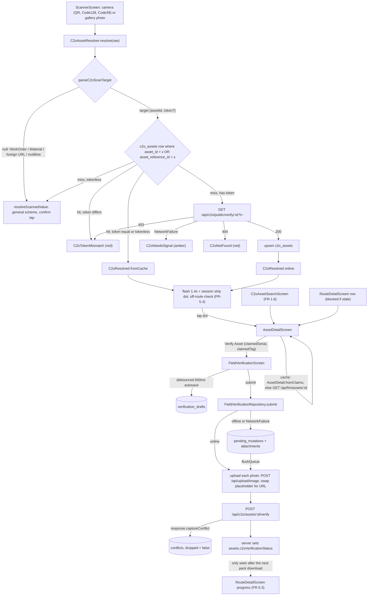
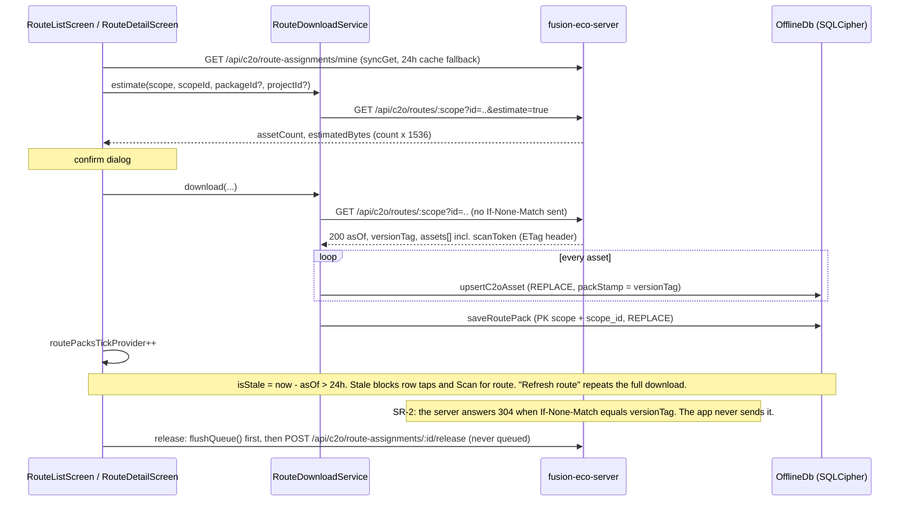

# C2O field verification and routes

C2O (Construction-to-Operations) field verification lets a technician stand in front of a handed-over asset, identify it (QR tag, barcode plate, nameplate OCR or manual search), see what the register claims about it, and record what is actually there: result, observed serial/tag, condition, photos, GPS. Route mode (FR-5) downloads a whole package, building, level or system ahead of time, so identification and capture keep working in plant rooms and basements with no signal. Checks queue offline and upload later.

For the generic offline engine (`SyncClient`, queue flush policy, background sync, SQLCipher DB), see [architecture.md](architecture.md). This doc covers only what is specific to C2O.

## Where the code lives

| Layer | Files |
|---|---|
| Pure logic (no I/O, unit-tested) | [c2o_scan_payload.dart](../lib/core/c2o/c2o_scan_payload.dart), [asset_detail.dart](../lib/core/c2o/asset_detail.dart), [c2o_asset_search.dart](../lib/core/c2o/c2o_asset_search.dart), [assigned_assets.dart](../lib/core/c2o/assigned_assets.dart), [assigned_route.dart](../lib/core/c2o/assigned_route.dart), [route_pack.dart](../lib/core/c2o/route_pack.dart), [route_progress.dart](../lib/core/c2o/route_progress.dart), [nameplate_ocr.dart](../lib/core/ocr/nameplate_ocr.dart), [qr_payload.dart](../lib/core/utils/qr_payload.dart) |
| Services over interfaces (fakeable) | [c2o_asset_resolver.dart](../lib/core/c2o/c2o_asset_resolver.dart), [route_download_service.dart](../lib/core/c2o/route_download_service.dart). Interfaces: `C2oAssetCache` / `RoutePackStore` / `VerificationDraftStore` / `TagIssueLog` in [offline_db.dart:257](../lib/core/offline/offline_db.dart#L257), `C2oScanFetcher` in [c2o_field_verification_repository.dart:5](../lib/data/c2o_field_verification_repository.dart#L5), `RouteFetcher` in [route_pack_repository.dart:6](../lib/data/route_pack_repository.dart#L6) |
| Repositories | [c2o_field_verification_repository.dart](../lib/data/c2o_field_verification_repository.dart), [field_verification_repository.dart](../lib/data/field_verification_repository.dart), [route_pack_repository.dart](../lib/data/route_pack_repository.dart), [route_assignment_repository.dart](../lib/data/route_assignment_repository.dart), [asset_repository.dart](../lib/data/asset_repository.dart), [floor_plan_repository.dart](../lib/data/floor_plan_repository.dart), [asset_tag_issue_repository.dart](../lib/data/asset_tag_issue_repository.dart) |
| Device capture | [capture_services.dart](../lib/core/capture/capture_services.dart), [nameplate_reader.dart](../lib/core/ocr/nameplate_reader.dart) (ML Kit), [floor_plan_image_cache.dart](../lib/core/floorplan/floor_plan_image_cache.dart) |
| Screens | [scanner_screen.dart](../lib/features/scanner/scanner_screen.dart), [c2o_asset_search_screen.dart](../lib/features/c2o_search/c2o_asset_search_screen.dart), [asset_detail_screen.dart](../lib/features/asset_detail/asset_detail_screen.dart), [field_verification/](../lib/features/field_verification/) (form, camera, annotation, voice), [floor_plan_screen.dart](../lib/features/floor_plan/floor_plan_screen.dart), [route_list_screen.dart](../lib/features/routes/route_list_screen.dart), [route_detail_screen.dart](../lib/features/routes/route_detail_screen.dart), [nameplate_ocr_screen.dart](../lib/features/nameplate_ocr/nameplate_ocr_screen.dart), [twin_screen.dart](../lib/features/twin/twin_screen.dart), [web_page_screen.dart](../lib/features/web/web_page_screen.dart) |
| Wiring | Providers [providers.dart:65-172](../lib/state/providers.dart#L65). Routes `/scan`, `/nameplate-ocr`, `/c2o-search`, `/c2o-routes`, `/c2o-routes/:scope/:id`, `/asset/:id`, `/verify/:id`, `/floor-plan/:floorId`, `/twin/:id`, `/web` in [router.dart:225-313](../lib/app/router.dart#L225). All params are query strings, never `extra` ([router.dart:50-55](../lib/app/router.dart#L50)). |

Entry points: dashboard "Scan QR" → `/scan`. The scanner header links to search (FR-1.6) and routes (FR-5.1). The push link `/technician/c2o-routes` maps to `/c2o-routes` through the `/technician` prefix strip in [notification_route.dart:58](../lib/core/utils/notification_route.dart#L58).

## End-to-end flow

### Route pack download, refresh and release

## Scan payloads

Every scan goes through `ScannerScreen._handleRaw` ([scanner_screen.dart:124](../lib/features/scanner/scanner_screen.dart#L124)). The c2o parser runs first. Only if it returns null (or the resolver defers) does the general parser run.

| Format | Example | Parsed in | Token | Resolution |
|---|---|---|---|---|
| C2O tag JSON | `{"type":"C2oAsset","id":"<uuid>","t":"<16 hex>"}` | [c2o_scan_payload.dart:78](../lib/core/c2o/c2o_scan_payload.dart#L78) | yes | Cache first, then the public verify endpoint. Built server-side by `buildScanPayload` ([fieldVerificationService.ts:135](../../fusion-eco-server/src/services/c2o/fieldVerificationService.ts#L135)). |
| C2O "open in browser" URL | `{webBaseUrl}/public/c2o-verify/<uuid>?t=<token>` | [c2o_scan_payload.dart:43-61](../lib/core/c2o/c2o_scan_payload.dart#L43) | yes (optional `t`) | Same as the JSON tag, but only when scheme, host and port equal `Env.webBaseUrl`. A foreign URL returns null and never becomes a bare id. |
| General FM asset label | `{"type":"Asset","id":"<assetReferenceId or uuid>"}` | [c2o_scan_payload.dart:93](../lib/core/c2o/c2o_scan_payload.dart#L93) | no | Cache only, matched on id or `asset_reference_id`. If uncached, the resolver returns null and the general scheme opens `/public/assets/<id>` in the WebView behind a confirm tap. |
| Bare Code 128/39 plate (FR-1.3) | `AST228` | [c2o_scan_payload.dart:66-76](../lib/core/c2o/c2o_scan_payload.dart#L66) | no | Same as the general label. Rejected if longer than 64 characters or multiline. Anything `Uri.tryParse` sees as having a scheme goes down the URL branch instead. |
| WorkOrder / Material JSON, same-origin `/public/*` link | `{"type":"WorkOrder","id":..}` | [qr_payload.dart:87-139](../lib/core/utils/qr_payload.dart#L87) | n/a | `ScannedRecord` behind a confirm tap: an in-app route or the `/public/*` WebView. |
| Anything else | text, foreign URL | [qr_payload.dart:79-85](../lib/core/utils/qr_payload.dart#L79) | n/a | `http`/`https` opens the system browser. Everything else is shown as a toast. |

The HMAC token is never computed on the device. A cached row's `scanToken` is the exact value the server returned, from `resolveScan` (single scan) or from the pack's per-asset `scanToken`. Comparison is plain string equality ([c2o_asset_resolver.dart:6-10](../lib/core/c2o/c2o_asset_resolver.dart#L6), [:72](../lib/core/c2o/c2o_asset_resolver.dart#L72)).

## Offline behaviour by step

| Step | Where the data comes from | Works with no signal? |
|---|---|---|
| Scan a tag already in the cache | `c2o_assets` ([offline_db.dart:780-791](../lib/core/offline/offline_db.dart#L780)) | Yes. The network is never touched. |
| Scan a tokened tag not in the cache | `GET /api/c2o/public/verify/:id`, then written to the cache | No. Shows amber `C2oNeedsSignal` ("not in today's pack"), which is different from "not found". |
| Scan a tokenless label or plate not in the cache | falls through to the general scanner | Asset label: the WebView needs signal. Bare text: toast only. |
| Manual search (FR-1.6) | `c2o_assets` ∪ assigned work orders from `OrdersRepository.listAll` (its own offline cache). The scan-cache copy wins on overlap ([c2o_asset_search_screen.dart:70-75](../lib/features/c2o_search/c2o_asset_search_screen.dart#L70)). | Yes. Matching is entirely on-device ([c2o_asset_search.dart](../lib/core/c2o/c2o_asset_search.dart)). |
| Tag missing/unreadable (FR-1.7) | local `tag_issue_reports` row, plus a queued `POST /api/fm/assets/:id/tag-issue` | Yes (queued) |
| Asset detail (FR-2) | `c2o_assets.claims`. Fallback: `syncGet /api/fm/assets/:id` ([asset_detail_screen.dart:50-71](../lib/features/asset_detail/asset_detail_screen.dart#L50)). | Yes if the asset is in `c2o_assets`, or its full record was opened online within the last 24h. Otherwise it shows "not found". |
| Floor plan (FR-2.8) | metadata via `syncGet /api/floors/floors/:id`. Image file via `FloorPlanImageCache`: download on demand, no expiry, keyed by URL. | Only if it was opened online before and the metadata is under 24h old. With no metadata it shows "no plan", not "offline" (see gotcha 14). |
| 3D twin, "Open in browser" | WebView of the web app | No |
| Capture form (FR-3) | form state. GPS falls back to the last known fix ([capture_services.dart:222-229](../lib/core/capture/capture_services.dart#L222)). OCR is on-device ML Kit. | Yes |
| Draft autosave (FR-4.2) | `verification_drafts`, one row per `assetId`, photos stored as base64 inside the JSON payload ([field_verification_screen.dart:184-212](../lib/features/field_verification/field_verification_screen.dart#L184)) | Yes |
| Submit | `SyncClient.syncRequest`: parks in `pending_mutations` when offline or on `NetworkFailure` | Yes (queued). An online 4xx/5xx is not queued: the form shows `submit_failed` and keeps the draft. |
| Assigned routes (FR-5.5) | `syncGet /api/c2o/route-assignments/mine` (24h TTL), flagged `fromCache` | Only the cached list, with an "offline" hint |
| Downloaded routes, route detail and progress | `route_packs` + `c2o_assets` | Yes, until 24h after `asOf`. After that, opening assets and scan-for-route are blocked until a refresh, which needs signal. |
| Estimate, download, refresh, release | direct network | No. Release is deliberately never queued. |

`syncGet` never serves an expired cache entry, even as a last resort offline, so every cached read above disappears 24h after it was fetched (`Env.cacheTtl`, [env.dart:35](../lib/app/env.dart#L35)). `c2o_assets` and `route_packs` have no TTL. They are cleared only by `OfflineDb.wipe()` on logout ([offline_db.dart:862](../lib/core/offline/offline_db.dart#L862)). Deleting a route removes only its `route_packs` row. Its assets stay in `c2o_assets` and remain scannable and searchable.

### Photo paths

| Path | Pipeline | Size / format |
|---|---|---|
| Verify form photo (FR-3.4/3.10) | `CameraCaptureScreen` (`camera` package, `ResolutionPreset.high`, torch and bubble level) → `compute(downscaleJpeg)` ([camera_capture_screen.dart:120-139](../lib/features/field_verification/camera_capture_screen.dart#L120), [capture_services.dart:84-104](../lib/core/capture/capture_services.dart#L84)) | Long edge ≤ 1600px, JPEG q80, only re-encoded if larger. Always named `photo.jpg`. |
| Annotated photo (FR-3.5) | `RepaintBoundary.toImage(pixelRatio: devicePixelRatio)` → PNG ([photo_annotation_screen.dart:91-107](../lib/features/field_verification/photo_annotation_screen.dart#L91)) | Screen resolution. PNG bytes keep the original `.jpg` name (see Known gaps). |
| Nameplate OCR shot (FR-1.5) | `image_picker` maxWidth 2000, q90 → ML Kit | Used locally only, never uploaded |
| `PhotoCapture.takeJobPhoto` | `image_picker` maxWidth 1600, q80 | Not used by this flow. The `_PhotoGrid` doc comment that says otherwise is stale. |

### Attachment placeholders (FR-4.7)

`FieldVerificationRequest.toJson` writes `photos: [{url: "__pending_photo_<i>__", name, contentType}]`. `toAttachments()` hands the bytes to `SyncClient` as `QueuedAttachment(field: 'image', placeholder: same)` ([field_verification_repository.dart:83-124](../lib/data/field_verification_repository.dart#L83)). Online, each photo uploads to `POST /api/upload/image` before the verify POST. On a queued flush, each attachment uploads independently and remembers its `uploadedUrl` across partial retries. The substitution is a string `replaceAll` over the JSON-encoded body ([sync_client.dart:468-472](../lib/core/offline/sync_client.dart#L468)). The verify body never carries base64.

## Requirement map

Only IDs that appear in this area's code comments.

| ID | Meaning | Primary files |
|---|---|---|
| FR-1.1 | Offline-first resolve of a scanned tag | [c2o_asset_resolver.dart](../lib/core/c2o/c2o_asset_resolver.dart), [scanner_screen.dart:136](../lib/features/scanner/scanner_screen.dart#L136) |
| FR-1.2 | Continuous scan mode, session log, no confirm tap | [scanner_screen.dart:29-36](../lib/features/scanner/scanner_screen.dart#L29), `_C2oSessionStrip` |
| FR-1.3 | Bare Code 128/39 plate | [c2o_scan_payload.dart:66](../lib/core/c2o/c2o_scan_payload.dart#L66), scanner formats [scanner_screen.dart:57-65](../lib/features/scanner/scanner_screen.dart#L57) |
| FR-1.5 | Nameplate OCR prefill, editable guesses only | [nameplate_ocr.dart](../lib/core/ocr/nameplate_ocr.dart), [nameplate_ocr_screen.dart](../lib/features/nameplate_ocr/nameplate_ocr_screen.dart), serial shortcut in [field_verification_screen.dart:257](../lib/features/field_verification/field_verification_screen.dart#L257) |
| FR-1.6 | Manual search (id, serial, room) over assigned ∪ cached assets | [c2o_asset_search.dart](../lib/core/c2o/c2o_asset_search.dart), [assigned_assets.dart](../lib/core/c2o/assigned_assets.dart), [c2o_asset_search_screen.dart](../lib/features/c2o_search/c2o_asset_search_screen.dart) |
| FR-1.7 | Structured "tag missing/unreadable" report | [c2o_asset_search_screen.dart:183](../lib/features/c2o_search/c2o_asset_search_screen.dart#L183), [asset_tag_issue_repository.dart](../lib/data/asset_tag_issue_repository.dart), `TagIssueReport` [offline_db.dart:267](../lib/core/offline/offline_db.dart#L267) |
| FR-2.1–2.7 | Detail: identity, location walk, nameplate claims, warranty verdict, status chips, last check, open findings | [asset_detail.dart](../lib/core/c2o/asset_detail.dart), [asset_detail_screen.dart](../lib/features/asset_detail/asset_detail_screen.dart) |
| FR-2.8 | Cached floor plan with the asset's pin | [floor_plan_repository.dart](../lib/data/floor_plan_repository.dart), [floor_plan_image_cache.dart](../lib/core/floorplan/floor_plan_image_cache.dart), [floor_plan_screen.dart](../lib/features/floor_plan/floor_plan_screen.dart) |
| FR-2.9 | Native 3D ruled "Won't (v1)". The web xeokit viewer is hosted in a WebView instead. | [asset_detail_screen.dart:165](../lib/features/asset_detail/asset_detail_screen.dart#L165), [twin_screen.dart](../lib/features/twin/twin_screen.dart) |
| FR-3.1 | Five results: verified, mismatch, missing, damaged, inaccessible | [field_verification_repository.dart:5-9](../lib/data/field_verification_repository.dart#L5) |
| FR-3.2 | Observed serial/tag plus a "same as claimed" shortcut | `_ObservedField` [field_verification_screen.dart:577](../lib/features/field_verification/field_verification_screen.dart#L577) |
| FR-3.3 | Condition good/fair/poor/damaged | [field_verification_repository.dart:11](../lib/data/field_verification_repository.dart#L11) |
| FR-3.4 | Up to 8 photos (client cap only), 1600px | [field_verification_screen.dart:24](../lib/features/field_verification/field_verification_screen.dart#L24), [capture_services.dart:84](../lib/core/capture/capture_services.dart#L84) |
| FR-3.5 | Photo annotation (freehand, circle, arrow) | [photo_annotation_screen.dart](../lib/features/field_verification/photo_annotation_screen.dart) |
| FR-3.6 | Voice note | [voice_note_capture.dart](../lib/features/field_verification/voice_note_capture.dart). Not submitted, see Known gaps. |
| FR-3.7 | Identity comes from the session, never typed | [field_verification_screen.dart:30](../lib/features/field_verification/field_verification_screen.dart#L30). The server takes the name from the token. |
| FR-3.8, 3.12 | Signature, measurements: named as later phases only | [field_verification_screen.dart:32](../lib/features/field_verification/field_verification_screen.dart#L32) |
| FR-3.9 | GPS fix. The floor comes from `AssetDetail.floorId`, not the request. | [field_verification_repository.dart:76-81](../lib/data/field_verification_repository.dart#L76) |
| FR-3.10 | In-app camera with torch and bubble level | [camera_capture_screen.dart](../lib/features/field_verification/camera_capture_screen.dart) |
| FR-3.11 | Re-inspection flag, independent of the result | [field_verification_repository.dart:67-71](../lib/data/field_verification_repository.dart#L67), `_ReinspectionCard` |
| FR-4.2 | Draft autosave per asset | [field_verification_screen.dart:79-212](../lib/features/field_verification/field_verification_screen.dart#L79), `VerificationDraft` [offline_db.dart:319](../lib/core/offline/offline_db.dart#L319) |
| FR-4.7 | One queued upload per photo | [field_verification_repository.dart:14-19](../lib/data/field_verification_repository.dart#L14), [:83-124](../lib/data/field_verification_repository.dart#L83) |
| FR-4.8 | Capture conflict: the register changed since capture | `captureClaims` [field_verification_repository.dart:58-65](../lib/data/field_verification_repository.dart#L58), [sync_client.dart:441-466](../lib/core/offline/sync_client.dart#L441) |
| FR-5.1 | Route pack download with a size estimate first | [route_pack.dart](../lib/core/c2o/route_pack.dart), [route_download_service.dart](../lib/core/c2o/route_download_service.dart), [route_list_screen.dart](../lib/features/routes/route_list_screen.dart) |
| FR-5.2 / 5.3 | Room-grouped list; verified/outstanding/flagged | [route_progress.dart](../lib/core/c2o/route_progress.dart), [route_detail_screen.dart](../lib/features/routes/route_detail_screen.dart) |
| FR-5.4 | Off-route marking while walking a route | [scanner_screen.dart:40-46](../lib/features/scanner/scanner_screen.dart#L40), [:144-149](../lib/features/scanner/scanner_screen.dart#L144), `Routes.scanForRoute` |
| FR-5.5 | Routes assigned to me | [assigned_route.dart](../lib/core/c2o/assigned_route.dart), [route_assignment_repository.dart](../lib/data/route_assignment_repository.dart) |
| FR-5.6 | Route detail survives a force-quit (everything read from the DB) | [route_detail_screen.dart:18-23](../lib/features/routes/route_detail_screen.dart#L18) |
| FR-5.7 | Pack age; hard block after 24h | [route_download_service.dart:107-112](../lib/core/c2o/route_download_service.dart#L107), [route_detail_screen.dart:91-95](../lib/features/routes/route_detail_screen.dart#L91) |
| FR-5.8 | Hand-over display; release; warning about queued checks | [assigned_route.dart:41-49](../lib/core/c2o/assigned_route.dart#L41), [:99-117](../lib/core/c2o/assigned_route.dart#L99), [route_list_screen.dart:269-310](../lib/features/routes/route_list_screen.dart#L269) |
| SR-1 | Bulk route-pack endpoint | [route_pack_repository.dart:22](../lib/data/route_pack_repository.dart#L22) |
| SR-2 | Pack freshness stamp (`asOf`) and `versionTag` for 304 | [route_pack.dart:100-106](../lib/core/c2o/route_pack.dart#L100), `DownloadedRoutePack` [offline_db.dart:364](../lib/core/offline/offline_db.dart#L364) |
| SR-6 | Server field for tag-issue reports. The comment says it is missing, but `POST /api/fm/assets/:id/tag-issue` now exists. | [offline_db.dart:267-272](../lib/core/offline/offline_db.dart#L267) |

## API endpoints

| Method | Path | Caller | Notes / quirks |
|---|---|---|---|
| GET | `/api/c2o/public/verify/:assetId?t=` | `C2oFieldVerificationRepository.fetchScanTarget` (direct `ApiClient`, not `syncGet`) | Unauthenticated: the tag is the credential. A token is required, so a tokenless request is a guaranteed 403. 403 means bad token, 404 means unknown id. Body: `{asset: {…, locationPath, verificationStatus, floorID, space/building/floor/location}, history (≤5, newest first), openFindings (≤10, open)}` ([fieldVerificationService.ts:243-374](../../fusion-eco-server/src/services/c2o/fieldVerificationService.ts#L243)). Cached whole as `claims`. |
| POST | `/api/c2o/assets/:assetId/verify` | `FieldVerificationRepository.submit` → `syncRequest` (`entityType: 'Asset'`) | 201 `{verification, result, discrepancies, corrections, finding, photos, captureConflict}`. The server downgrades `verified` to `mismatch` on any discrepancy. `damaged`/`inaccessible` set the asset status to `mismatch`, which the app counts as flagged ([fieldVerificationService.ts:490-491](../../fusion-eco-server/src/services/c2o/fieldVerificationService.ts#L490), [:598-601](../../fusion-eco-server/src/services/c2o/fieldVerificationService.ts#L598)). URL photos default to `kind: "nameplate"` because the app sends no `kind`. `name`/`contentType` are ignored on that path. |
| POST | `/api/upload/image` | `SyncClient.uploadBytes` (field `image`) | The URL is read from `data.url` or `url` |
| GET | `/api/c2o/routes/:scope?id=&packageId=&projectId=&estimate=true` | `RoutePackRepository.fetchRouteEstimate` | `{assetCount, estimatedBytes}`, where bytes is count × 1536 |
| GET | `/api/c2o/routes/:scope?id=&packageId=&projectId=` | `RoutePackRepository.fetchRoutePack` | `{scope, id, asOf, versionTag, assetCount, assets[]}` plus `ETag`. Returns 304 on a matching `If-None-Match`, which the app never sends ([c2oExtendedController.ts:480-486](../../fusion-eco-server/src/controllers/c2oExtendedController.ts#L480)). `building`/`level`/`system` need `packageId` or `projectId`, otherwise 400. Assets come in floor → space → reference order. |
| GET | `/api/c2o/route-assignments/mine` | `RouteAssignmentRepository.fetchMine` via `syncGet` | Released routes are excluded. Rows carry `progress{verified, flagged,…}` and `handedOverFrom{name}`. Contract: [c2o-route-assignment.md](../../fusion-eco-server/documentation/c2o-route-assignment.md) |
| POST | `/api/c2o/route-assignments/:id/release` | `RouteAssignmentRepository.release` (direct, never queued) | Body `{note?}`. Location-gated per the server doc: 428 triggers the check-in prompt through `ApiClient.onLocationRequired`. Someone else's id returns 404. |
| GET | `/api/fm/assets/:id` | `AssetRepository.get` via `syncGet` | Flat shape unwrapped from the envelope, parsed by `AssetDetail.fromAssetRecord`. `maintainability` is a string enum and `qrCode` maps to barcode. No history or findings. |
| POST | `/api/fm/assets/:id/tag-issue` | `AssetTagIssueRepository.report` via `syncRequest` | `{reason: "missing"\|"unreadable", note?}`. The server accepts a uuid or an `assetReferenceId` ([assetController.ts:1693-1711](../../fusion-eco-server/src/controllers/assetController.ts#L1693)). |
| GET | `/api/floors/floors/:id` | `FloorPlanRepository.get` via `syncGet` | Returns a one-element list, not an object. Pins come from `floorAssets[].customAttributes.{x,y}`, as percentages. |
| GET | `<floor imageUrl>` | `FloorPlanImageCache` (a bare `Dio()` with no auth header) | Non-`http(s)` seed paths are treated as "no plan" |
| WebView | `{webBaseUrl}/technician/twin/:assetId` | `TwinScreen` | Bearer token and session keys are written into the origin's `localStorage` first |
| WebView | `{webBaseUrl}/public/assets/:id` | `WebPageScreen` | 9s load timeout, with an escape to the system browser |

## Invariants and gotchas

1. **C2O is resolved before the general scheme, and offline** ([scanner_screen.dart:136-139](../lib/features/scanner/scanner_screen.dart#L136)). The general path can only open web pages, so moving it first breaks offline identification.
2. **An uncached tokenless target must return `null`, not call the server** ([c2o_asset_resolver.dart:82-88](../lib/core/c2o/c2o_asset_resolver.dart#L82)). The public route requires a token. The inevitable 403 would show a genuine asset as "tampered tag".
3. **A token mismatch on a cache hit never asks the server** ([c2o_asset_resolver.dart:72-79](../lib/core/c2o/c2o_asset_resolver.dart#L72)). After a server-side token rotation (reprinted tag), the old cached token shows red until the pack is re-downloaded.
4. **The cache lookup matches `asset_id OR asset_reference_id`** ([offline_db.dart:780-791](../lib/core/offline/offline_db.dart#L780)). Every cache writer must fill `assetReferenceId`, or general labels and barcode plates stop resolving. The test fake mirrors this ([c2o_asset_resolver_test.dart:8-23](../test/c2o_asset_resolver_test.dart#L8)).
5. **`c2o_assets` is one shared table for scan, pack and search.** `claims` must keep the `resolveScan()` wrapper `{asset, history, openFindings}`, and `claims.asset.id` is mandatory or `AssetDetail.fromClaims` returns null ([assigned_assets.dart:38-41](../lib/core/c2o/assigned_assets.dart#L38)). The upsert is `REPLACE`, so the last writer wins everything. A pack download replaces a richer scanned row: history is trimmed to `[{result}]` and `openFindings` becomes `[]` ([route_download_service.dart:69-79](../lib/core/c2o/route_download_service.dart#L69)). A later single scan nulls `packStamp`.
6. **Search must never write its thin assigned-work-order rows into `c2o_assets`** ([c2o_asset_search_screen.dart:248-257](../lib/features/c2o_search/c2o_asset_search_screen.dart#L248)). They would shadow real scan data on every later search.
7. **Nothing refreshes a cached asset except a pack download.** Scanning again answers from the cache, and there is no TTL. That is why FR-4.8 sends `captureClaims` (the claimed serial/tag the technician saw), so the server can flag "the register moved since capture" ([field_verification_repository.dart:58-65](../lib/data/field_verification_repository.dart#L58)).
8. **Enum names are the wire format.** `VerificationResult`/`ObservedCondition` match the server enums exactly. Renaming one also breaks `values.byName` when an old draft is restored ([field_verification_screen.dart:132-133](../lib/features/field_verification/field_verification_screen.dart#L132)). `queuedChecksForRoute` counts queue rows by `entityType == 'Asset'` and a URL ending in `/verify` ([assigned_route.dart:105-116](../lib/core/c2o/assigned_route.dart#L105)). Changing the verify URL or entity type silently zeroes the FR-5.8 warning.
9. **Draft lifecycle** ([field_verification_screen.dart](../lib/features/field_verification/field_verification_screen.dart)):
    - `_draftLoaded` must flip even when no draft exists, or autosave never switches on ([:116-122](../lib/features/field_verification/field_verification_screen.dart#L116)).
    - `dispose` flushes a pending debounce instead of cancelling it ([:97-104](../lib/features/field_verification/field_verification_screen.dart#L97)).
    - An empty form deletes its draft rather than saving one ([:161-190](../lib/features/field_verification/field_verification_screen.dart#L161)).
    - The draft is deleted only after `submit` returns, whether synced or queued ([:327-332](../lib/features/field_verification/field_verification_screen.dart#L327)).
10. **Photo placeholders must be unique and never substrings of one another**, because substitution is a raw `replaceAll` over the JSON ([sync_client.dart:468-472](../lib/core/offline/sync_client.dart#L468)). The online path uploads every photo before the verify POST ([sync_client.dart:202-211](../lib/core/offline/sync_client.dart#L202)). A `NetworkFailure` mid-way re-queues everything, and a 4xx/5xx leaves the uploaded objects orphaned.
11. **`downscaleJpeg` stays top-level with no optional params** so it can go to `compute()` ([capture_services.dart:84-93](../lib/core/capture/capture_services.dart#L84)). The in-app camera has no `image_picker` resize, so it must downscale itself.
12. **The camera controller is disposed on `inactive` and rebuilt on `resumed`** ([camera_capture_screen.dart:83-97](../lib/features/field_verification/camera_capture_screen.dart#L83)).
13. **Voice note is recording-only.** The recorder and the on-device speech recognizer starve each other on Android (measured 0.14s of audio out of 4s), so do not reintroduce live transcription alongside recording ([voice_note_capture.dart:18-31](../lib/features/field_verification/voice_note_capture.dart#L18)).
14. **Floor plans have two caches on purpose.** Metadata rides the JSON sync cache, and image bytes go to their own file store, written to `.part` and then renamed so a killed write never looks complete ([floor_plan_image_cache.dart:7-17](../lib/core/floorplan/floor_plan_image_cache.dart#L7), [:52-57](../lib/core/floorplan/floor_plan_image_cache.dart#L52)). A metadata fetch failure is caught and shown as `noPlan` ([floor_plan_screen.dart:62-77](../lib/features/floor_plan/floor_plan_screen.dart#L62)), so "offline, never opened" reads as "this floor has no plan".
15. **Floor plan viewer**: `InteractiveViewer(constrained: false)` at native pixel size, fitted on the first frame. The pin is a screen-space overlay reprojected through the same `TransformationController`, not a child of the viewer ([floor_plan_screen.dart:217-222](../lib/features/floor_plan/floor_plan_screen.dart#L217), [:261-284](../lib/features/floor_plan/floor_plan_screen.dart#L261)).
16. **The twin gate is `isDigitalTwin != false`** (null means allowed). It is checked on the button and again at route level, because a deep link skips the button ([asset_detail_screen.dart:170-173](../lib/features/asset_detail/asset_detail_screen.dart#L170), [twin_screen.dart:195-198](../lib/features/twin/twin_screen.dart#L195)).
17. **Scanner navigation**: open detail with `push`, never `pushReplacement`, so continuous mode survives ([scanner_screen.dart:272-277](../lib/features/scanner/scanner_screen.dart#L272)). Only a general-scheme hit blocks `onDetect` ([:383-395](../lib/features/scanner/scanner_screen.dart#L383)). A horizontal `ListView` inside a `Row` needs `Expanded`, otherwise the strip silently fails to paint ([:903-907](../lib/features/scanner/scanner_screen.dart#L903)).
18. **Only `http`/`https` ever launch externally** (`javascript:`, `data:` and `wifi:` all parse as URIs), and the camera and gallery paths share `resolveScannedValue` ([qr_payload.dart:79-85](../lib/core/utils/qr_payload.dart#L79), [:108-109](../lib/core/utils/qr_payload.dart#L108)).
19. **Same-origin checks compare against `Env.webBaseUrl`**, whose default is a LAN IP ([env.dart:16-19](../lib/app/env.dart#L16)). URL-form C2O tags parse only when the build's `WEB_BASE_URL` equals the `FRONTEND_URL` the server printed them with.
20. **Release is never queued** ([route_assignment_repository.dart:21-25](../lib/data/route_assignment_repository.dart#L21)). The queue is flushed first so the admin's numbers are current ([route_list_screen.dart:294-297](../lib/features/routes/route_list_screen.dart#L294)). Use no `PopupMenuButton` on route cards: on the OPPO Android 16 test phone it injects `KEYCODE_BACK` and pops the screen ([route_list_screen.dart:429-433](../lib/features/routes/route_list_screen.dart#L429)).
21. **Staleness is measured from the server `asOf`, not `downloadedAt`**, against the device clock ([offline_db.dart:384-402](../lib/core/offline/offline_db.dart#L384)). Past 24h, `RouteDetailScreen` refuses asset taps and scan-for-route until a refresh, which needs signal ([route_detail_screen.dart:43-47](../lib/features/routes/route_detail_screen.dart#L43), [:80-82](../lib/features/routes/route_detail_screen.dart#L80)). The plain scanner and search still work from the cache.
22. **Before adding SR-2 conditional refresh:** `ApiClient` treats any status below 400 as success ([api_client.dart:25](../lib/core/network/api_client.dart#L25)). A 304 would reach `Map.from(response.data as Map)` in [route_pack_repository.dart:61](../lib/data/route_pack_repository.dart#L61) and throw. Handle 304 explicitly and keep the existing rows. `DownloadedRoutePack` already stores the anchors a refresh needs ([offline_db.dart:392-396](../lib/core/offline/offline_db.dart#L392)).
23. **`AssignedRoute.fromJson` and `parseAssignedRoutes` skip bad or unknown-scope rows** ([assigned_route.dart:51-58](../lib/core/c2o/assigned_route.dart#L51)). `RoutePack.fromJson` does not: `RouteScope.values.byName` throws on an unknown scope ([route_pack.dart:112](../lib/core/c2o/route_pack.dart#L112)).
24. **OCR output is never ground truth.** It is always an editable guess ([nameplate_ocr.dart:7-10](../lib/core/ocr/nameplate_ocr.dart#L7)). Labels are tried longest first, so "SERIAL NUMBER" is never cut to "SERIAL" + "Number" ([:58-61](../lib/core/ocr/nameplate_ocr.dart#L58)). Matching is a substring search and the first match wins, so `TYPE` can capture a refrigerant "Type" line.

## Known gaps and stale comments

- **The scanner can freeze.** `_handleRaw` sets `_processing = true` and awaits the resolver with no try/finally ([scanner_screen.dart:124-139](../lib/features/scanner/scanner_screen.dart#L124)). The resolver rethrows any `HttpFailure` other than 403/404, and lets non-`ApiFailure` errors through ([c2o_asset_resolver.dart:112-116](../lib/core/c2o/c2o_asset_resolver.dart#L112)). A 5xx or 401 on an uncached tokened tag leaves `onDetect` ignoring every later code until the screen is reopened or a gallery scan resets the flag.
- **Tag-issue server errors are swallowed.** `catch (_) {}` around `report()` ([c2o_asset_search_screen.dart:204-208](../lib/features/c2o_search/c2o_asset_search_screen.dart#L204)) means a 4xx or 428 is neither sent nor queued, yet the technician still sees "reported". Only the local row survives.
- **The voice note is dropped.** `VoiceNoteCapture` keeps the clip in its own widget state ([voice_note_capture.dart:43-47](../lib/features/field_verification/voice_note_capture.dart#L43)) and is mounted as `const VoiceNoteCapture()` ([field_verification_screen.dart:422](../lib/features/field_verification/field_verification_screen.dart#L422)). It is not in the request, the draft or the queue. The server accepts only `voiceTranscript`.
- **Route progress ignores the technician's own checks.** `RouteAssetRow.status` reads `claims.asset.verificationStatus` ([route_progress.dart:52](../lib/core/c2o/route_progress.dart#L52)), and nothing writes it after a submit. Progress moves only after a re-download, which the UI offers only once the pack is stale.
- **The pack walk order is lost.** Rows come from `listC2oAssets()` ordered by `cached_at DESC` ([route_detail_screen.dart:158](../lib/features/routes/route_detail_screen.dart#L158)), and rooms are sorted alphabetically ([route_progress.dart:95](../lib/core/c2o/route_progress.dart#L95)). The server's floor → space → reference order is discarded.
- **Pack mapping is lossy.** `lastVerification.verifiedAt` and `verifiedByName`, and `openFindingCount`, are dropped ([route_download_service.dart:73-78](../lib/core/c2o/route_download_service.dart#L73)). FR-2.6 and FR-2.7 on a pack-only asset show a result with no who or when, and no findings.
- **Annotated photos are PNG bytes named `photo.jpg`**, so `CapturedPhoto.mimeType` says `image/jpeg` ([photo_annotation_screen.dart:99-102](../lib/features/field_verification/photo_annotation_screen.dart#L99), [capture_services.dart:24-42](../lib/core/capture/capture_services.dart#L24)).
- **`gpsAccuracy` is never set** (`CapturedLocation` has no accuracy field). **`floorId` reaches `FieldVerificationScreen` but is unused**, despite [router.dart:82-84](../lib/app/router.dart#L82).
- **The nameplate OCR screen is a dead end.** Its fields feed no lookup or navigation ([nameplate_ocr_screen.dart](../lib/features/nameplate_ocr/nameplate_ocr_screen.dart)).
- **Stale comments:**
    - [field_verification_screen.dart:31-33](../lib/features/field_verification/field_verification_screen.dart#L31) says 3.5, 3.6 and 3.11 are later phases, but all three are built.
    - [field_verification_screen.dart:687-688](../lib/features/field_verification/field_verification_screen.dart#L687) credits `takeJobPhoto`.
    - [offline_db.dart:267-272](../lib/core/offline/offline_db.dart#L267) says tag issues are local-only.
    - [c2o_asset_search_screen.dart:255-257](../lib/features/c2o_search/c2o_asset_search_screen.dart#L255) says detail falls back to assigned orders, but it actually uses `AssetRepository`.
    - `RouteFetcherLike` ([route_download_service.dart:115-131](../lib/core/c2o/route_download_service.dart#L115)) is unused.

## Tests

| File | What it pins down |
|---|---|
| [c2o_scan_payload_test.dart](../test/c2o_scan_payload_test.dart) | Parses the JSON tag, general label and same-origin URL. Foreign hosts, WorkOrder/Material and malformed JSON give null. Bare ids are accepted; over 64 characters or multiline is rejected. |
| [c2o_asset_resolver_test.dart](../test/c2o_asset_resolver_test.dart) | Cache hit avoids the network. Cached token mismatch is flagged. Tokenless id match. Network fallback writes the cache. `NetworkFailure` gives NeedsSignal, 403 gives Mismatch, 404 gives NotFound. Bare barcode resolves. Uncached tokenless gives null. |
| [c2o_asset_search_test.dart](../test/c2o_asset_search_test.dart) | Matches on reference id, real id, serial, space and name, case-insensitive. An empty query returns everything. |
| [assigned_assets_test.dart](../test/assigned_assets_test.dart) | Work-order asset sub-object → cache shape, including the `name` vs `assetName` fallbacks and dedupe per asset |
| [asset_detail_test.dart](../test/asset_detail_test.dart) | `fromClaims` (location walk, findings, floorId, null safety), the `fromAssetRecord` fallback shape, and the warranty verdict (expired, today, 1 day, none) |
| [field_verification_request_test.dart](../test/field_verification_request_test.dart) | Wire enum names, `inaccessible` as the fifth result, placeholder photos `{url, name, contentType}`, `geo` only when lat and lng are both present |
| [downscale_jpeg_test.dart](../test/downscale_jpeg_test.dart) | Long edge capped at 1600 for landscape and portrait. No upscale and no re-encode at or below the cap. |
| [floor_plan_repository_test.dart](../test/floor_plan_repository_test.dart) | Image URL and name parsing, seed placeholder paths meaning no plan, pins only where x/y exist |
| [nameplate_ocr_test.dart](../test/nameplate_ocr_test.dart) | Same-line and next-line labels, first-line manufacturer guess, label spellings, blank input, a label line never used as a value |
| [qr_payload_test.dart](../test/qr_payload_test.dart) | General-scheme paths, same-origin `/public` only, http/https-only launch, plain text |
| [tag_issue_report_test.dart](../test/tag_issue_report_test.dart) | `TagIssueReport` row round-trip |
| [route_pack_test.dart](../test/route_pack_test.dart) | Estimate formatting, per-asset fields and defaults, `asOf`/`versionTag`, empty pack |
| [route_download_service_test.dart](../test/route_download_service_test.dart) | Estimate passthrough; download writes the wrapper with `history: [{result}]` (pins the lossy mapping) and `packStamp`; route row carries asset ids and anchors; delete; `isStale` threshold |
| [route_progress_test.dart](../test/route_progress_test.dart) | Room label from the location walk (code before label), status buckets (mismatch and missing count as flagged), tallies, Unassigned sorted last |
| [assigned_route_test.dart](../test/assigned_route_test.dart) | `/mine` parsing, unknown scope skipped, checked count = verified + flagged, hand-over name (a deleted account shows as "—"), `queuedChecksForRoute`, `isDownloadedIn` keyed on (scope, id) |

There are no widget tests for any of these screens: the scanner state machine, the draft restore, the stale block and the release dialog are all untested.
