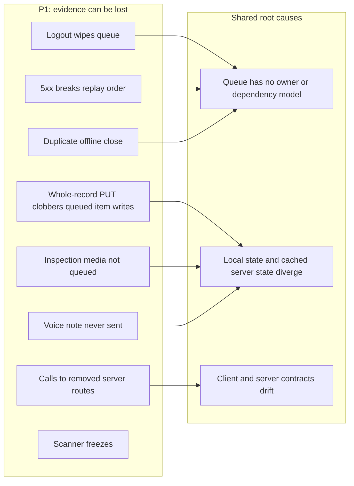

# FieldOps — Findings and Improvement Backlog

Audit of the codebase as of **2026-09-25** (commit `8b60a07`, branch `main`). Nothing here has been changed in code yet. Every item cites the evidence so it can be re-checked before work starts. Items marked **✔ verified** were re-read in source by a second pass. The others come from a single careful read.

Priority: **P1** loses field work or shows the technician something false · **P2** robustness, security, performance · **P3** structure, tests, polish.
Effort: **S** < ½ day · **M** 1–3 days · **L** a week or more.

## P1: data loss and false feedback

| # | Finding | Evidence | Suggested fix | Effort / risk |
|---|---|---|---|---|
| 1 | **Every logout deletes the unsynced queue.** `logout()` → `OfflineDb.wipe()` drops `pending_mutations`. It runs on manual sign-out, the in-app 24h timer, the session-expired dialog, and **any 401**. This contradicts the "queue is kept" design in `background_sync.dart` and the 401 → `stopRun` rule. ✔ verified | [auth_controller.dart:116-125](../lib/state/auth_controller.dart#L116), [background_sync.dart:112](../lib/core/offline/background_sync.dart#L112), [flush_policy.dart:26](../lib/core/offline/flush_policy.dart#L26) | Keep `pending_mutations` (and drafts) on logout; wipe only caches. Stamp each mutation with `userId` and flush only the current user's rows. On manual sign-out with a non-empty queue, warn with the count. | S–M / low |
| 2 | **A 5xx breaks replay order.** `retryLater` continues to the next item, so "complete" can replay before an RCA or downtime write that just got a 5xx. It then 422s and is dropped to conflicts. The code's own comment says order is what keeps "RCA → downtime → complete correct". ✔ verified | [sync_client.dart:382-388](../lib/core/offline/sync_client.dart#L382), [offline_db.dart:612](../lib/core/offline/offline_db.dart#L612) | On `retryLater`, skip later mutations with the **same `entityType`/`entityId`** for the rest of this run (per-entity ordering), or stop the run as for `NetworkFailure`. Add `SyncClient` tests (none exist today). | S / low |
| 3 | **Offline "Other item" or signature PUTs clobber queued checklist writes.** These are whole-record `PUT`s built from `record.raw['checklists']`, which is the cached detail when offline, and the server replaces `checklists` wholesale. Earlier queued ticks and sessions are overwritten on replay. ✔ verified | [checklist_repository.dart:265-275](../lib/data/checklist_repository.dart#L265), [checklist_repository.dart:323](../lib/data/checklist_repository.dart#L323) | A server-side append endpoint, or merge-by-item-`id` on `PUT`. Rebuilding from local items is **not** safe: they can hold other mutations' `__pending_*` placeholders. Coordinate with the web `handleAddOtherItem`. | M / contract change |
| 4 | **An offline close can be queued twice.** `CloseSection` checks only `completedDate`, not a queued close, and `addSignature` doesn't patch local items. Reopening the sheet queues another signature, RCA and close. The replayed duplicate gets a 400 "already completed", which flush drops as a failed conflict. ✔ verified (the first half) | [checklist_tab.dart:477](../lib/features/order_detail/checklist_tab.dart#L477), [checklist_controller.dart:270-281](../lib/state/checklist_controller.dart#L270), [flush_policy.dart:32](../lib/core/offline/flush_policy.dart#L32) | Gate the close on "any queued mutation for this entity". Apply the signature locally. In `classifyFlushFailure`, treat `isAlreadyCompleted` on close URLs as success. | S–M / low |
| 5 | **The app calls routes the server removed.** Annual maintenance is now read-only (no technician list, `PUT`, checklist, time-tracking or assignment). Reactive has no `checklist` or `time-tracking`. Online these 404; offline they queue and are later dropped. ✔ verified | server `annualMaintenanceRoutes.ts:12-15`, `reactiveMaintenanceRoutes.ts`, [orders_repository.dart:47-67](../lib/data/orders_repository.dart#L47) | Product decision: make RM/AMC detail read-only, or route their writes to the unified work-order/PM endpoints. Drop annual from the invite fan-out. | M / needs a decision |
| 6 | **Inspection media is not really queued.** A failed photo or signature upload shows the standard "Saved offline, will sync" message, but the bytes live only in widget memory and are lost when the screen closes. A non-required photo can be submitted as `{uploadStatus:'pending'}` with no URL. | [inspection_form_screen.dart:270-284](../lib/features/inspection/inspection_form_screen.dart#L270), [inspection_form_screen.dart:478-494](../lib/features/inspection/inspection_form_screen.dart#L478) | Minimum: stop showing `kOfflineQueuedMessage` and block submit while uploads are pending. Full: send media as `QueuedAttachment`s through `syncRequest` (multi-attachment already supported). | S / M |
| 7 | **The field-verification voice note is never sent.** The clip lives only in `VoiceNoteCapture`'s private state (mounted as `const`, no callback), so it never reaches the request, the draft or the queue. ✔ verified | [voice_note_capture.dart:43-47](../lib/features/field_verification/voice_note_capture.dart#L43), [field_verification_screen.dart:422](../lib/features/field_verification/field_verification_screen.dart#L422) | Hide the widget until the server stores audio (today it has only `voiceTranscript`), or lift the clip into form state and send it as a queued `file` attachment. | S / M (server field) |
| 8 | **The scanner can freeze.** `_handleRaw` sets `_processing = true` with no `try/finally`. Any resolver error other than 403/404 leaves it stuck, and every later scan is ignored until the screen is reopened. ✔ verified | [scanner_screen.dart:124-139](../lib/features/scanner/scanner_screen.dart#L124), [c2o_asset_resolver.dart:112-116](../lib/core/c2o/c2o_asset_resolver.dart#L112) | `try/finally` plus an amber "couldn't check this tag" outcome. Add resolver tests for 500 and `UnknownFailure`. | S / low |
| 9 | **Route progress ignores the technician's own checks.** It reads the cached `verificationStatus`, which only a re-download updates. | [route_progress.dart:52](../lib/core/c2o/route_progress.dart#L52) | After a synced or queued submit, patch the cached status (the server mapping is in `fieldVerificationService.ts`) plus a "queued" marker, then bump `routePacksTickProvider`. | S–M / local-vs-server drift |
| 10 | **Committed defaults point at a LAN dev server.** `API_BASE_URL`/`WEB_BASE_URL` default to `http://192.168.0.142`. A release built without `--dart-define` ships pointing at a private IP. The default changed four times in five days. ✔ verified | [env.dart:4-19](../lib/app/env.dart#L4) | `--dart-define-from-file=env/<flavor>.json` with committed dev and prod files, and a gitignored `env/local.json` for LAN hosts. Fail fast in `kReleaseMode` if the host is a private IP or plain `http`. | S / low |
| 30 | **Release builds allow cleartext and show the server-address override.** `usesCleartextTraffic="true"` applies app-wide (iOS: `NSAllowsArbitraryLoads`). The login-screen override (not gated by `kReleaseMode`) lets anyone point the app, and its bearer token, at any host. ✔ verified | [AndroidManifest.xml:22](../android/app/src/main/AndroidManifest.xml#L22), [login_screen.dart:449-460](../lib/features/login/login_screen.dart#L449) | Move cleartext to `src/debug/AndroidManifest.xml` (or a `network_security_config` limited to LAN ranges), and hide the override in release. | S / field testers lose the override in release builds |
| 31 | **A release build silently signs with the debug key when `key.properties` is missing**, and there is no CI. Nobody has run the test suite on the Mac checkout. ✔ verified | [app/build.gradle.kts:60-66](../android/app/build.gradle.kts#L60) | Fail `*Release` tasks when `hasReleaseKeystore` is false. Add a pinned Flutter 3.44.x CI job running `pub get --enforce-lockfile`, `analyze` and `test`. | M / low |
| 32 | **Push setup can die silently for the whole run.** `PushService.init` sets `_initialized = true` *before* `getToken()`. If that throws (offline at launch), the foreground listener and cold-start tap routing are never attached and nothing retries. `init()` is called unawaited. ✔ verified | [push_service.dart:38-58](../lib/core/push/push_service.dart#L38), [auth_controller.dart:64](../lib/state/auth_controller.dart#L64) | Attach `onMessage` and read the launch payload first, wrap `getToken` in try/catch, retry on token refresh or permission grant. Skip drawing messages that have a `type` but no `title`. | S / low |

## P2: robustness, security, performance

| # | Finding | Evidence | Suggested fix | Effort |
|---|---|---|---|---|
| 11 | Queued mutations replay under **whoever signs in next** (a session that expires while the app is closed keeps the queue; the next login flushes it with the new token). | [session_store.dart:178-202](../lib/core/storage/session_store.dart#L178), [sync_client.dart:289](../lib/core/offline/sync_client.dart#L289) | Part of #1: an owner column on `pending_mutations`. | S |
| 12 | The **Sync Center re-reads every queued row, including base64 photo bytes, on every flush tick** (O(n²) decoding during a long drain). Capture drafts also rewrite up to 8 base64 photos every 600ms. | [offline_db.dart:613-618](../lib/core/offline/offline_db.dart#L613), [providers.dart:127](../lib/state/providers.dart#L127), [field_verification_screen.dart:199-202](../lib/features/field_verification/field_verification_screen.dart#L199) | A `listMutationSummaries()` without attachment columns for the UI. Store blobs as encrypted files referenced by path (keep reading base64 for old rows). | M |
| 13 | **The WebView bearer token outlives logout.** `TwinScreen` seeds the token into WebView `localStorage` and nothing clears it. `WebPageScreen` has no navigation allow-list. | [twin_screen.dart:169-188](../lib/features/twin/twin_screen.dart#L169), [web_page_screen.dart:50-75](../lib/features/web/web_page_screen.dart#L50) | Clear WebView storage and cookies in `logout()`. Restrict `WebPageScreen` to `Env.webBaseUrl` like the twin screen. | S |
| 14 | **SR-2 conditional refresh isn't wired**, and a pack download REPLACEs richer scanned rows (history cut to `{result}`, `openFindings` → `[]`). | [route_download_service.dart:69-79](../lib/core/c2o/route_download_service.dart#L69), [api_client.dart:25](../lib/core/network/api_client.dart#L25) | Send `If-None-Match` from `versionTag` and handle 304 explicitly (Dio treats <400 as success). Merge rather than replace. | M |
| 15 | **A pack older than 24h hard-blocks route detail with no offline escape.** Pack age compares server `asOf` against the device clock. | [route_detail_screen.dart:43-47](../lib/features/routes/route_detail_screen.dart#L43), [route_detail_screen.dart:91](../lib/features/routes/route_detail_screen.dart#L91) | On a `NetworkFailure` refresh, offer "continue with the old pack" plus a warning; FR-4.8 `captureConflict` still flags drift. | S (product decision) |
| 16 | **Swallowed or mislabelled results.** A tag-issue POST failure is discarded while the UI says "reported". Annotated photos are PNG bytes named `photo.jpg`. A floor plan never cached shows "no plan" offline. | [c2o_asset_search_screen.dart:204-208](../lib/features/c2o_search/c2o_asset_search_screen.dart#L204), [photo_annotation_screen.dart:96-102](../lib/features/field_verification/photo_annotation_screen.dart#L96), [floor_plan_screen.dart:62-77](../lib/features/floor_plan/floor_plan_screen.dart#L62) | Surface the `HttpFailure`, encode annotations as JPEG, and add a distinct offline-not-cached state. | S each |
| 17 | **Close-readiness rules are re-derived in four places** (the section, the sheet, `CloseRejected` which doesn't map `session`, and the server). | [checklist_tab.dart:464-475](../lib/features/order_detail/checklist_tab.dart#L464), [close_controller.dart:66-73](../lib/state/close_controller.dart#L66) | One `closeReadiness(items, record)` returning the server's `missing[]` vocabulary (`checklist, signature, session, rootCause`). | S |
| 18 | **Order detail is parsed without its known type**, so a row missing its reference id closes against `/work-order/...`. | [orders_repository.dart:72](../lib/data/orders_repository.dart#L72), [close_sheet.dart:230](../lib/features/order_detail/close_sheet.dart#L230) | Pass `type` into `detailPage` and `listByType`, and use `OrderKey.type` in `CloseSheet`. | S |
| 19 | **Provider lifetimes.** Chat state outlives the sheet, and a failed send clears its attachments. Order history never refreshes. | [chat_controller.dart:204-207](../lib/state/chat_controller.dart#L204), [order_detail_controller.dart:100-103](../lib/state/order_detail_controller.dart#L100) | `autoDispose` (or reset in `open()`), restore attachments on failure, and pull-to-refresh plus invalidation on `queueChangedProvider`. | S |
| 20 | **Stop-session GPS is discarded.** It is written at the item's top level, which the server doesn't merge. | [checklist_repository.dart:425-428](../lib/data/checklist_repository.dart#L425) | Put it on the session object; agree field names with the web first. | S |
| 21 | **Notification tap routing exists twice** (in-app list and push payload). | [notification_route.dart](../lib/core/utils/notification_route.dart), [push_service.dart:102](../lib/core/push/push_service.dart#L102) | One function over a flat `Map<String,String?>`; `AppNotification` adapts to it. | S |
| 22 | **iOS can't ship yet.** There is no `GoogleService-Info.plist` (so `Firebase.initializeApp()` fails at start). The bundle id is still the retired `com.thefusionapps.fusioneco.technician`. `LocalNotifications` initialises Android settings only. There are no push entitlements, `UIBackgroundModes` or signing team. Background sync is Android-only. | [main.dart:26](../lib/main.dart#L26), [local_notifications.dart:32-35](../lib/core/push/local_notifications.dart#L32), [background_sync.dart:38-47](../lib/core/offline/background_sync.dart#L38) | Decide the bundle id, add the Firebase iOS app, `DarwinInitializationSettings`, entitlements and BGTaskScheduler (or accept sync only while open). Upload the APNs key to Firebase. | L |
| 33 | **App uploads are never tagged.** `uploadBytes` accepts `entityType`/`entityId`, but no caller passes them, so every photo, signature and voice file is stored as `misc` and can't be cleaned up with its record. | [sync_client.dart:411-423](../lib/core/offline/sync_client.dart#L411) | Pass the storage type (`workorder`, `inspection`, `asset`, …) from each repository. Handle `402 QUOTA_EXCEEDED` and `413 FILE_TOO_LARGE` before the server leaves `monitor` mode. | S |
| 34 | **Prefetch is guarded only by a timestamp written after it finishes**, so two callers (dashboard plus Profile, or app plus background) can both run it. The web hit this same race. | [prefetch.dart:35-42](../lib/core/offline/prefetch.dart#L35) | An in-memory in-flight flag (or reuse the lease) set before the first `await`. | S |
| 35 | **`analysis_options.yaml` is the Flutter template.** | [analysis_options.yaml](../analysis_options.yaml) | Enable `unawaited_futures`/`discarded_futures` (they would flag #32), `cancel_subscriptions`, `close_sinks`, `avoid_dynamic_calls`, `prefer_final_locals`, plus analyzer `strict-casts`/`strict-raw-types`. Fix in batches. | M |
| 36 | **An i18n key is missing from both locales:** `common.pull_down_to_retry` is used in three screens. en and ar have matching key sets (595 each), so a parity check can't catch it. ✔ verified | [profile_screen.dart:130](../lib/features/profile/profile_screen.dart#L130) | Add the key, plus a unit test: en/ar parity **and** every `'x.y'.getString` literal in `lib/` exists in `en.json`. | S |
| 23 | **The invites inbox looks empty offline** (`listInvites` returns `[]` instead of an error), and the invites controller uses its own offline wording. | [invites_controller.dart:54-58](../lib/state/invites_controller.dart#L54) | Surface `NetworkFailure` as an offline state and use `kOfflineQueuedMessage`. | S |

## P3: structure, tests, polish

| # | Finding | Suggested fix | Effort |
|---|---|---|---|
| 24 | **The core replay engine has no tests.** Only the pure `classifyFlushFailure` is covered. | Tests with a fake `ApiClient` and an in-memory DB behind an interface: order, partial attachment upload resume, lease contention, 428/401 stop, `captureConflict`. | M |
| 25 | **Oversized screens mix state machines and widgets:** `order_chat_sheet.dart` (1,682 lines), `inspection_form_screen.dart` (1,590), `dashboard_screen.dart` (1,061), `order_detail_screen.dart` (1,050), `profile_screen.dart` (987), `scanner_screen.dart` (955), `checklist_item_sheet.dart` (945), `field_verification_screen.dart` (908). | Extract a Notifier for form/draft/session state first (this makes #6 and #7 testable), then split the widgets. Write the tests before refactoring. | L |
| 26 | **Hard-coded English** in the inspection form and in controller failure texts. | Move them to `assets/i18n/en.json` and `ar.json`. | M |
| 27 | **Gloved-hand targets.** The session-strip dots are about 22px, and "same as claimed" is a caption-size `InkWell`. | 48dp minimum. | S |
| 28 | **Stale comments and dead code:** `calendar_controller.dart:8-9`, `api_exception.dart:28` (the server also sends `signature` and `session`), `close_repository.dart:75-78` (the server bug looks fixed), `notification_route.dart:34` (dangling reference), `RouteFetcherLike` unused, `docs/fcm-backend-handoff.md:6` cites `docs/analysis/…` which isn't in the repo. | Sweep them in one pass. | S |
| 29 | The `/inspections` list route has no in-app entry point. Order detail fetches twice on open. The face-verification photo can come from the gallery. Completed inspections stay editable. | Case-by-case product calls. | S each |
| 37 | **Repo hygiene.** `README.md` is the Flutter template. `android/build/reports/problems/problems-report.html` and `android/build.gradle.kts.bak` are tracked (the `/build/` ignore rule covers only the root). `VERSIONING.md` stops at build 2 while pubspec is `+3`. `RELEASE_INFO.md` contradicts itself about SHA fingerprints and holds Windows paths and a named test user. The `macos/` bundle id is `com.example.flutterApplication1`. | README → a pointer into `docs/` and `CLAUDE.md`. Untrack and ignore `android/build/`. Record build 3. Clean up RELEASE_INFO. | S |
| 38 | **Unused dependencies:** `permission_handler`, `cupertino_icons`, and plain `sqflite` next to `sqflite_sqlcipher` (check for SQLCipher linking conflicts before the iOS work). | Remove them after one analyze run confirms. | S |
| 39 | **Poppins is fetched at runtime** by `google_fonts` in an offline-first app, so the first launch offline shows a fallback font and widget tests may try the network. | Bundle the font files and set `GoogleFonts.config.allowRuntimeFetching = false`. | S |
| 40 | **The server's 3D stand-in fields are ignored:** `twinGlobalId` and `isPresentation` are never read, so the twin view can't say "this is a stand-in component". | Read them in `asset_detail.dart` and label the 3D button accordingly (the web copy says "use it to find the area, not to confirm the item"). | S |
| 41 | **The toolchain on the Mac is broken.** The `flutter` alias targets a missing path, the newest installed SDK is 3.19.3, and the project needs 3.44 or later. | Install Flutter 3.44+ (e.g. through `fvm`, pinned in `.fvmrc`) and fix `~/.zshrc:6,131-132`. | S |

## Cross-repo notes

- `fusion-eco-server/CLAUDE.md` and `fusion-eco-client/CLAUDE.md` both point to `../VOLUME5-CMMS.md` as "the single consolidated reference" for maintenance. **That file does not exist** under `fusion-eco-main/` (checked 2026-09-25). Either restore it or fix those links.
- `fusion-eco-server/LEARNINGS.md` (2026-09-15, "Deliberately NOT built yet") asks this app to handle a silent `location_request` push. The same-day follow-up **removed** that push, so it is obsolete; don't build it. See [LEARNINGS.md](../LEARNINGS.md).
- `fusion-eco-server/documentation/technician-location-capture.md` lists one location-gate exemption, but `middleware/auth.ts:35-39` has three (check-in, C2O verify, tag-issue).
- The `X-Client-Mutation-Id` idempotency contract (2xx responses cached 24h; failures not cached) is documented only in FieldOps' LEARNINGS.md. It deserves a server doc.

## Suggested order of work

1. **Stop losing field work** (one short PR on the queue): #1 and #11 (keep the queue across logout, owner column), then #2 (per-entity ordering on 5xx), then #4 (close idempotency in flush). Add #24 (`SyncClient` tests) **first**, so these changes land under test.
2. **Release safety before the next Play upload:** #10, #30, #31, #32, and record build 3 (#37).
3. **Contract drift with the server:** #5 (needs a product call on RM/AMC), #3 (needs a server append/merge endpoint), #20, #33.
4. **Truthful UI:** #6, #7, #8, #9, #16, #23, #36.
5. **Then** the structural work: #25 (screen splits, with tests), #26, #35, #22 (iOS) when iOS is actually on the roadmap.
