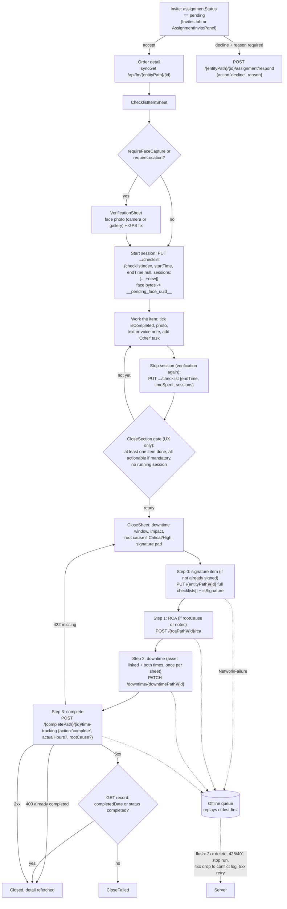

# Maintenance orders (CMMS): orders, checklists, close, inspections, invites, AI chat

This guide is for anyone about to change the technician's maintenance-work flow. It covers these files:

- `lib/domain/{maintenance_record,checklist,downtime,inspection,chat_message,history_entry,technician_insights,asset_document}.dart`
- `lib/data/{orders,checklist,close,history,assignment,inspection,ai_chat,analytics,asset_documents,notifications}_repository.dart`
- `lib/state/{orders,order_detail,checklist,close,inspection,chat,invites,dashboard,calendar,overview,profile,notifications,asset_documents}_controller.dart`
- `lib/features/{orders,order_detail,inspection,invites,calendar,dashboard,overview,profile,notifications,sync}/`
- `lib/core/inspection/conditional_logic.dart` and `lib/core/utils/{checklist_status,dates,currency,notification_route}.dart`

These are covered elsewhere and assumed known: the offline transport (`sync_client.dart`, `flush_policy.dart`), the auth/check-in/428 location gate, and the router shell.

---

## 1. The four order types and inspections

`OrderType` ([maintenance_record.dart:10](../lib/domain/maintenance_record.dart#L10)) hard-codes a path vocabulary for each kind. The vocabularies cannot be derived from the slug. Work orders use the plural `work-orders` for RCA and downtime but the singular `work-order` everywhere else ([maintenance_record.dart:7-9](../lib/domain/maintenance_record.dart#L7)). This rule is pinned by `orders_filter_test.dart` ("path vocabulary").

| | Work order | Preventive | Reactive | Annual | Inspection |
|---|---|---|---|---|---|
| App route | `/orders/work-order/:id` | `/orders/preventive/:id` | `/orders/reactive/:id` | `/orders/annual/:id` | `/inspections/:id` (not an `OrderType`) |
| Technician list | `GET /api/fm/work-order/technician/:techId` (the only list fetched; see §2) | `.../preventive-maintenance/technician/:techId` (invites only) | `.../reactive-maintenance/technician/:techId` (invites only) | `.../annual-maintenance/technician/:techId` (invites only) | `GET /api/fm/inspections/technician/assigned` |
| Detail | `GET /api/fm/work-order/:id` | `/api/fm/preventive-maintenance/:id` (raw record, no envelope) | `/api/fm/reactive-maintenance/:id` | `/api/fm/annual-maintenance/:id` | `GET /api/fm/inspections/technician/:id` |
| Checklist item write | `PUT /api/fm/work-order/:id/checklist` | `.../preventive-maintenance/:id/checklist` | `.../reactive-maintenance/:id/checklist` | `.../annual-maintenance/:id/checklist` | n/a (whole form submitted once) |
| RCA | `POST /api/fm/work-orders/:id/rca` | `.../preventive-maintenance/:id/rca` | `.../reactive-maintenance/:id/rca` | `.../annual-maintenance/:id/rca` | n/a |
| Downtime | `PATCH /api/fm/downtime/work-orders/:id` | `.../downtime/preventive-maintenance/:id` | `.../downtime/reactive-maintenance/:id` | `.../downtime/annual-maintenance/:id` | n/a |
| Close | `POST /api/fm/work-order/:id/time-tracking {action:"complete"}` | `.../preventive-maintenance/:id/time-tracking` | `.../reactive-maintenance/:id/time-tracking` | `.../annual-maintenance/:id/time-tracking` | `POST .../inspections/technician/:id/submit` |
| History feed | `GET /api/fm/work-order/:id/work-log` (`WorkOrderLog`) | `GET /api/fm/history/Preventive/:id` | `.../history/Reactive/:id` | `.../history/Annual/:id` | none |
| `downtimeSource` (window ownership) | `work-order` | `preventive` | `reactive` | `annual` | n/a |
| Notification `entityType` | `WorkOrder` | `PreventiveMaintenance` | `ReactiveMaintenance` | `AnnualMaintenance` | `Inspection` |
| `checklistMandatory` null means | optional | mandatory | mandatory | mandatory | n/a |

UI differences on the detail screen ([order_detail_screen.dart](../lib/features/order_detail/order_detail_screen.dart)):
- Title: a work order uses its own `title`. Reactive uses the asset name, then `subRequest`. Preventive and annual use the asset name, then the kind label (`detailTitleFor`, [order_detail_screen.dart:50](../lib/features/order_detail/order_detail_screen.dart#L50)).
- Summary card: work orders show `TimeTrackerCard`, which is read-only and understands a queued close. The other three kinds show `ChecklistSummaryCard` ([order_detail_screen.dart:410](../lib/features/order_detail/order_detail_screen.dart#L410)).
- Tab label: "Tasks (n)" for work orders, "Checklist" otherwise. The signature item is excluded from the count ([order_detail_screen.dart:125-139](../lib/features/order_detail/order_detail_screen.dart#L125)).
- Annual only: the date row shows `startDate`–`endDate`, and `contractValue` is shown converted from INR (`formatCurrencyFromBase`).
- The detail screen has three tabs: Details, Checklist, and History. Asset documents (`DocumentsTab`, read-only, `syncGet /api/fm/assets/:id/documents`) render inside the Details tab ([order_detail_screen.dart:704](../lib/features/order_detail/order_detail_screen.dart#L704)).

### 1.1 Routes the server actually serves (fusion-eco-server working tree, 2026-09-25)

Work orders are now the unified task for every kind ([orders_repository.dart:39-45](../lib/data/orders_repository.dart#L39)). The server has already removed routes that the app still has code paths for:

| Endpoint | work-order | preventive | reactive | annual |
|---|---|---|---|---|
| `GET .../technician/:techId` | yes | yes | yes | **no** (404, which `listInvites` swallows) |
| `PUT /:id` | yes | yes | yes | **no** |
| `PUT /:id/checklist` | yes | yes | **no** | **no** |
| `POST /:id/time-tracking` | yes | yes | **no** | **no** |
| `POST /:id/assignment/respond` | yes | yes | yes | **no** |
| `POST /:id/rca`, `PATCH /downtime/:source/:id` | yes | yes | yes | yes |

Sources: [annualMaintenanceRoutes.ts:12-24](../../fusion-eco-server/src/routes/annualMaintenanceRoutes.ts#L12) ("read-only… all of that happens through preventiveMaintenanceRoutes.ts now") and [reactiveMaintenanceRoutes.ts](../../fusion-eco-server/src/routes/reactiveMaintenanceRoutes.ts), which has no `checklist` or `time-tracking` route. Reactive and annual detail screens are therefore reachable only through legacy notifications and invites. On those screens every checklist write and every close fails with a 4xx. Online, the technician sees the error; offline, the write is queued and then dropped to the conflict log.

---

## 2. Lists: which records appear where

- **Orders tab, dashboard, calendar**: all three call `OrdersRepository.listAll`, which is **work orders only** ([orders_repository.dart:44](../lib/data/orders_repository.dart#L44)). They read through `syncGet`, so a cached list is used when offline. The Orders tab adds an Inspections chip fed by `assignedInspectionsProvider` ([orders_screen.dart:17-21](../lib/features/orders/orders_screen.dart#L17)). Search is the only filter left.
- **Invites tab**: `listInvites` fans out over all four kinds, including preventive, because an invite is the only way to reach a preventive detail page. It uses the plain `ApiClient`, not `syncGet`, and each kind's failure becomes `[]` ([orders_repository.dart:47-67](../lib/data/orders_repository.dart#L47)). Offline, the inbox therefore shows as *empty*, not as an error.
- **Dashboard** ([dashboard_controller.dart:95](../lib/state/dashboard_controller.dart#L95)): an order is finished when its status is `Completed`, `completed`, or `Expired`. `Cancelled` is excluded from active. Overdue compares against *now*, while "due today" covers the whole calendar day, so one record can count in both. Active tasks list due-today orders first, then in-progress ones, deduplicated, capped at 5. Every refresh also kicks `prefetchOfflineBundle`, which is throttled to 4 h ([dashboard_controller.dart:88-92](../lib/state/dashboard_controller.dart#L88)).
- **Overview**: `GET /api/analytics/technician/:id/insights`. It is online-only, takes no date range, and the response keys are `workOrders`, `preventive`, `reactive`, and `annual` (not the route slugs) ([technician_insights.dart:79-87](../lib/domain/technician_insights.dart#L79)). Any missing field parses to zero.
- **Profile**: `GET /api/analytics/technician/:id/profile` returns `{profile, analytics}` and is online-only. The "Download My Work" card runs `prefetchOfflineBundle(force: true)`.
- **Calendar**: records are bucketed by `effectiveDate` (`dueDate ?? plannedDate ?? dateTime`), and weeks start on Sunday ([calendar_controller.dart:41](../lib/state/calendar_controller.dart#L41)).
- **Notifications**: `GET /api/notifications?limit=50` returns `data.notifications` and `data.unseenCount`. Opening the screen marks everything *seen*; tapping one notification marks it *read*. Routing is covered in `notification_route.dart`. The invite title `New assignment invite` goes to `/invites`, which is a shell branch, so it must be opened with `go`, not `push`.

Every list and detail controller listens to `queueChangedProvider` and refetches, so a queued write that syncs or gets dropped corrects the status on screen.

---

## 3. Lifecycle as the app drives it

---

## 4. Checklist writes

All checklist writes are in [checklist_repository.dart](../lib/data/checklist_repository.dart). The two families behave very differently:

1. **Per-item writes**: `PUT /api/fm/{entityPath}/{id}/checklist` with `{checklistIndex, ...updates}`. Items are addressed by **array index**, including the hidden signature item, so the loop in `ChecklistTab` keeps real indices ([checklist_tab.dart:111](../lib/features/order_detail/checklist_tab.dart#L111)). The server merges only `isCompleted, comments, attachments, attachmentDetails, startTime, endTime, timeSpent, sessions` onto the item ([workOrderController.ts:4064](../../fusion-eco-server/src/controllers/workOrderController.ts#L4064)). Anything else in the body is silently ignored, including `attachmentDetails` in practice ([checklist_repository.dart:33-35](../lib/data/checklist_repository.dart#L33)).
2. **Whole-record writes**: `PUT /api/fm/{entityPath}/{id}` with `{checklists: [...record.raw['checklists'], newItem]}`. Three things use this: "Other" tasks ([checklist_repository.dart:265](../lib/data/checklist_repository.dart#L265)), the signature ([checklist_repository.dart:316](../lib/data/checklist_repository.dart#L316)), and the record-level voice note (`{notesAudioUrl}`). Its UI (`record_voice_note.dart`) is currently commented out ([order_detail_screen.dart:25](../lib/features/order_detail/order_detail_screen.dart#L25)). The server's generic update **replaces** the whole `checklists` column.

Body details:
- **Start session** ([checklist_repository.dart:362](../lib/data/checklist_repository.dart#L362)): sets top-level `startTime` because the server derives the record's `startedDate` and the "In Progress" status from the first start it sees. It also sets `endTime: null` and appends a session carrying `faceCaptureUrl` and geo only when they were captured.
- **Stop session** ([checklist_repository.dart:390](../lib/data/checklist_repository.dart#L390)): closes the open session, or synthesises one from a legacy top-level `startTime`. It re-totals `timeSpent` in minutes across all sessions and stamps `endFaceCaptureUrl`. Stop-time geo is written at the item's **top level** ([checklist_repository.dart:425-428](../lib/data/checklist_repository.dart#L425)), which the checklist endpoint does not merge.
- **Notes**: the full `comments` array is re-sent with the new note appended. A legacy string `comments` is promoted to the first note ([checklist_repository.dart:179](../lib/data/checklist_repository.dart#L179)). A voice note has `audioUrl = __pending_audio_uuid__` and `durationSeconds`.
- **Photos**: `attachments: [...existing, __pending_photo_uuid__]`. Removing a photo re-sends the filtered list.
- **Other item**: gets an `id` of `other-<ms>-<7 chars>` so the admin edit page does not delete every id-less item together ([checklist_repository.dart:281-284](../lib/data/checklist_repository.dart#L281)).
- **Signature item** (2026-09-09): has `isOther: true, isSignature: true, isCompleted: true, signatureUrl: __pending_signature_uuid__, signerName, signedAt`. The shape must match the web's `handleSaveSignature` exactly. It must ride the queued-attachment path and never be uploaded directly ([checklist_repository.dart:301-315](../lib/data/checklist_repository.dart#L301)).

Local state ([checklist_controller.dart](../lib/state/checklist_controller.dart)):
- `_run` applies the exact patch that was sent to the local item, so offline changes show immediately. On a synced write it also refetches the detail ([checklist_controller.dart:79-118](../lib/state/checklist_controller.dart#L79)). `addOther` and `addSignature` do **not** patch locally; they only refetch when the write synced.
- `build` refuses to let a *cached* detail overwrite an existing local list, because that would undo offline writes. The exception is a cold start, when there is nothing on screen yet ([checklist_controller.dart:61-72](../lib/state/checklist_controller.dart#L61)).
- An `HttpFailure` message is shown verbatim. For example, the server returns 409 "auto-generated from a PM schedule… must be accepted by a supervisor" for unaccepted generated work orders.

Status derivations ([checklist_status.dart](../lib/core/utils/checklist_status.dart)) are ports of the web's `lib/checklist-status.ts` and the server's `checklistCloseGuard.ts` and must stay equivalent:
- "Other" items, and therefore the signature, are excluded from progress and from the mandatory check, but they count toward "at least one done" ([checklist_status.dart:48-110](../lib/core/utils/checklist_status.dart#L48)).
- `hasRequiredSignature` is unconditional ([checklist_status.dart:112-117](../lib/core/utils/checklist_status.dart#L112)).
- A running session blocks the close ([checklist_status.dart:119-126](../lib/core/utils/checklist_status.dart#L119)). The server returns `missing:["session"]` for it.
- `calculateChecklistsActualHours` is the single source for `actualHours`, rounded to 1 decimal place and including "Other" items. It is shown as the placeholder in the manual-hours field, which is capped to `DECIMAL(10,2)` ([checklist_tab.dart:22-32](../lib/features/order_detail/checklist_tab.dart#L22)).

---

## 5. Close flow

The flow runs through `CloseSheet` ([close_sheet.dart](../lib/features/order_detail/close_sheet.dart)), `CloseSubmitter` ([close_controller.dart:90](../lib/state/close_controller.dart#L90)), and `CloseRepository` ([close_repository.dart](../lib/data/close_repository.dart)).

- **Order**: signature, then RCA, then downtime, then complete. The signature is written first because the server reads it out of `checklists` during the completion call ([close_sheet.dart:187-226](../lib/features/order_detail/close_sheet.dart#L187)). A signature write that genuinely failed (not merely queued) stops the close.
- **RCA block visibility**: shown when `rcaRequiredForPriority(priority)` is true, which matches `critical`/`high` case-insensitively because reactive stores its priority in lowercase. It is also shown when the server has already returned `missing` containing `rootCause` ([downtime.dart:69-78](../lib/domain/downtime.dart#L69), [close_sheet.dart:90-98](../lib/features/order_detail/close_sheet.dart#L90)). Whether RCA is *required* is never decided client-side; only the server's 422 `missing[]` decides ([downtime.dart:29-32](../lib/domain/downtime.dart#L29)).
- **Downtime pre-fill**:
  - The start defaults to the first checklist start, falling back to `startedDate` ([checklist_tab.dart:446-451](../lib/features/order_detail/checklist_tab.dart#L446)). The end defaults to now.
  - `GET /api/fm/assets/:assetId/downtime` returns `data.history[]` of *derived* windows whose `id` is `"<source>:<recordId>"`. It is read with the plain client, not the cache, because a stale window would lock the start time. On error it returns `[]` ([close_repository.dart:10-32](../lib/data/close_repository.dart#L10)).
  - A window counts as "mine" when `source == type.downtimeSource && sourceId == record.id` and it is open (`endedAt == null && !derived`). That window fixes the start and makes an end compulsory ([close_sheet.dart:125-145](../lib/features/order_detail/close_sheet.dart#L125)).
  - An open window on another record is informational only.
  - The history is folded in once, so later rebuilds do not overwrite the technician's edits.
- **Downtime write**: one idempotent `PATCH` carrying `startedAt`, `endedAt` (UTC ISO), and `impact` (`full_outage|degraded|no_impact`). It runs at most once per sheet (`_downtimeHandled`), so a retry after a 422 does not re-send it ([close_controller.dart:95-147](../lib/state/close_controller.dart#L95)). No linked asset means no downtime step. Supplying only one of start or end fails locally before anything is sent.
- **Results**:
  - `CloseSucceeded(queued)`
  - `CloseAlreadyClosed`: a 400 whose message matches `already (completed|been started or completed)`
  - `CloseRejected(missing, message)`: a 422 with `missing[]` of `rootCause`, `checklist`, `signature`, or `session`. The first three get localized copy; `session` falls back to the server's message ([close_sheet.dart:262-295](../lib/features/order_detail/close_sheet.dart#L262)).
  - `CloseFailed`
- **5xx on complete**: the app asks the server whether the record actually closed (`completedDate` set or `status == completed`) before reporting failure ([close_controller.dart:158-169](../lib/state/close_controller.dart#L158)). The code comment cites a post-commit throw in `workOrderController.ts`.
- **After close**: the sheet refetches the detail and pops with a message. `OrderDetail.queuedComplete` scans the offline queue for a `time-tracking` mutation with `action == complete`, so `TimeTrackerCard` does not fall back to "in progress" ([order_detail_controller.dart:51-58](../lib/state/order_detail_controller.dart#L51)). `CloseSection` itself only checks `completedDate` ([checklist_tab.dart:477](../lib/features/order_detail/checklist_tab.dart#L477)).

---

## 6. Offline behaviour per action

Writes through `syncRequest` return `SyncedWrite(synced:false)` and show the single `kOfflineQueuedMessage`. The `label` is English-only and is shown in the Sync Center and conflict log. `entityType` is `OrderType.name` (`workOrder|preventive|reactive|annual`) or `'inspection'`. `mutation_labels.dart` maps it back for grouping.

| Action | Method + path | `label` | Attachment (field, placeholder) |
|---|---|---|---|
| Accept / decline invite | `POST /{entityPath}/{id}/assignment/respond` `{action, reason?}` | `Accept assignment` / `Decline assignment` | none |
| Tick item | `PUT /{entityPath}/{id}/checklist` | `Checklist item` | none |
| Start timer | same | `Start task timer` | face: `image`, `__pending_face_uuid__` |
| Stop timer | same | `Stop task timer` | face: `image`, `__pending_face_uuid__` |
| Text note | same | `Checklist note` | none |
| Voice note | same | `Checklist voice note` | `file`, `__pending_audio_uuid__` |
| Add photo | same | `Checklist photo` | `image`, `__pending_photo_uuid__` |
| Remove photo | same | `Remove checklist photo` | none |
| Add "Other" task | `PUT /{entityPath}/{id}` (full `checklists`) | `Add other task` | none |
| Signature | `PUT /{entityPath}/{id}` (full `checklists`) | `Technician signature` | `image`, `__pending_signature_uuid__` |
| Record voice note (UI hidden) | `PUT /{entityPath}/{id}` `{notesAudioUrl}` | `Work order voice note` / `Remove voice note` | `file`, `__pending_audio_uuid__` |
| Root cause | `POST /{rcaPath}/{id}/rca` | `Root cause` | none |
| Downtime | `PATCH /api/fm/downtime/{downtimePath}/{id}` | `Downtime` | none |
| Close | `POST /{completePath}/{id}/time-tracking` | `Close work order` (and so on: `Close ${label.toLowerCase()}`) | none |
| Inspection submit | `POST /api/fm/inspections/technician/{id}/submit` `{data}` | `Inspection submission` | none; `entityType: 'inspection'` |

**Cached reads (`syncGet`, 24 h TTL)**: the orders list, order detail, asset documents, the inspections list and detail, and `/api/sync/manifest` plus every URL it lists.

**Online-only**:
- `listInvites` (errors become `[]`)
- order history
- downtime history and the post-5xx `isCompleted` check
- the whole AI assistant
- insights, profile, and notifications
- inspection photo and signature uploads (`uploadBytes` direct, [inspection_repository.dart:37-44](../lib/data/inspection_repository.dart#L37))

Placeholders are swapped for uploaded URLs by string-replacing the JSON-encoded body at flush time. The UI hides pending items by prefix: `isPendingAudio` checks `__pending_audio_` and `photo_viewer.dart` checks `__pending_photo_`.

---

## 7. API endpoints used by this area

| Method | Path | Repository | Response-shape notes |
|---|---|---|---|
| GET | `/api/fm/{entityPath}/technician/{techId}` | `OrdersRepository.listByType` / `listInvites` | list in `data`; row type is inferred from `workOrderId → ticketId → amcScheduleId → pmScheduleId` unless the caller passes it (`listInvites` does) |
| GET | `/api/fm/{entityPath}/{id}` | `OrdersRepository.detailPage`, `CloseRepository.isCompleted` | preventive detail is a raw record with no envelope; `detailPage` does **not** pass the known type ([orders_repository.dart:72](../lib/data/orders_repository.dart#L72)) |
| PUT | `/api/fm/{entityPath}/{id}/checklist` | `ChecklistRepository` | 409 for unaccepted PM-generated work orders; 400 "Invalid checklist index" |
| PUT | `/api/fm/{entityPath}/{id}` | `ChecklistRepository.addOtherItem`/`addSignatureItem`/`setRecordVoiceNote` | generic update; replaces `checklists` wholesale |
| POST | `/api/fm/{entityPath}/{id}/assignment/respond` | `AssignmentRepository.respond` | the responder is taken from the token, never the body |
| POST | `/api/fm/{rcaPath}/{id}/rca` | `CloseRepository.submitRca` | `{rootCause?, rcaNotes?}` (empty values omitted) |
| PATCH | `/api/fm/downtime/{downtimePath}/{id}` | `CloseRepository.patchDowntime` | writes three columns on the record; there is no log row |
| GET | `/api/fm/assets/{assetId}/downtime` | `CloseRepository.downtimeHistory` | `data.history[]`; rows without `startedAt` are dropped |
| POST | `/api/fm/{completePath}/{id}/time-tracking` | `CloseRepository.complete` | 422 `{message, missing[]}`; 400 "already completed" |
| GET | `/api/fm/work-order/{id}/work-log` | `HistoryRepository.list` | `type` maps to action: `status_change`/`completion` → `STATUS_UPDATE`, `assignment` → `ASSIGNMENT_UPDATED`, `system` → `CHECKLIST_UPDATED`; `user` may be a map or a string |
| GET | `/api/fm/history/{Preventive\|Reactive\|Annual}/{id}` | `HistoryRepository.list` | `timestamp ?? createdAt` |
| GET | `/api/fm/assets/{assetId}/documents` | `AssetDocumentsRepository.list` | `type` is the upper-cased extension, or `LINK`; `category` defaults to `other` |
| GET | `/api/fm/inspections/technician/assigned` | `InspectionRepository.listAssigned` | `template.{name,location}` nested |
| GET | `/api/fm/inspections/technician/{id}` | `InspectionRepository.detail` | `{assignmentId, schema:{components, conditionalRules, _fms}, responseData}` |
| POST | `/api/fm/inspections/technician/{id}/submit` | `InspectionRepository.submit` | body `{data: responseData}` |
| POST | `/api/upload/image` \| `/api/upload/file` | `SyncClient.uploadBytes` | URL at `data.url` or `url`; 120 s timeout |
| POST | `/api/fm/ai/technician-checklist/chat` | `AiChatRepository.send` (general) | bare `{content, messageId}`; 90 s timeout |
| POST | `/api/fm/ai/chat` | `AiChatRepository.send` (createAsset/report) | same bare shape |
| GET | `/api/fm/ai/chat/history?page=1&limit=200&sessionId=` | `AiChatRepository.history` | bare `{messages, pagination}` with **no** `data` envelope |
| POST | `/api/fm/ai/context/build` | `AiChatRepository.buildContext` | fire-and-forget; errors swallowed |
| GET | `/api/analytics/technician/{id}/insights` | `AnalyticsRepository.insights` | keys `workOrders` / `preventive` / `reactive` / `annual` |
| GET | `/api/analytics/technician/{id}/profile` | `AnalyticsRepository.profile` | `{profile, analytics}` |
| GET/POST | `/api/notifications`, `/mark-seen`, `/mark-read/{id}`, `/mark-read/all`, `/register-device`, `/unregister-device` | `NotificationsRepository` | `data.notifications`, `data.unseenCount` |

Other shape quirks:
- `unwrap` tolerates four shapes (see [envelope.dart:1-6](../lib/core/network/envelope.dart#L1)).
- Sequelize DECIMAL columns arrive as strings (`asDouble`).
- Dates arrive as ISO UTC strings and are converted to local time.
- `ChecklistItem.comments` may be a plain string in seeded rows.
- Older session rows nest geo fields under `location` ([checklist.dart:82-98](../lib/domain/checklist.dart#L82)).
- `MaintenanceRecord` keeps `raw` so that writes never drop fields the app does not model.

---

## 8. Inspections

- **Where they appear**: the list is shown under the Orders tab's Inspections chip. The standalone `/inspections` route has no in-app entry point. The detail is reached through `/inspections/:id`, from the chip or from a notification with `entityType == 'Inspection'`.
- **Form state**: the form is local widget state; there is no draft persistence, and leaving the screen loses answers. The form is read-only only when `status == 'expired'` ([inspection_form_screen.dart:733](../lib/features/inspection/inspection_form_screen.dart#L733)).
- **Form-level settings (`_fms`)**:
  - `gpsRequired` stores `_gpsLocation {latitude, longitude, city, district, timestamp}`.
  - `timerEnabled` stores `_timerSessions [{start, end}]` and `_totalDurationMs`. Submission is disabled while the timer runs.
  - `supervisorSignature` stores `_supervisorSignature` as a plain uploaded URL.
  - `supervisorApproval` is deliberately not modelled.
- **Media fields**:
  - `photo` and `signature` fields upload immediately and store `{values:[{url, uploadStatus:'uploaded', takenAt, geo?}]}`.
  - A failed upload stores `{uploadStatus:'pending', pendingId}` with the bytes held **only in memory**, retryable during this screen session only ([inspection_form_screen.dart:253-285](../lib/features/inspection/inspection_form_screen.dart#L253)).
  - `file` fields are *not* uploaded. They store raw, uncompressed `data:` URLs inside `responseData` ([inspection_form_screen.dart:337-355](../lib/features/inspection/inspection_form_screen.dart#L337)).
  - A `button` component is never rendered; its label becomes the submit label. `columns` is treated as unsupported.
- **Submit**: `syncRequest` with the whole `responseData`, so it queues offline. The detail and list are refreshed afterwards.

**Conditional logic** ([conditional_logic.dart](../lib/core/inspection/conditional_logic.dart)) is a port of the web's `FormRenderer.tsx`:
- Rules are `{enabled, conditions[0], actions[0]}`. Only index 0 of each array is evaluated ([inspection.dart:191-195](../lib/domain/inspection.dart#L191)).
- Default visibility: a field targeted by any enabled `show` rule starts hidden; every other field starts visible ([conditional_logic.dart:103-108](../lib/core/inspection/conditional_logic.dart#L103)).
- Rules run in order and the last matching rule wins. Actions are `show`, `hide`, `require`, and `unrequire`. `email_admin` and disabled actions are skipped.
- `condition.fieldId` is a component **id**, while answers are keyed by component **key**. Lookup tries the id first, then resolves id to key ([conditional_logic.dart:14-22](../lib/core/inspection/conditional_logic.dart#L14)).
- Operators:
  - String comparisons: `equals` and `not equals` are case-sensitive; `contains`, `starts with`, and `ends with` are case-insensitive. `is empty` and `is not empty` also belong here.
  - Numeric: `greater`/`less`, plus the `or equal` variants. Anything that is not a number parses to NaN, so these return false.
  - `is checked` and `is unchecked` accept a bool or the string `'true'`/`'false'`.
  - `includes` and `does not include` apply to lists.
  - `has file` and `no file`.
  - `has photo`/`no photo`/`has signature`/`no signature`: a *pending* item counts as present.
  - `answer is` is a strict `==` comparison.
  - Any unknown operator evaluates to false.
- **Required check** (`missingRequiredFields`, [inspection_controller.dart:42-99](../lib/state/inspection_controller.dart#L42)) runs over `visibleFieldsFor`, so a hidden field is never required and a rule-`require`d field is checked:
  - photo and signature need at least one item with `uploadStatus == 'uploaded'`, which is stricter than the `has photo` operator (keep the two separate)
  - `selectboxes` needs at least one true value
  - `survey` needs every row answered
  - `checkbox` must be `true`
  - `panel`, `html`, `button`, and `unsupported` are never blockable
- The server's own check is cruder (it skips every conditional target), so it acts only as a backstop.

---

## 9. Order Assistant (AI chat sheet)

- **Entry**: the AppBar button, shown only when `permissions.isAiAgent` is true and the detail has loaded ([order_detail_screen.dart:113](../lib/features/order_detail/order_detail_screen.dart#L113)). The flags come from `GET /api/auth/config` and are opt-in: missing or false means off ([session_store.dart:111-131](../lib/core/storage/session_store.dart#L111)).
- **Modes** ([chat_message.dart:6-16](../lib/domain/chat_message.dart#L6)):
  - `general`: `POST /api/fm/ai/technician-checklist/chat {message, sessionId, maintenanceId, maintenanceType: type.slug, images?, audio?}`. The server hard-codes "general" mode for this endpoint.
  - `createAsset` (tile shown only when `isCreateAsset`) and `report` (only when `isAssetReport`): `POST /api/fm/ai/chat {message, sessionId, isGeneral:false, isCreateAsset, isAssetReport, images?}`. **No `audio`**: `chatWithFacilityAgent` never reads it, so the mic is disabled in these modes ([order_chat_sheet.dart:365-370](../lib/features/order_detail/order_chat_sheet.dart#L365)). The history rows for these modes are hidden if the permission is revoked.
- **Session ids**: deterministic per order and per mode. `technician-checklist:{slug}:{id}` for general, with a `:create-asset` or `:report` suffix for the other modes ([ai_chat_repository.dart:21-32](../lib/data/ai_chat_repository.dart#L21)). The prefix keeps these threads out of the web facility agent's history.
- **Views**: `home → chat | historyList → historyDetail`.
  - `openMode` always starts the visible thread empty; past turns are only visible through the read-only history view, which always re-fetches ([chat_controller.dart:94-133](../lib/state/chat_controller.dart#L94)).
  - The history list opens on a **triple tap** of the home subtitle within 600 ms ([order_chat_sheet.dart:87-91](../lib/features/order_detail/order_chat_sheet.dart#L87)).
  - `buildContext` fires once per controller instance.
- **Attachments**:
  - Images are `CapturedPhoto.dataUrl` (`data:<mime>;base64,…`), downscaled to 1600 px at quality 80, with no count limit in the app.
  - Voice is one clip per message as a `data:` URL, and "latest wins" if recorded again before sending.
  - Text may be empty when an attachment is present.
  - The server parses the `data:` URLs into Gemini `inlineData` parts. The JSON body limit is 30 MB (`fusion-eco-server/documentation/order-assistant-media.md`).
- **Offline**: the assistant is online-only by design ([ai_chat_repository.dart:5-6](../lib/data/ai_chat_repository.dart#L5)). A failed send replaces the pending bubble with "That did not go through". The attachments were already cleared from the composer.
- **Rendering**: replies are Markdown. Links open externally over http(s) only.

---

## 10. Invariants and gotchas

1. **Do not derive `OrderType` paths from the slug.** Also keep `downtimeSource`, `historyType`, the insights keys, and the notification `entityType` names as spelled-out tables ([maintenance_record.dart:7-9](../lib/domain/maintenance_record.dart#L7), [maintenance_record.dart:70-74](../lib/domain/maintenance_record.dart#L70), [technician_insights.dart:79-81](../lib/domain/technician_insights.dart#L79), [notification_route.dart:44-53](../lib/core/utils/notification_route.dart#L44)).
2. **Pass the known type when parsing rows.** `inferType` defaults to work order when a row lacks a reference id ([maintenance_record.dart:345-352](../lib/domain/maintenance_record.dart#L345), pinned by `profile_test.dart` "invite rows"). `detailPage` does not pass it, and `CloseSheet` sends the close using `record.type` ([close_sheet.dart:230](../lib/features/order_detail/close_sheet.dart#L230)), not the route's `OrderKey.type`.
3. **Client close gates are UX only; the server's 422 `missing[]` wins.** Never decide RCA-requiredness client-side ([downtime.dart:29-32](../lib/domain/downtime.dart#L29), [close_controller.dart:60](../lib/state/close_controller.dart#L60)). If the server names a gate, the sheet must show a control that satisfies it (`_forceRcaVisible`, [close_sheet.dart:90-93](../lib/features/order_detail/close_sheet.dart#L90)).
4. **Signature before completion**, and it must stay on the queued-attachment path ([checklist_repository.dart:301-311](../lib/data/checklist_repository.dart#L301), [close_sheet.dart:187-196](../lib/features/order_detail/close_sheet.dart#L187)). The signature item is never shown as a task row and is never un-tickable ([checklist_tab.dart:93-97](../lib/features/order_detail/checklist_tab.dart#L93)).
5. **Full-array record PUTs are built from `record.raw['checklists']`**, the last fetched (possibly cached) detail, not from the locally patched `ChecklistState.items` ([checklist_repository.dart:271](../lib/data/checklist_repository.dart#L271), [checklist_repository.dart:323](../lib/data/checklist_repository.dart#L323)). Offline, "Other" or signature writes queued after per-item writes will replay a stale array over them.
6. **Only server truth replaces an existing local checklist.** Keep the `fromCache` guard, including its cold-start exception ([checklist_controller.dart:61-72](../lib/state/checklist_controller.dart#L61)).
7. **A 5xx on complete is not proof of failure.** Verify before reporting ([close_controller.dart:158-169](../lib/state/close_controller.dart#L158)). A duplicate close's 400 "already completed" is success, but only in `CloseSubmitter` ([api_exception.dart:38-45](../lib/core/network/api_exception.dart#L38)). During a queue flush the same 400 is classified as a 4xx and goes to the conflict log ([flush_policy.dart:32-35](../lib/core/offline/flush_policy.dart#L32)).
8. **Downtime is written once per sheet instance.** Create one `CloseSubmitter` per open sheet ([close_controller.dart:88-97](../lib/state/close_controller.dart#L88), [close_sheet.dart:47](../lib/features/order_detail/close_sheet.dart#L47)).
9. **Read downtime history with the plain client and throw it away with the sheet** (`autoDispose`). A cached window would pin a start time that is no longer true ([close_repository.dart:10-13](../lib/data/close_repository.dart#L10), [close_controller.dart:199-205](../lib/state/close_controller.dart#L199)).
10. **Priority comparisons are case-insensitive** (reactive stores lowercase) ([downtime.dart:69-78](../lib/domain/downtime.dart#L69)).
11. **A derived downtime window is never "open"** ([downtime.dart:106-111](../lib/domain/downtime.dart#L106)).
12. **Checklist item writes address items by index.** Never filter the list before computing an index; filter at render time, as `ChecklistTab` does ([checklist_tab.dart:111-112](../lib/features/order_detail/checklist_tab.dart#L111)).
13. **Every queued-write outcome shows the one `kOfflineQueuedMessage`.** `InvitesController` still words its own offline message ([invites_controller.dart:54-58](../lib/state/invites_controller.dart#L54)), and `AssignmentInvitePanel` detects "queued" by string equality with `kOfflineQueuedMessage` ([detail_widgets.dart:476-480](../lib/features/order_detail/detail_widgets.dart#L476)).
14. **Shell branches are switched to with `go`, never pushed.** This covers notification taps that resolve to `/invites` ([router.dart:108-121](../lib/app/router.dart#L108), [notifications_screen.dart:46-51](../lib/features/notifications/notifications_screen.dart#L46)).
15. **Inspections: keep "has photo" (pending counts) separate from "required satisfied" (uploaded only)** ([conditional_logic.dart:24-29](../lib/core/inspection/conditional_logic.dart#L24)).
16. **The assistant never falls back to cache** ([ai_chat_repository.dart:5-6](../lib/data/ai_chat_repository.dart#L5)), and `audio` is sent only in `general` mode ([ai_chat_repository.dart:56-59](../lib/data/ai_chat_repository.dart#L56)).
17. **Overview and profile are online-only on purpose**: a stale cached score is worse than "not available" ([overview_controller.dart:7-9](../lib/state/overview_controller.dart#L7)).
18. **The face photo may come from the gallery.** `VerificationSheet` offers both the camera and the gallery ([verification_sheet.dart:82-88](../lib/features/order_detail/verification_sheet.dart#L82)).

---

## 11. Tests covering this area

| Test | What it pins down |
|---|---|
| `test/checklist_session_test.dart` | `startUpdates`/`stopUpdates` bodies: appends a session and clears `endTime`; face placeholder and coordinates go on the session; keys are omitted when nothing was captured; stop totals all sessions; legacy session synthesis; top-level fallback; end-face placeholder; under one minute rounds to 0 |
| `test/checklist_status_test.dart` | Summary states (Not Started/Started/Paused/Completed); "Other" excluded from progress but counted by `hasAnyChecklistCompleted`; first-start and last-end; `actualHours` precedence (session minutes, then session span, then item time; "Other" included); legacy `task`/`completed`/string-comment rows |
| `test/close_flow_test.dart` | `rcaRequiredForPriority` casing; `DowntimeWindow` open, derived, and no-start; `CloseSubmitter` order (rca, downtime, complete); RCA skipped when empty; downtime skipped without an asset; hours and root cause carried; one queued call makes the whole close queued; open window without an end refused before sending; downtime written once across retries; "already completed" is success; 5xx followed by a verify; 422 `checklist` |
| `test/order_detail_test.dart` | Per-type headings and title fallbacks (widget tests); `HistoryEntry` labels and timestamp fallback; `shortChecklistTitle`; currency conversion |
| `test/orders_filter_test.dart` | `inferType`; the `OrderType` path vocabulary; `visibleRecords` sort and search; card and dashboard title chains; display placeholders |
| `test/profile_test.dart` | Profile parsing; the endpoint's own kind beats inference for invite rows |
| `test/insights_test.dart` | Insights keys (`workOrders`), degradation to zeros; `AiChatRepository.sessionIdFor` (general mode only) |
| `test/calendar_test.dart` | Sunday-start month grid; day bucketing; undated records are left out |
| `test/notification_route_test.dart` | Entity-to-route mapping; invite title goes to `/invites` (a shell branch); a link wins after the `/technician` prefix is stripped; foreign links and AI conversations go nowhere |
| `test/notifications_and_media_test.dart` | `isPendingAudio`; clip duration format; `AppNotification` parsing |
| `test/envelope_test.dart`, `dates_test.dart`, `status_colors_test.dart`, `queue_bus_test.dart` | Envelope shapes and coercion; overdue and duration formatting; status and priority chip palettes; distinct queue ticks |

Not covered by any test:
- `conditional_logic.dart` and `missingRequiredFields`
- `hasRequiredSignature` and `hasAnyRunningChecklistItem`
- the `ChecklistController` cache guard
- the `addOtherItem`/`addSignatureItem` bodies
- `AiChatRepository.send` bodies for each mode
- `ChatController`, `InvitesController`, and `DashboardController._derive`
- the signature-before-close ordering in `CloseSheet`
